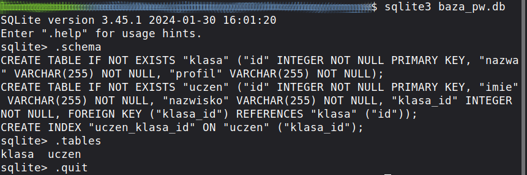

.. _orm_peewee:

System ORM Peewee
#################

Używanie systemów ORM, takich jak :term:`Peewee`, w prostych projektach
sprowadza się do schematu, który poglądowo można opisać w trzech krokach:

1. deklaracja modelu opisującego bazę
2. utworzenie na podstawie modelu tabel w bazie,
3. wykonywanie operacji :term:`CRUD`.

Przez model (zob. też: :term:`model bazy danych`) rozumiemy tutaj deklaracje klas i ich właściwości (atrybutów)
opisujące obiekty, które będą przechowywane w bazie. Systemy ORM na podstawie klas tworzą
odpowiednie tabele i pola, uwzględniając ich typy i powiązania. Odwzorowanie klas i ich właściwości
na tabele, kolumny i relacje w bazie stanowi istotę mapowania relacyjno-obiektowego.

Poniżej spróbujemy pokazać, jak wykonywać typowe operacje na bazie z wykorzystaniem biblioteki Peewee.

.. note::

    Wyjaśnienia podanego niżej kodu są uproszczone ze względu na przejrzystość i poglądowość instrukcji.
    Do używania systemów ORM wystarczające jest poznanie ich interfejsu API.

Klasa bazowa
************

W ulubionym edytorze utwórz plik o nazwie :file:`orm_pw.py` z następującym kodem:

.. raw:: html

    
Peewee. Kod nr 

.. literalinclude:: orm_pw.py
    :linenos:
    :lineno-start: 1
    :lines: 1-16

Na początku importujemy potrzebne klasy. Dalej tworzymy zmienną ``plik_bazy``,
która będzie przechowywała nazwę pliku z bazą danych.
Jeżeli plik znajduje się na dysku (``if os.path.exists()``), usuwamy go (os.remove()),
aby zapewnić bezproblemowe działanie skryptu podczas wielokrotnego uruchamiania.

Następnie tworzymy obiekt ``baza`` do obsługi bazy SQlite3 przechowywanej w pliku :file:`baza_pw.db`.

.. tip::

    Jeżeli zamiast nazwy pliku, podamy argument ``:memory:``, baza utworzona zostanie w pamięci RAM,
    co może być przydatne podczas testowania.

Do utworzenia modeli danych potrzebna będzie **klasa bazowa**, którą tworzymy w oparciu o klasę ``Model``,
w podklasie ``Meta`` dodatkowo przypisujemy obiekt służący do komunikacji z bazą do atrybutu ``database``.

Model danych
*************

Dodajemy definicje klas opisujących dwa obiekty reprezentujące klasę i ucznia. Każda klasa ma swoją nazwę
i profil, każdy uczeń ma imię, nazwisko oraz przynależy do jakiejś klasy.

.. raw:: html

    
Peewee. Kod nr 

.. literalinclude:: orm_pw.py
    :linenos:
    :lineno-start: 18
    :lines: 18-32

Deklarowanie modelu opiera się na dziedziczonej klasie podstawowej ``Model``.
Klasy o nazwach ``Klasa`` i ``Uczen`` reprezentują tabele w bazie. Właściwości tych klas odpowiadają polom.
Każde pole jest instancją klasy określającej typ danych i ma ograniczenia podawane jako dodatkowe argumenty
konstruktora:

- ``CharFiled()`` – klasa definiująca pole zawierające ciąg znaków,
- ``null=False`` – ograniczenie, pole nie może zawierać wartości ``NULL``,
- ``default=''`` – ograniczenie, wartość domyślna przechowywana w polu,
- ``ForeignKeyField()`` – klasa definiująca relację, konstruktor otrzymuje nazwę klasy powiązanej,
  z którą tworzymy relację, oraz nazwę atrybutu określającego relację zwrotną w powiązanej klasie;
  dzięki temu wywołanie w postaci ``Klasa.uczniowie`` da nam dostęp do obiektów reprezentujących
  uczniów przypisanych do danej klasy.

Po zdefiniowaniu modelu, co jest relatywnie najtrudniejsze, trzeba go przetestować,
czyli utworzyć tabele i kolumny w bazie. W Peewee łączymy się z bazą (``baza.connect()``)
i wywołujemy metodę ``create_tables()``, której podajemy w liście nazwy klas reprezentujących tabele.

Omówiony kod można już uruchomić, w katalogu, z którego uruchamiamy skrypt, powinien zostać utworzony
plik bazy :file:`baza_pw.db`.

Ćwiczenie
==========

1) Wykorzystaj :ref:`interpreter sqlite3 <sqlite3>` i sprawdź, czy zostały utworzone tabele,
   czyli jak wygląda kod SQL wygenerowany przez ORM. Przykładowy zrzut poniżej.

.. note::

    Nazwy utworzonych tabel to nazwy klas, które je opisują, podobnie nazwy pól odpowiadają nazwom atrybutów.
    Warto zauważyć, że *Peewee* nie wymaga definiowania kluczy głównych, są tworzone automatycznie
    jako pola o nazwie ``id`` zawierające liczby całkowite.

Dodawanie danych
****************

Dodawanie (ang. *create*) danych w Peewee wykonywane jest za pomocą obiektów
reprezentujących rekordy zdefiniowanych tabel oraz ich metod.

.. raw:: html

    
Peewee. Kod nr 

.. literalinclude:: orm_pw.py
    :linenos:
    :lineno-start: 33
    :lines: 33-51

Zanim dodamy pierwsze informacje sprawdzamy, czy w bazie są już zapisane jakieś obiekty typu ``Klasa``,
wykonujemy więc kwerendę zliczającą definiowaną za pomocą kolejno wywoływanych metod:
``Klasa().select().count()``. Jeżeli w bazie nie są zapisane żądne klasy, dodajemy dwie klasy.

Dodawanie polega na utworzeniu instancji odpowiedniego obiektu i podaniu w konstruktorze wartości
jego atrybutów, np.: ``Klasa(nazwa = '1A', profil = 'matematyczny')``.
Utworzony obiekt zapisujemy w bazie jako rekord za pomocą metody ``.save()``.

Można również dodawać wiele rekordów na raz. Na początku tworzymy obiekt reprezentujący klasę
o podanej nazwie jako kwerendę warunkową. Warunki podajemy jako parametry metody ``where()``:
``Klasa.select().where(Klasa.nazwa == '1A').get()``.

Następnie definiujemy listę słowników ``uczniowie``. Każdy słownik zawieraja dane w formacie
"klucz":"wartość", przy czym klucze są nazwami atrybutów klasy. Wartością klucza ``'klasa'`` jest
utworzona wcześniej instancja klasy o nazwie ``1A``.

Za pomocą metody ``insert_many()``, która jako parametr przyjmuje listę słowników,
dodajemy rekordy z danymi wielu uczniów do bazy.

Odczytywanie danych
*******************

Odczytywanie danych polega na u użyciu metody ``select()`` obiektu z opcjonalnymi metodami,
które zawężają zbiór zwracanych rekordów. Do tej pory użyliśmy już instrukcji:

- ``Klasa().select().count()`` – wybieramy wszystkie klasy i je zliczamy;
- ``Klasa.select().where(Klasa.nazwa == '1A').get()`` – wybieramy obiekt reprezentujący klasę o nazwie ``1A``.

Do skryptu dodajemy poniższy kod, który wypisze dane wszystkich klas oraz wszystkich uczniów zapisanych w bazie:

.. raw:: html

    
Peewee. Kod nr 

.. literalinclude:: orm_pw.py
    :linenos:
    :lineno-start: 52
    :lines: 52-67

Metoda ``select()`` wywołana dla danej klasy zwraca listę obiektów zapisanych w bazie.
Elementy listy odczytujemy w pętli ``for klasa in klasy:`` i wypisujemy atrybuty kolejnych obiektów używając
notacji z kropką: ``print(klasa.id, klasa.nazwa, klasa.profil)``.

Funkcja ``czytaj_dane()``, pokazuje jak odczytywać dane obiektów połączonych relacjami, tj. dane z wielu tabel.
Oprócz metody ``select()`` używamy metody ``join()``, aby wskazać obiekt (tabelę) połączony relacją zawierający
dodatkowe dane, w tym przypadku informacje o klasie, do której przypisany jest uczeń: ``Uczen.select().join(Klasa)``.
Zwrócone rekordy odczytujemy w pętli ``for``.

Dodatkowe metody dostępne podczas odczytywania danych to:

- ``.get()`` - zwraca pojedynczy rekord pasujący do zapytania lub wyjątek ``DoesNotExist``, jeżeli go brak;
- ``.first()`` - zwróci z kolei pierwszy rekord ze wszystkich pasujących.

Modyfikowanie danych
====================

Systemy ORM ułatwiają modyfikowanie danych w bazie, ponieważ operacja ta polega
na zmianie wartości pól wybranego obiektu. W naszym skrypcie dopisujemy kod:

.. raw:: html

    
Peewee. Kod nr 

.. literalinclude:: orm_pw.py
    :linenos:
    :lineno-start: 68
    :lines: 68-73

Powyższy kod pokazuje, jak zmienić przypisanie ucznia do klasy. Na początku zwróć uwagę na kwerendy warunkowe:

- ``Uczen().select().join(Klasa).where(Uczen.id == 2).get()`` – zwraca obiekt
  ucznia o identyfikatorze "2";
- ``Klasa.select().where(Klasa.nazwa == '1B').get()`` – zwraca obiekt klasy o nazwię "1B".

Modyfikacja polega na przypisaniu obiektu ``nowa_klasa`` do odpowiedniego atrybutu obiektu ``uczen``.

Usuwanie danych
================

Usuwanie jest jeszcze prostsze. Wystarczy użyć metody ``delete_instance()`` obiektu przeznaczonego do
usunięcia.

.. raw:: html

    
Peewee. Kod nr 

.. literalinclude:: orm_pw.py
    :linenos:
    :lineno-start: 74
    :lines: 74-

Za pomocą kwerendy warunkowej tworzymy obiekt ucznia o identyfikatorze "3",
a następnie wywołujemy metodę ``delete_instance()``.

Po zakończeniu operacji wykonywanych na danych powinniśmy pamiętać o zamknięciu połączenia.
Robimy to używając metody obiektu bazy ``baza.close()``

Zadania
********

1) Spróbuj dodać do bazy korzystając z systemu Peewee wiele rekordów na raz pobranych z pliku
   :download:`uczniowie.csv <uczniowie.csv>`.
   Wykorzystaj i zmodyfikuj funkcję ``pobierz_dane()`` opisaną w materiale :ref:`Dane z pliku <dane_z_pliku>`.

2) Postaraj się przedstawione aplikacje wyposażyć w konsolowy interfejs,
   który umożliwi operacje odczytu, zapisu, modyfikowania i usuwania rekordów.
   Dane powinny być pobierane z klawiatury od użytkownika.

3) Przedstawione rozwiązania warto użyć w aplikacjach internetowych
   jako relatywnie szybki i łatwy sposób obsługi danych. Zobacz,
   jak to zrobić na przykładzie scenariusza aplikacji :ref:`Quiz ORM <quiz-orm>`.

4) Przejrzyj scenariusz aplikacji internetowej :ref:`Czat <czat1>`, zbudowanej z użyciem
   frameworku *Django*, korzystającego z własnego modelu ORM.
