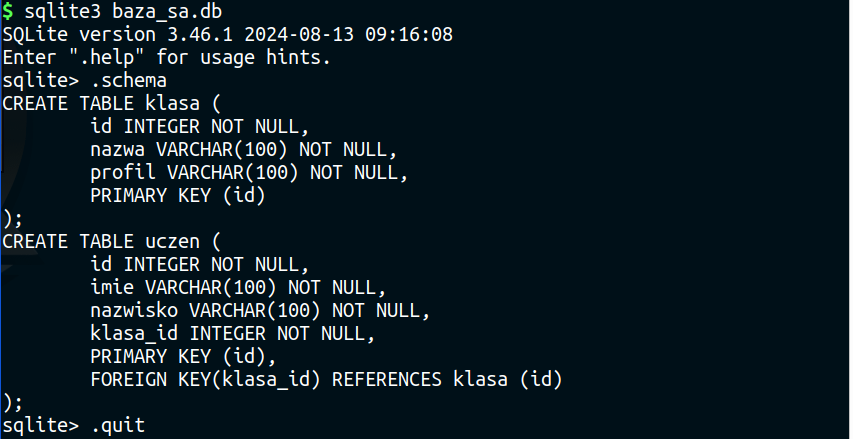

.. _orm_sqlalchemy:

System ORM SQLAlchemy
#####################

Używanie systemów ORM, takich jak :term:`SQLAlchemy`, w prostych projektach
sprowadza się do schematu, który poglądowo można opisać w trzech krokach:

1. deklaracja modelu opisującego bazę
2. utworzenie na podstawie modelu tabel w bazie,
3. wykonywanie operacji :term:`CRUD`.

Przez model (zob. też: :term:`model bazy danych`) rozumiemy tutaj deklaracje klas i ich właściwości (atrybutów)
opisujące obiekty, które będą przechowywane w bazie. Systemy ORM na podstawie klas tworzą
odpowiednie tabele i pola, uwzględniając ich typy i powiązania. Odwzorowanie klas i ich właściwości
na tabele, kolumny i relacje w bazie stanowi istotę mapowania relacyjno-obiektowego.

Poniżej spróbujemy pokazać, jak wykonywać typowe operacje na bazie z wykorzystaniem biblioteki SQLAlchemy.

.. note::

    Wyjaśnienia podanego niżej kodu są uproszczone ze względu na przejrzystość i poglądowość instrukcji.
    Do używania systemów ORM wystarczające jest poznanie ich interfejsu API.

Środowisko pracy
================

Do tworzenia aplikacji możesz użyć dowolnych narzędzi, np. terminala i ulubionego edytora kodu.
Sugerujemy jednak wykorzystanie środowiska **PyCharm** lub innego, ponieważ w ułatwiają pracę nad projektami
w języku Python.

Przed rozpoczęciem pracy przygotuj w wybranym katalogu, np. :file:`baza_orm`` :ref:`wirtualne środowisko Pythona <venv>`
i w aktywnym środowisku zainstaluj pakiet *SQLAlchemy*:

.. code-block:: bash

    (.venv) ~/baza_orm$ pip install sqlalchemy

Klasa bazowa
************

W ulubionym edytorze utwórz dwa plik o nazwie :file:`orm_sa.py`.

.. raw:: html

    
SQLAlchemy. Kod nr 

.. literalinclude:: orm_sa.py
    :linenos:
    :lineno-start: 1
    :lines: 1-17

Na początku importujemy potrzebne klasy. Dalej tworzymy zmienną ``plik_bazy``,
która będzie przechowywała nazwę pliku z bazą danych.
Jeżeli plik znajduje się na dysku (``if os.path.exists()``), usuwamy go (os.remove()),
aby zapewnić bezproblemowe działanie skryptu podczas wielokrotnego uruchamiania.

Następnie tworzymy obiekt ``baza`` do obsługi bazy SQlite3 przechowywanej w pliku :file:`baza_sa.db`.

Do utworzenia modeli danych potrzebna będzie **klasa bazowa**, którą tworzymy w oparciu o klasę
``DeclarativeBase``.

Model danych
*************

Dodajemy definicje klas opisujących dwa obiekty reprezentujące klasę i ucznia. Każda klasa ma swoją nazwę
i profil, każdy uczeń ma imię, nazwisko oraz przynależy do jakiejś klasy.

.. raw:: html

    
SQLAlchemy. Kod nr 

.. literalinclude:: orm_sa.py
    :linenos:
    :lineno-start: 18
    :lines: 18-37

Tworzenie modelu opiera się na dziedziczonej klasie podstawowej ``Base`` i mapowaniu deklaratywnym
(ang. *Declarative Mapping*). Definicje klas o nazwach ``Klasa`` i ``Uczen`` z jednej strony opisują
obiekty Pythona, z drugiej strony zawierają metainformacje opisujące tabele SQL,
które utworzone zostaną w bazie. Definicje wykorzystują również wskazówki dotyczące typów danych
(ang. *type hinst*). Przeanalizujmy kilka fragmentów kodu:

- ``__tablename__`` – określa nazwę tabeli w bazie danych,
- ``id: Mapped[int]`` – nazwa pola z adnotacją typu danych,
- ``mapped_column()`` - funkcja pozwalająca definiować ograniczenia pól tworzonych w tabelach, np.:

  - ``Integer`` – pole przechowuje liczby całkowite,
  - ``String(100)`` – pole przechowuje maksymalnie 40 znaków,
  - ``primary_key=True`` – pole jest kluczem głównym,
  - ``nullable=False`` – pole nie może zawierać wartości null,
  - ``default=''`` – domyślna wartość pola,
  - ``ForeignKey()`` – definiuje klucz obcy, jako argument podajemy nazwę tabeli i klucza głównego,

- ``relationship()`` – funkcja, która tworzy relację zwrotną między dwoma zmapowanymi klasami podanymi
  w adnotacji typu, np.: ``Mapped[List["Uczen"]]``, ``Mapped["Klasa"]``; argument ``back_populates``
  pozwala wskazać nazwę relacji w powiązanej klasie.

Relacja zwrotna pozwala na dostęp do powiązanych obiektów, np. kod typu ``klasa.uczniowie``
da nam dostęp do uczniów należących do danej klasy, a kod ``uczen.klasa`` wskaże klasę,
do której należy uczeń.

Zdefiniowane model możemy sprawdzić za pomocą kodu tworzącego tabele: ``Base.metadata.create_all(baza)``.

Omówiony kod można uruchomić. W katalogu, z którego uruchamiamy skrypt, powinien zostać utworzony
plik bazy :file:`baza_sa.db`.

Ćwiczenie
==========

1) Wykorzystaj :ref:`interpreter sqlite3 <sqlite3>` i sprawdź, czy zostały utworzone tabele,
   czyli jak wygląda kod SQL wygenerowany przez ORM. Przykładowy zrzut poniżej.

.. note::

    Nazwy utworzonych tabel to nazwy klas, które je opisują, podobnie nazwy pól odpowiadają nazwom atrybutów.

Dodawanie danych
****************

Do pliku :file:`orm_sa.py` dodajemy następujący kod:

.. raw:: html

    
SQLAlchemy. Kod nr 

.. literalinclude:: orm_sa.py
    :linenos:
    :lineno-start: 38
    :lines: 38-57

Wykonywanie operacji na bazie danych wymaga utworzenia obiektu sesji:
``with Session(baza) as sesja``. Użycie konstrukcji ``with ... as ...``
pozwala uniknąć niektórych błędów podczas wykonywania operacji na bazie.

.. _sesja:

.. note::

    Mechanizm sesji jest unikalny dla SQLAlchemy, pozwala wykonywać serię powiązanych
    ze sobą operacji na bazie danych w ramach jednej transakcji. Sesja przechowuje
    tworzone obiekty i zapamiętuje wykonywane na nich operacje.
    W prostych aplikacjach wykorzystuje się jedną instancję sesji,
    w bardziej złożonych można korzystać z wielu.
    Instancja sesji tworzona jest na podstawie klasy ``Session`` z parametrem wskazującym bazę.
    Obiekt sesji zawiera metody pozwalające komunikować się z bazą, np. ``execute()``, która
    wykonuje zapytania. Jeżeli zmiany w sesji mają zostać zapisane w bazie danych,
    trzeba użyć metody ``commit()`` do ich zatwierdzenia.

Do tworzenia nowych rekordów używamy metody ``add()``. Jako argument podajemy nazwę modelu
z wymaganymi argumentami.

W ramach sesji można wykonywać wiele operacji, jednak aby zostały odzwierciedlone w bazie danych,
trzeba wywołać metodę ``commit()``.

.. note::

    Dopiero po zatwierdzeniu zmian metodą ``commit()`` mamy dostęp do identyfikatorów nowo
    utworzonych obiektów.

Metoda ``add_all()`` służy do dodawania wielu rekordów na raz. Jako argument podajemy listę obiektów
``uczniowie``. Warto zwrócić uwagę, że aby określić klasę, do której należy uczeń, atrybutowi ``klasa_id``
modelu przypisujemy identyfikator obiektu reprezentującego klasę.

Ćwiczenie
==========

1) Ponownie wykonaj dotychczasowy kod i sprawdź za pomocą interpretera ``sqlite3``,
   czy w tabelach znalazły się odpowiednie dane.

   .. tip::

      W interpreterze możesz wykorzystać proste kwerendy SQL, np.:
      ``SELECT * FROM klasa;`` oraz ``SELECT * FROM uczen;``.

Odczyt danych
*************

Odczyt danych może być realizowany na wiele sposobów. Zacznijmy od uzupełnienia kodu skryptu:

.. raw:: html

    
SQLAlchemy. Kod nr 

.. literalinclude:: orm_sa.py
    :linenos:
    :lineno-start: 58
    :lines: 58-85

Do tworzenia zapytań używamy funkcji ``select()``, np.:

- ``select(Klasa)`` – odczytujemy wszystkie obiekty modelu ``Klasa``,
- ``select(Klasa).where(Klasa.nazwa == '1A')`` – odczytujemy obiekt reprezentujący klasę *1A*,
  metoda ``where()`` odpowiada klauzuli ``WHERE`` języka SQL,
- ``select(Uczen).join(Klasa)`` – odczytujemy obiekty modelu ``Uczen`` razem z danymi o klasie, do której uczeń należy,
  metoda ``join()`` odpowiada klauzuli ``JOIN`` języka SQL.

Zapytania wykonujemy za pomocą metod sesji:

- ``scalars()`` – zwraca wszystkie pasujące obiekty, które można odczytywać np. w pętli ``for``,
- ``scalar()`` – zwraca pierwszy element pierwszego zwróconego rekordu lub wyjątek ``MultipleResultsFound``.

W funkcji ``wypisz_liste_uczniow()`` do sprawdzenia liczby obiektów zapisanych w bazie używamy zapytania
zawierającego:

- funkcję ``select()``, której argumentem jest funkcja ``count()`` wywoływana z przestrzeni nazw ``func``
  udostępniającej funkcje SQL,
- metody ``select_from()``, które pozwala określić źródło danych na podstawie podanego modelu.

Zapytanie wykonujemy za pomocą metody ``execute()``, wynik, tzn. liczbę obiektów,
pobieramy z użyciem metody ``scalar()``.

.. tip::

    Omówiony powyżej kod zliczający obiekty, czyli rekordy zapisane w tabeli bazy danych,
    charakterystyczny dla SQLAlchemy w wersji 2.x można zastąpić prostszym stosowanym w wersji
    1.4, który nadal działa: ``if sesja.query(Uczen).count():``.

Modyfikowanie danych
=================================

Systemy ORM ułatwiają modyfikowanie danych w bazie, ponieważ operacja ta polega
na zmianie wartości pól wybranego obiektu. W naszym skrypcie dopisujemy kod:

.. raw:: html

    
SQLAlchemy. Kod nr 

.. literalinclude:: orm_sa.py
    :linenos:
    :lineno-start: 87
    :lines: 87-94

Na początku odczytujemy obiekt klasy ``Uczen`` o podanym identyfikatorze.
Następnie wykonujemy zapytanie ``select(Klasa.id).where(Klasa.nazwa == '1A')`` za pomocą
metody ``scalar()``, która zwraca identyfikator klasy 1A.
W kolejnym kroku zmieniamy atrybut ``klasa_id`` obiektu reprezentującego ucznia.
Ma końcu zatwierdzamy zmiany w bazie danych za pomocą metody ``commit()``.

Usuwanie danych
****************

Do skryptu dodajemy kolejna porcję kodu:

.. raw:: html

    
SQLAlchemy. Kod nr 

.. literalinclude:: orm_sa.py
    :linenos:
    :lineno-start: 95
    :lines: 95-

Z użyciem metody ``get()`` sesji możemy odczytać obiekt (ucznia), o podanym identyfikatorze (3).
Obiekt usuwamy za pomocą metody ``delete()`` sesji. Za pomocą metody ``flush()`` przekazujemy
bazie danych zlecenie usunięcia obiektu.

Do usuwania wielu rekordów służy funkcja ``delete()``, któ©a podobnie jak ``select()``
służy do przygotowania zapytania wybierającego rekordy na podstawie kryteriów podanych
jako argumenty metody ``where()``. Zapytanie wykonujemy za pomocą metody ``execute()`` sesji.

Na koniec ponownie zatwierdzamy (tj. zapisujemy) zmiany w bazie danych.

Zadania
********

1) Spróbuj dodać do bazy korzystając z systemu Peewee wiele rekordów na raz pobranych z pliku
   :download:`uczniowie.csv <uczniowie.csv>`.
   Wykorzystaj i zmodyfikuj funkcję ``pobierz_dane()`` opisaną w materiale :ref:`Dane z pliku <dane_z_pliku>`.

2) Dodaj do aplikacji konsolowy interfejs, który umożliwi operacje
   odczytu, zapisu, modyfikowania i usuwania rekordów.
   Dane powinny być pobierane z klawiatury od użytkownika.

3) Przedstawione rozwiązania warto użyć w aplikacjach internetowych
   jako relatywnie szybki i łatwy sposób obsługi danych. Zobacz,
   jak to zrobić na przykładzie scenariusza aplikacji :ref:`Quiz ORM <quiz-orm>`.

4) Przejrzyj scenariusz aplikacji internetowej :ref:`Czat <czat1>`, zbudowanej z użyciem
   frameworku *Django*, korzystającego z własnego modelu ORM.
