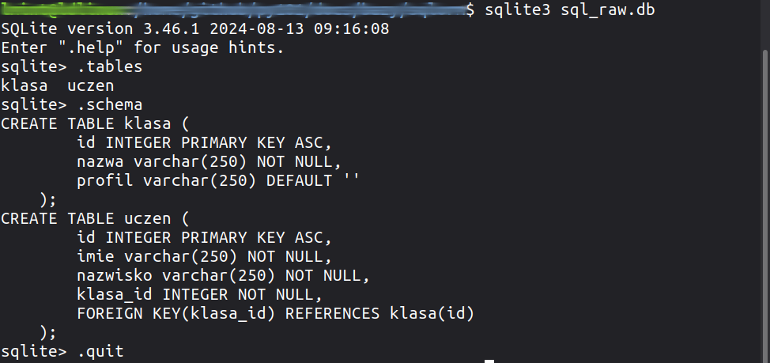
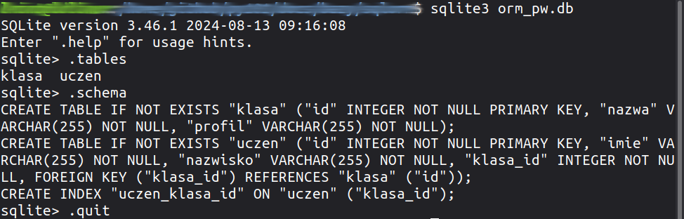

.. _sql-orm:

SQL vs ORM
##################

.. contents::
    :depth: 1
    :local:

Bazy danych są niezbędnym składnikiem większości aplikacji. Poniżej
zwięźle pokażemy, w jaki sposób z wykorzystaniem Pythona można je obsługiwać
przy użyciu modułu ``sqlite3`` i języka :term:`SQL`, jak i systemów :term:`ORM`
na przykładzie frameworku :term:`Peewee`.

.. note::

    Niniejszy materiał koncentruje się na poglądowym wyeksponowaniu różnic w kodowaniu,
    komentarz ograniczono do minimum. Dokładne wyjaśnienia poszczególnych instrukcji
    znajdziesz w materiale :ref:`SQL <sql_raw>` oraz :ref:`System ORM Peewee <orm_peewee>`
    i :ref:`System ORM SQLAlchemy <orm_sqlalchemy>`.

Połączenie z bazą
***********************

Na początku pliku :file:`sql_raw.py` umieszczamy kod, który importuje moduł do obsługi bazy *SQLite3*
i przygotowuje obiekt kursora, który posłuży nam do wydawania poleceń SQL:

.. raw:: html

    
Plik <i>sql_raw.py</i>. Kod nr 

.. literalinclude:: sql_raw.py
    :linenos:
    :lineno-start: 1
    :lines: 1-9

System ORM Peewee inicjujemy w pliku :file:`orm_pw.py` tworząc klasę bazową, która zapewni połączenie z bazą:

.. raw:: html

    
Plik <i>orm_pw.py</i>. Kod nr 

.. literalinclude:: orm_pw.py
    :linenos:
    :lineno-start: 1
    :lines: 1-12

.. note::

    Parametr ``:memory:`` powoduje utworzenie bazy danych w pamięci operacyjnej,
    która istnieje tylko w czasie wykonywania programu. Aby utworzyć trwałą bazę,
    zastąp omawiany parametr nazwę pliku, np. :file:`baza.db`.

Model bazy
**********

Dane w bazie zorganizowane są w tabelach połączonych relacjami.
Aby utworzyć tabele ``klasa`` i ``uczen`` powiązane relacją jeden-do-wielu,
musimy wydać następujące polecenia SQL:

.. raw:: html

    
Plik <i>sql_raw.py</i>. Kod nr 

.. literalinclude:: sql_raw.py
    :linenos:
    :lineno-start: 10
    :lines: 10-26

Wydawanie poleceń SQL-a wymaga znajomości składni tego języka.
Systemy ORM, chociaż pozwalają na wykonywanie zapytań SQL, oferują manipulowanie obiektami, a nie tabelami.
W powyższym kodzie zamiast tabel definiujemy więc modele, tj. klasy reprezentujące klasy i uczniów.
Na podstawie właściwości modeli system ORM utworzy tabele i odpowiednie pola, tj. wygeneruje i wykona odpowiednie
zapytania SQL.

.. raw:: html

    
Plik <i>orm_pw.py</i>. Kod nr 

.. literalinclude:: orm_pw.py
    :linenos:
    :lineno-start: 13
    :lines: 13-27

Ćwiczenie 1
============

Utwórz za pomocą powyższych skryptów bazy w plikach o nazwach :file:`sql_raw.db` oraz
:file:`orm_pw.db`. Następnie otwórz te bazy w `interpreterze Sqlite <sqlite3>`_  i wykonaj
podane niżej polecenia. Porównaj struktury utworzonych tabel.

.. code-block:: bash

    sqlite> .tables
    sqlite> .schema

Dodawanie danych
*****************

Chcemy wstawić do naszych tabel dane dwóch klas oraz trzech uczniów.
Korzystając z języka SQL użyjemy następujących poleceń:

.. raw:: html

    
Plik <i>sql_raw.py</i>. Kod nr 

.. literalinclude:: sql_raw.py
    :linenos:
    :lineno-start: 27
    :lines: 27-42

Metoda kursora ``execute()`` pozwala wykonać pojedyncze zapytanie SQL. Metoda ``executemany()``
wykonuje jedno zapytanie dla danych podanych w liście krotek. Dane zapisane krotkach odpowiadają rekordom w tabeli.
Znaki zapytania (zamienniki) w poleceniach SQL są zastępowane przez kolejne parametry przekazywane w krotkach.

W systemie ORM tworzymy obiekty (instancje) na podstawie klas modelu. Właściwości obiektów przekazujemy metodzie
``create()``, która od razu tworzy rekord w bazie, lub konstruktorowi, po którym wywołujemy metodę ``save()``.

.. raw:: html

    
Plik <i>orm_pw.py</i>. Kod nr 

.. literalinclude:: orm_pw.py
    :linenos:
    :lineno-start: 28
    :lines: 28-41

Do dawania wielu rekordów używamy metody ``insert_many()`` modelu, która przyjmuje jako argument
listę słowników opisujących właściwości kolejnych obiektów.

Pobieranie danych
*****************

Pobieranie danych (czyli :term:`kwerenda`) wymaga polecenia ``SELECT`` języka SQL.
Aby wyświetlić dane wszystkich uczniów zapisane w bazie użyjemy kodu:

.. raw:: html

    
Plik <i>sql_raw.py</i>. Kod nr 

.. literalinclude:: sql_raw.py
    :linenos:
    :lineno-start: 43
    :lines: 43-60

Funkcja ``wypisz_liste_uczniow()`` na początku wykonuje zapytanie o liczbę rekordów w tabeli ``uczen``.
Jeżeli w tabeli są jakieś rekordy (``if (cur.fetchone()[0]):``), pobieramy informacje o wszystkich uczniach
wykonując zapytanie SQL i wypisujemy je.

W systemie ORM korzystamy z metod modelu ``select().count()``, aby sprawdzić, czy w tabeli ``uczen`` są jakieś dane.
Jeżeli tak, wykorzystujemy metody ``select().join()``, aby pobrać dane uczniów i klas, do których należą.
W pętli ``for`` odczytujemy zwrócone obiekty i wypisujemy ich właściwości korzystając z notacji z kropką:

.. raw:: html

    
Plik <i>orm_pw.py</i>. Kod nr 

.. literalinclude:: orm_pw.py
    :linenos:
    :lineno-start: 42
    :lines: 42-54

Modyfikacja danych
******************

Edycja danych zapisanych już w bazie to kolejna częsta operacja. Jeżeli chcemy przepisać ucznia do innej klasy,
w przypadku SQL-a musimy pobrać identyfikator ucznia. To wymaga wykonania zapytania,
np. ``SELECT id FROM uczen WHERE nazwisko="Nowak"`` i pobrania wartości pierwszego zwróconego obiektu:
``uczen_id = cur.fetchone()[0]``.

Podobnie uzyskujemy identyfikator klasy.

Na koniec używamy zapytania aktualizującego: ``UPDATE uczen SET klasa_id=? WHERE id=?``,
któremu podajemy w krotce identyfikator nowej klasy i ucznia.

.. raw:: html

    
Plik <i>sql_raw.py</i>. Kod nr 

.. literalinclude:: sql_raw.py
    :linenos:
    :lineno-start: 61
    :lines: 61-68

W systemie ORM tworzymy obiekty reprezentujące ucznia i nową klasę. Następnie zmieniamy klasę ucznia,
przypisując odpowiadającej właściwości obiekt nowej klasy (``uczen.klasa = nowa_klasa``).

.. raw:: html

    
Plik <i>orm_pw.py</i>. Kod nr 

.. literalinclude:: orm_pw.py
    :linenos:
    :lineno-start: 55
    :lines: 55-62

Usuwanie danych
****************

Usuwanie danych w języku SQL wymaga użycia klauzuli ``DELETE``, która na podstawie podanych kryteriów wybiera i usuwa
wybrany z tabeli rekord, np.:

.. raw:: html

    
Plik <i>sql_raw.py</i>. Kod nr 

.. literalinclude:: sql_raw.py
    :linenos:
    :lineno-start: 69
    :lines: 69-

W systemach ORM zazwyczaj na początku odczytujemy interesujący nas obiekt za pomocą metody ``select()``,
a następnie usuwamy za pomocą metody ``delete_instance()``.

.. raw:: html

    
Plik <i>orm_pw.py</i>. Kod nr 

.. literalinclude:: orm_pw.py
    :linenos:
    :lineno-start: 63
    :lines: 63-

.. note::

    Po wykonaniu wszystkich założonych operacji na danych połączenie z bazą należy
    zamknąć, zwalniając w ten sposób zarezerwowane zasoby. W przypadku modułu ``sqlite3``
    wywołujemy polecenie ``con.close()``, w Peewee ``baza.close()``.

Podsumowanie
***********************

Bazę danych można obsługiwać za pomocą języka SQL na niskim poziomie. Zyskujemy wtedy na szybkości
działania, ale wymaga to znajomości SQL-a, a kod może być mniej czytelny, a jego rozwijanie trudniejsze.
W bardziej rozbudowanych projektach zazwyczaj używamy systemów ORM, które pozwalają zarządzać danymi
nie w formie tabel, pól i rekordów, ale w postaci obiektów reprezentujących modele, tj. klasy.
Takie podejście odpowiada obiektowemu wzorcowi projektowania aplikacji.

Dodatkową zaletą systemów ORM jest większa odporność na błędy i ewentualne ataki na dane w bazie.

Systemy ORM można łatwo integrować z programami desktopowymi i frameworkami przeznaczonymi do tworzenia
aplikacji sieciowych. Wśród tych ostatnich znajdziemy również takie, w których system ORM jest
podstawowym składnikiem, np. *Django*.

Zadania
********

1) Wykonaj scenariusze aplikacji :ref:`System ORM Peewee <orm_peewee>`
   i/lub :ref:`System ORM SQLAlchemy <orm_sqlalchemy>`, aby poznać przykłady
   użycia systemów ORM.

2) Wykonaj scenariusz aplikacji internetowej :ref:`Czat (cz. 1) <czat1>`,
   zbudowanej z użyciem frameworku *Django*, korzystającego z własnego modelu ORM.
