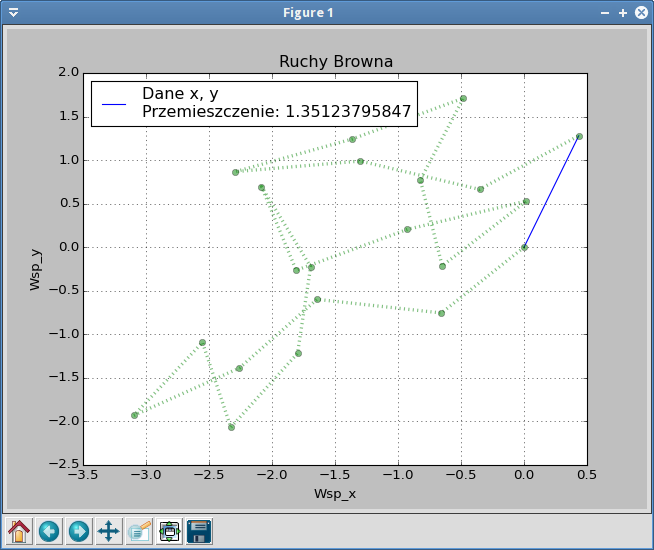
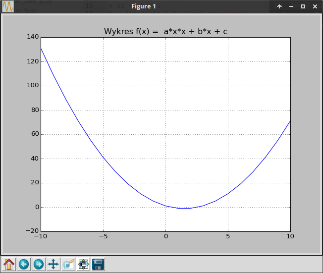

.. _pylab:

Matplotlib
################

Jedną z potężniejszych bibliotek Pythona jest `matplotlib <http://pl.wikipedia.org/wiki/Matplotlib>`_,
która służy do tworzenia różnego rodzaju wykresów. W tym scenariuszu pokażemy, jak przygotować wykresy funkcji
w dwuwymiarowym układzie współrzędnych.

Środowisko pracy
================

.. note::

    Do kodowania i uruchamiania skryptu możesz użyć dowolnych narzędzi, np. ulubionego edytora kodu i terminala.
    Sugerujemy jednak wykorzystanie środowiska typu **PyCharm** lub innego, ponieważ ułatwiają przygotowania
    i pracę nad projektami w języku Python.

Przed rozpoczęciem pracy przygotuj w wybranym katalogu, np. :file:`matplot` :ref:`wirtualne środowisko Pythona <venv>`
i w aktywnym środowisku zainstaluj pakiet *Matplotlib*:

.. code-block:: bash

    (.venv) ~/matplot$ pip install matplotlib

.. note::

    *Matplotlib* oferuje dwa główne style kodowania:

    - styl jawny, zorientowany obiektowo, w którym po kolei tworzymy wszystkie elementy budujące wykres,
      takie jak *Figure*, *Axes* czy *Axis*,
    - styl niejawny, w którym korzystamy z funkcji interfejsu ``pyplot``.

    Oficjalna dokumentacja sugeruje, aby w bardziej złożonych projektach stosować
    styl jawny. Tak zrobimy w przykładach korzystających z funkcji matematycznych,
    które zaczynać będziemy następującymi importami:

    .. code-block:: python

        import matplotlib.pyplot as plt
        import numpy as np

    W pierwszym wierszu importujemy interfejs ``pyplot`` pod skróconą nazwą (aliasem) ``plt``.
    W drugim importujemy towarzyszącą modułowi ``matplotlib`` bibliotekę ``numpy`` pod aliasem ``np``.
    Dostarcza ona wielu narzędzi wspomagających obliczenia naukowe.

Anatomia wykresu
****************

Zacznijmy od prostego przykładu, który możemy przetestować w konsoli Pythona:

.. raw:: html

    
<i>Terminal</i>. Kod nr 

.. code-block:: python

    import matplotlib.pyplot as plt
    x = [1, 2, 3]
    y = [4, 6, 5]
    plt.plot(x, y)
    plt.show()

Tworzenie wykresów punktowych jest proste. Postępujemy według schematu:

- przygotowujemy dwie listy wartości: argumentów ``x`` i wartości ``y``, odpowiadające sobie wartości
  zinterpretowane zostaną jako współrzędne punktów w 2-wymiarowym układzie współrzędnych,
- obie listy przekazujemy jako argumenty metody ``plot()``,
- wyświetlamy wykres za pomocą metody ``show()``.

W powyższym przykładzie zastosowaliśmy niejawny styl kodowania wystarczający do prostych pojedynczych wykresów.
W jawnym stylu kodowania dwie ostatnie linie zastąpimy poniższym kodem:

.. code-block:: python

    fig, ax = plt.subplots()
    ax.plot(x, y)
    plt.show()

Żeby lepiej go rozumieć, musimy poznać składniki wykresu. Twórcy pakietu przyjęli następującą terminologię:

- **Figure** – nadrzędny pojemnik zawierający wszystkie inne składniki, w praktyce będzie to okno zawierające wykres(y),
- **Axes** – obiekt reprezentujący pojedynczy wykres i jego elementy, wykresów w figurze może być wiele.

Najprostszym sposobem stworzenia omówionych obiektów jest użycie metody ``subplots()``: ``fig, ax = plt.subplots()``.

Figura (*Figure*) zawiera wykres(y). Wykres (*Axes*) może z kolei zawierać różne elementy
pokazane na poniższym diagramie:

.. figure:: img/anatomy.webp

- **Title** – tytuł ustawiany za pomocą: ``plt.title()`` lub ``ax.set_title()``,
- **Legend** – legenda wykresu może być dodana za pomocą ``plt.legend()`` lub
  ``ax.legend()``,
- **Axis** – obiekty reprezentujące osie X, Y (2D) i ewentualnie Z (3D), zawierają:

    - skalę osi (ang. *tick*) – znaczniki skali, główne (ang. *major*) i poboczne (ang. *minor*),
    - etykiety osi (ang. *label*) – możemy je ustawić za pomocą ``plt.xlabel()`` lub metod wykresu:
      ``ax.set_xlabel()``, ``ax.set_ylabel()``,

- **Markers** – pojedyncze punkty, które można dodać za pomocą ``ax.scatter()``,
- **Line** – linie generowane przez metodę ``plot()``,
- **Grid** – siatka wykresu, którą można dodać za pomoca metody ``grid()``.

Funkcja liniowa
***************

**Zadania**: Wykonaj wykres funkcji ``f(x) = a*x + b``.

**Dane**:

- współczynnik kierunkowy ``a`` i wyraz wolny ``b``, liczby całkowite,
- lista argumentów ``x`` zawierająca liczby całkowite z zakresu ``<-10;10>``.

W pliku :file:`matplot01.py` umieszczamy poniższy kod:

.. raw:: html

    
Kod nr 

.. highlight:: python
.. literalinclude:: matplot01.py
    :linenos:

Na początku nadajemy wartości parametrom ``a`` i ``b``. Następnie postępujemy wg omówionego schematu.
Generujemy listę argumentów ``x`` za pomocą funkcji ``range()``.
W pętli ``for`` dla każdego argumentu obliczamy wartość funkcji i dodajemy do listy ``y``.

Następnie stosujemy jawny styl kodowania, tzn. używamy metody ``subplots()``, która obiekty
reprezentujące figurę (``fig``, okno) i wykres (``ax``). Serie danych dodajemy za pomocą metody
``plot()``, która wizualizuje je domyślnie przy użyciu linii ciągłych. Dodajemy tytuł (``set_title()``)
i siatkę (``ax.grid()``). Na koniec wyświetlamy wykres (``plt.show()``).

Ćwiczenie 1
============

Zmodyfikuj powyższy kod tak, aby współczynniki ``a`` i ``b`` oraz zakres argumentów ``x``
pobierane były z klawiatury. Sprawdź poprawność działania programu.

Ćwiczenie 2
============

W konsoli Pythona wydajemy następujące polecenia:

.. raw:: html

    
<i>Terminal</i>. Kod nr 

.. code-block:: python

    >>> a = 2
    >>> x = range(11)
    >>> for i in x:
    ...   print(a + i)
    >>> y = [a + i for i in x]
    >>> print(y)

Powyższy przykład wykorzystuje tzw. :term:`wyrażenie listowe`, które zwięźle
zastępuje pętlę i zwraca listę wartości. Jego działanie należy rozumieć następująco:
dla każdej wartości ``i`` (nazwa zmiennej dowolna) odczytywanej w pętli z listy ``x`` (``for i in x``)
wylicz wyrażenie ``a + i`` i umieść w liście ``y``.

Użyjmy wyrażenia listowego w naszym programie:

.. raw:: html

    
Kod nr 

.. highlight:: python
.. literalinclude:: matplot02.py
    :linenos:
    :emphasize-lines: 10
    :lineno-start: 1

Dwie funkcje
*************

**Zadanie**: wykonaj wykres podanych funkcji:

    * *f(x) = x/(-3) + a* dla *x* <= 0,
    * *f(x) = x\*x/3* dla *x* >= 0,

– gdzie *x* = <-10;10> z krokiem 0.5.

**Dane:**

- współczynnik ``a`` pobrany z klawiatury, liczba całkowita.
- lista argumentów ``x`` zawierająca liczby z zakresu ``<-10;10>`` z krokiem 0.5.

Wykonanie zadania wymaga na początku wygenerowania listy argumentów.
Do tego celu możemy wykorzystać funkcję ``arange()``. Listę wartości funkcji
wyliczymy za pomocą wyrażenia listowego.

Ćwiczenie 3
============

Zanim zrealizujemy zadanie przećwiczmy w konsoli Pythona następujący kod:

.. raw:: html

    
<i>Terminal</i>. Kod nr 

.. code-block:: python

    >>> import numpy as np
    >>> x = np.arange(-10, 10.5, 0.5)
    >>> print(x)
    >>> len(x)
    >>> a = 3
    >>> y1 = [i / -3 + a for i in x if i <= 0]
    >>> len(y1)

Funkcja ``arange()`` znajduje się w module ``numpy`` i zwraca listę wartości zmiennoprzecinkowych
(zob. :term:`typy danych`) z zakresu określonego przez dwa pierwsze argumenty i z krokiem
wyznaczonym przez argument trzeci. Do obliczenia wartości pierwszej funkcji ``x / -3``
wykorzystujemy wyrażenie listowe uzupełnione o instrukcję warunkową ``if i <= 0``, która
ogranicza zbiór argumentów, dla których obliczana jest wartość funkcji.

.. warning::

    Nie zamykaj tej sesji konsoli, będziemy z niej korzystać w kolejnych ćwiczeniach.

W pliku :file:`matplot03.py` umieszczamy poniższy kod:

.. raw:: html

    
Kod nr 

.. highlight:: python
.. literalinclude:: matplot03.py
    :linenos:

Uruchom program. Nie działa, dostajemy komunikat:
``ValueError: x and y must have same first dimension, but have shapes (41,) and (21,)``,
który oznacza, że listy ``x`` i ``y1`` powinny mieć tyle samo elementów, ale nie mają.
Przyczyną tego jest fakt, że w powyższym kodzie wyliczyliśmy 21 wartości funkcji
(dla argumentów mniejszych lub równych zero), a wszystkich argumentów jest 41.

Błąd można usunąć poprzez zawężenie listy argumentów do 21 elementów.

Ćwiczenie 4
============

Wróćmy do konsoli Pythona z wprowadzonym i wykonanym wcześniejszym kodem:

.. raw:: html

    
<i>Terminal</i>. Kod nr 

.. code-block:: python

    >>> x
    >>> x[0]
    >>> x[0:22]
    >>> x[:22]
    >>> x[:len(y1)]
    >>> len(x[:len(y1)])

Podane wyżej przykłady ilustrują działanie **notacji wycinania** (ang. *slice*),
której obecność rozpoznajemy po znaku dwukropka. Pozwala ona odczytywać z listy tylko
wskazany przez indeksy zakres elementów. W naszym przypadku wszystkie podane przykłady,
tzn. ``0:22``, ``:22``, ``:len(y1)`` – wskazują pierwsze 21 elementów listy.
Jeżeli brak indeksu początkowego przed dwukropkiem, domyślną wartością jest 0 (zero),
indeks po dwukropku oznacza z kolei element końcowy, przy czym nie wchodzi on do odczytywanego zakresu.

Zmieniamy więc wywołanie funkcji ``plot()`` w naszym skrypcie:

.. raw:: html

    
Kod nr 

.. code-block:: python

    ax.plot(x[:len(y1)], y1)

Uruchom i przetestuj działanie programu.

Ćwiczenie 5
===========

Udało się nam zrealizować pierwszą część zadania, tzn. uzyskać wykres jednej funkcji.
Zanim spróbujesz dokończyć zadanie, wróćmy jeszcze raz do konsoli Pythona
z wprowadzonym i wykonanym wcześniejszym kodem:

.. raw:: html

    
<i>Terminal</i>. Kod nr 

.. code-block:: python

    >>> len(x)
    >>> x[-10]
    >>> x[-10:]
    >>> len(y2)
    >>> x[-len(y2):]

Jak widać, w **notacji wycinania** możemy używać indeksów ujemnych wskazujących
elementy od końca listy. Jeżeli taki indeks umieścimy jako pierwszy przed
dwukropkiem, czyli separatorem przedziału, dostaniemy resztę elementów listy.

Na koniec musimy więc zmodyfikować funkcję ``plot()``:

.. raw:: html

    
Kod nr 

.. code-block:: python

    pylab.plot(x[:len(y1)], y1, x[-len(y2):], y2)

Ćwiczenie 6
============

Spróbuj dziedziny wartości *x* dla funkcji *y1* i *y2* wyznaczyć nie za pomocą
notacji wycinkowej, ale przy użyciu wyrażeń listowych, których wynik przypisz
do zmiennych *x1* i *x2*. Użyj ich jako argumentów funkcji ``plot()`` i przetestuj
program.

Ruchy Browna
***************

Napiszemy program, który symuluje `ruchy Browna <https://pl.wikipedia.org/wiki/Ruchy_Browna>`_. Jak wiadomo są to chaotyczne ruchy cząsteczek, które będziemy mogli zwizualizować w płaszczyźnie dwuwymiarowej.
Na początku przyjmujemy następujące założenia:

* cząsteczka, której ruch będziemy śledzić, znajduje się w początku układu współrzędnych (0, 0);
* w każdym ruchu cząsteczka przemieszcza się o stały wektor o wartości 1;
* kierunek ruchu wyznaczać będziemy losując kąt z zakresu <0; 2Pi>;
* współrzędne kolejnego położenia cząsteczki wyliczać będziemy ze wzorów:

.. math::

    x_n = x_{n-1} + r * cos(\phi)

    y_n = y_{n-1} + r * sin(\phi)

– gdzie: *r* – długość jednego kroku, :math:`\phi` – kąt wskazujący kierunek ruchu w odniesieniu do osi *OX*.

* końcowy wektor przesunięcia obliczymy ze wzoru: :math:`|s| = \sqrt{(x^2 + y^2)}`

Zacznijmy od wyliczenia współrzędnych opisujących ruch cząsteczki. Do pustego pliku o nazwie :file:`rbrowna.py` wpisujemy:

.. raw:: html

    
Kod nr 

.. highlight:: python
.. literalinclude:: rbrowna01.py
    :linenos:

Funkcje trygonometryczne zawarte w module ``math`` wymagają kąta podanego w radianach,
dlatego wylosowany kąt po zamianie na liczbę zmiennoprzecinkową mnożymy przez wyrażenie
``math.pi / 180``. Uruchom i przetestuj kod.

Ćwiczenie 6
============

Do przygotowania wykresu ilustrującego ruch cząsteczki generowane współrzędne musimy
zapisać w listach. Wstaw w odpowiednich miejscach pliku poniższe instrukcje:

.. raw:: html

    
Kod nr 

.. code-block:: python

    lx = [0]
    ly = [0]

    lx.append(x)
    ly.append(y)

Na końcu skryptu dopisz instrukcje wyliczającą końcowy wektor przesunięcia
(:math:`|s| = \sqrt{(x^2 + y^2)}`) i drukującą go na ekranie. Przetestuj program.

Pozostaje dopisanie importu biblioteki *matplotlib* oraz instrukcji generujących wykres.
Poniższy kod ilustruje również użycie opcji wzbogacających wykres o legendę, etykiety czy tytuł.

.. raw:: html

    
Kod nr 

.. highlight:: python
.. literalinclude:: rbrowna03.py
    :linenos:
    :emphasize-lines: 6, 28-34
    :lineno-start: 1
    :lines: 1-

Warto zwrócić uwagę na dodatkowe opcje formatujące wykres w poleceniu
``p.plot(lx, ly, "o:", color="green", linewidth=2, alpha=0.5)``.
Trzeci parametr określa styl linii, możesz sprawdzić inne wartości, np:
``r:.``, ``r:+``, ``r.``, ``r+``. Można też określać kolor (``color``),
grubość linii (``linewidth``) i przezroczystość (``alpha``). Poeksperymentuj.

Ćwiczenie 7
============

Spróbuj uzupełnić kod tak, aby na wykresie zaznaczyć prostą linią w kolorze niebieskim wektor przesunięcia.
Efekt końcowy może wyglądać następująco:

Zadania dodatkowe
*****************

Przygotuj wykres funkcji kwadratowej:
*f(x) = a*x^2 + b*x + c*, gdzie *x* = <-10;10> z krokiem 1, przyjmij następujące
wartości współczynników: *a = 1, b = -3, c = 1*.

Uzyskany wykres powinien wyglądać następująco:

Źródła
*******************

* :download:`pylab.zip <pylab.zip>`
