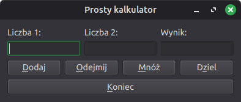
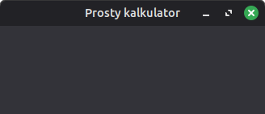
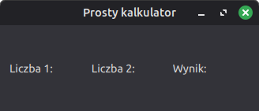
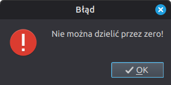

.. _kalkulator-qt6:

Kalkulator
###########################

.. highlight:: python

Prosta 1-okienkowa aplikacja ilustrująca podstawy tworzenia interfejsu graficznego
i obsługi działań użytkownika za pomocą Pythona 3 i PyQt6.
Przykład wprowadza również podstawy `programowania obiektowego <https://pl.wikipedia.org/wiki/Programowanie_obiektowe>`_
(ang. Object Oriented Programing).

Bibliotekę Pyqt6 instalujemy w :ref:`środowisku wirtualnym Pythona <venv>` za pomocą polecenia:

.. code-block:: bash

    (.venv) pip install pyqt6

Pokaż okno
***********

Zaczynamy od utworzenia pliku o nazwie :file:`kalkulator.py` i wstawiamy do niego poniższy kod:

.. raw:: html

    
Kod nr 

.. highlight:: python
.. literalinclude:: kalkulator01.py
    :linenos:

Podstawą naszego programu będzie moduł ``PyQt6.QtWidgets``, z którego importujemy
klasy ``QApplication`` – obsługa aplikacji, i ``QWidget`` – podstawową klasę wszystkich elementów interfejsu graficznego.

Wygląd okna naszej aplikacji definiować będziemy za pomocą klasy ``Kalkulator``
dziedziczącej (zob. :term:`dziedziczenie`) właściwości i metody z klasy ``QWidget``.
Konstruktor naszej klasy na początku wywołuje :term:`konstruktor` klasy bazowej: ``super(self).__init__(parent)``.
Następnie wywołujemy metodę ``interfejs()``, w której tworzyć będziemy :term:`GUI` naszej aplikacji.
Ustawiamy właściwości okna aplikacji i jego zachowanie:

* ``self.resize(300, 100)`` – szerokość i wysokość okna;
* ``setWindowTitle("Prosty kalkulator")``) – tytuł okna;
* ``self.show()`` – wyświetlenie okna na ekranie.

.. note::

    Słowo ``self`` to konwencjonalna nazwa używana wtedy, kiedy odnosimy się do właściwości lub metod obiektu
    utworzonego jako instancja jakiejś klasy. Słowo to zawsze występuje jako pierwszy parametr metod definiowanych
    jako funkcje klasy. Zob. `What is self? <https://docs.python.org/3/faq/programming.html#what-is-self>`_

Instrukcja ``app = QApplication(sys.argv)`` – tworzy obiekt aplikacji.
Argument ``sys.argv`` wskazuje, że aplikacja może otrzymywać parametry z linii poleceń.
W instrukcji ``okno = Kalkulator()`` tworzymy okno aplikacji, czyli obiekt będący instancją klasy ``Kalkulator``.

Na koniec uruchamiamy **główną pętlę programu** (``app.exec()``), która rozpoczyna obsługę
zdarzeń (zob. :term:`główna pętla programu`). Zdarzenia (np. kliknięcia) generowane są przez
system lub użytkownika i przekazywane są do aplikacji, która może je obsługiwać.

Poprawne zakończenie aplikacji zapewniające zwrócenie informacji o jej stanie do systemu,
co zapewnia wywołanie ``sys.exit()``.

Przetestujmy kod. Program uruchamiamy poleceniem wydanym w terminalu z aktywnym środowiskiem wirtualnym
w katalogu ze skryptem:

.. code-block:: bash

    ~$ python3 kalkulator.py

Etykiety
**********

Puste okno być może nie robi wrażenia, zobaczymy więc, jak tworzyć widżety (zob. :term:`widżet`).
Najprostszym przykładem będą etykiety.

Dodajemy wymagane importy i rozbudowujemy metodę ``interfejs()``:

.. raw:: html

    
Kod nr 

.. highlight:: python
.. literalinclude:: kalkulator02.py
    :linenos:
    :lineno-start: 1
    :lines: 1-3

.. raw:: html

    
Kod nr 

.. highlight:: python
.. literalinclude:: kalkulator02.py
    :linenos:
    :lineno-start: 12
    :lines: 12-31

Dodawanie widżetów zaczynamy od utworzenia obiektów na podstawie odpowiedniej klasy,
w tym wypadku `QtLabel <http://doc.qt.io/qt-6/qlabel.html>`_. Do jej konstruktora
przekazujemy tekst, który ma się wyświetlać na etykiecie, np.: ``etykieta_1 = QLabel("Liczba 1:", self)``.
Opcjonalny drugi argument, omówione wyżej słowo ``self``, wskazuje obiekt rodzica, w tym przypadku okno,
w którym ją umieszczamy.

.. note::

    Tworzenie widżetów z argumentem ``self`` umożliwia dostęp do ich właściwości
    w zasięgu całej klasy, czyli w innych metodach.

Do rozmieszczania widżetów w oknie służą tzw. układy (ang. *layout*). Tworzymy więc
układ tabelaryczny: ``uklad_t = QGridLayout()`` – i dodajemy do niego obiekty (etykiety) za
pomocą metody ``addWidget()``. Jako argumenty podajemy nazwę obiektu oraz numer wiersza i kolumny
definiujących komórkę, w której znaleźć się ma obiekt. Numeracja wierszy i kolumn zaczyna się od zera.
Zdefiniowany układ przypisujemy do okna nadrzędnego: ``self.setLayout(uklad_t)``.

Na koniec używamy metody ``setGeometry()`` do określenia położenia okna aplikacji
(początek układu jest w lewym górnym rogu ekranu) i jego rozmiaru (szerokość, wysokość).
Dodajemy również ikonę pokazywaną w pasku tytułowym lub w miniaturze na pasku zadań:
``self.setWindowIcon(QIcon('kalkulator.png'))``.

.. note::

    Plik graficzny z ikoną musimy :download:`pobrać <kalkulator.png>` i umieścić w katalogu
    ze skryptem :file:`kalkulator.py`.

Przetestuj wprowadzone zmiany.

Pola edycyjne i przyciski
**************************

Dodamy teraz pozostałe widżety tworzące graficzny interfejs naszej aplikacji,
czyli pola edycyjne (zob. `QLineEdit <http://doc.qt.io/qt-6/qlineedit.html>`_)
i przyciski (zob. `QPushButton <http://doc.qt.io/qt-6/qpushbutton.html>`_).
Jak zwykle zaczynamy od zaimportowania potrzebnych klas:

.. raw:: html

    
Kod nr 

.. highlight:: python
.. literalinclude:: kalkulator03.py
    :linenos:
    :lineno-start: 4
    :lines: 4

Następnie przed instrukcją ``self.setLayout(uklad_t)`` wstawiamy następujący kod:

.. raw:: html

    
Kod nr 

.. highlight:: python
.. literalinclude:: kalkulator03.py
    :linenos:
    :lineno-start: 27
    :lines: 27-57

Jak widać, dodawanie widżetów polega zazwyczaj na:

* **utworzeniu obiektu** na podstawie klasy opisującej potrzebny element interfejsu,
  np. ``liczba_1 = QLineEdit(self)`` lub ``prz_dodaj = QPushButton("&Dodaj", self)``;
* **ustawieniu właściwości** obiektu, np. ``self.wynik.readonly = True`` umożliwia tylko odczyt tekstu pola,
  ``self.wynik.setToolTip('Wpisz <b>liczby</b> i wybierz działanie...')`` – ustawia podpowiedź,
  a ``prz_koniec.resize(prz_koniec.sizeHint())`` – ustawia sugerowany rozmiar obiektu;
* **przypisaniu obiektu do układu** – ponieważ mamy 4 przyciski działań, tworzymy układ horyzontalny
  (zob. `QHBoxLayout <http://doc.qt.io/qt-6/qhboxlayout.html>`_): ``uklad_h = QHBoxLayout()``,
  dodajemy do niego przyciski za pomocą metody ``addWidget()`` i dodajemy go do układu tabelarycznego:
  ``uklad_t.addLayout(uklad_h, 2, 0, 1, 3)``.
  Argumenty liczbowe w metodzie ``addLayout()`` oznaczają odpowiednio wiersz i kolumnę,
  tj. komórkę, do której wstawiamy obiekt, oraz liczbę wierszy i kolumn, które chcemy wykorzystać.

Znak ``&`` przed jakąś literą w opisie przycisków tworzy skrót klawiaturowy dostępny po naciśnięciu :kbd:`ALT + litera`.

Po uruchomieniu programu powinniśmy zobaczyć okno podobne do poniższego:

Zamykanie aplikacji
*******************

Mamy okno z polami edycyjnymi i przyciskami, ale kontrolki te na nic nie reagują.
Nauczymy się więc obsługiwać poszczególne zdarzenia. Zacznijmy od zamykania aplikacji.

Na początku zaimportujmy klasę `QMessageBox <http://doc.qt.io/qt-6/qmessagebox.html>`_
pozwalającą tworzyć komunikaty oraz przestrzeń nazw `Qt <http://doc.qt.io/qt-5/qt.html>`_
zawierającą różne stałe:

.. raw:: html

    
Kod nr 

.. highlight:: python
.. literalinclude:: kalkulator04.py
    :linenos:
    :lineno-start: 5
    :lines: 5-6

Dalej po instrukcji ``self.setLayout(ukladT)`` w metodzie ``interfejs()`` dopisujemy:

.. raw:: html

    
Kod nr 

.. highlight:: python
.. literalinclude:: kalkulator04.py
    :linenos:
    :lineno-start: 60
    :lines: 60

Powyższa instrukcja zdarzenie kliknięcia przycisku (``clicked``) wiąże (``conect()``)
z metodą ``koniec()``, którą musimy dopisać na końcu klasy ``Kalkulator()``:

.. raw:: html

    
Kod nr 

.. highlight:: python
.. literalinclude:: kalkulator04.py
    :linenos:
    :lineno-start: 67
    :lines: 67-68

Funkcja ``koniec()``, obsługująca wydarzenie (ang. *event*) kliknięcia przycisku, tj.
wywołuje metodę ``close()`` okna głównego, co powoduje jego zamknięcie.

.. note::

    Omówiony fragment kodu ilustruje mechanizm zwany :term:`sygnały i sloty` (ang. *signals & slots*).
    Zapewnia on komunikację między obiektami. Sygnał powstaje w momencie wystąpienia jakiegoś wydarzenia,
    np. kliknięcia. Slot może z kolei być wbudowaną w Qt funkcją lub Pythonowym wywołaniem (ang. *callable*),
    np. klasą lub metodą.

Zamknięcie okna również jest rodzajem wydarzenia (`QCloseEvent <http://doc.qt.io/qt-6/qcloseevent.html>`_),
które można przechwycić. Np. po to, aby zapobiec utracie niezapisanych danych.
Do klasy ``Kalkulator()`` dopiszmy kolejna metodę:

.. raw:: html

    
Kod nr 

.. highlight:: python
.. literalinclude:: kalkulator04.py
    :linenos:
    :lineno-start: 70
    :lines: 81

W nadpisanej metodzie `closeEvent() <http://doc.qt.io/qt-6/qwidget.html#closeEvent>`_
wyświetlamy użytkownikowi prośbę o potwierdzenie zamknięcia
za pomocą metody ``question()`` (ang. pytanie) klasy ``QMessageBox``.
Do konstruktora metody przekazujemy:

* obiekt rodzica – ``self`` oznacza okno główne;
* tytuł kona dialogowego;
* komunikat dla użytkownika, np. pytanie;
* kombinację standardowych przycisków, np. ``QMessageBox.Yes | QMessageBox.No``;
* przycisk domyślny – ``QMessageBox.No``.

Udzielona odpowiedź ``odp``, np. kliknięcie przycisku "Tak", decyduje o zezwoleniu
na obsłużenie wydarzenia ``event.accept()`` lub odrzuceniu go ``event.ignore()``.

Może wygodnie byłoby zamykać aplikację naciśnięciem klawisza :kbd:`ESC`?
Dopiszmy jeszcze jedną funkcję:

.. raw:: html

    
Kod nr 

.. highlight:: python
.. literalinclude:: kalkulator04.py
    :linenos:
    :lineno-start: 86
    :lines: 86-88

Podobnie jak w przypadku ``closeEvent()`` tworzymy własną wersję funkcji
`keyPressEvent <http://doc.qt.io/qt-5/qwidget.html#keyPressEvent>`_ obsługującej
naciśnięcia klawiszy `QKeyEvent <http://doc.qt.io/qt-5/qkeyevent.html>`_.
Sprawdzamy naciśnięty klawisz ``if e.key() == Qt.Key_Escape:`` i zamykamy okno.

Przetestuj działanie aplikacji.

Działania
*********

Kalkulator powinien liczyć. Zaczniemy od dodawania, ale na początku wszystkie
sygnały wygenerowane przez przyciski działań połączymy z jednym slotem.
Pod instrukcją ``koniecBtn.clicked.connect(self.koniec)`` dodajemy:

.. raw:: html

    
Kod nr 

.. highlight:: python
.. literalinclude:: kalkulator05.py
    :linenos:
    :lineno-start: 65
    :lines: 65-68

Następnie zaczynamy implementację funkcji ``dzialanie()``. Na końcu klasy ``Kalkulator()`` dodajemy:

.. raw:: html

    
Kod nr 

.. highlight:: python
.. literalinclude:: kalkulator05.py
    :linenos:
    :lineno-start: 94
    :lines: 94-111

Ponieważ jedna funkcja ma obsłużyć cztery sygnały, musimy znać źródło sygnału (ang. *source*),
czyli nadawcę (ang. *sender*): ``nadawca = self.sender()``.
Dalej rozpoczynamy blok ``try: except:`` – użytkownik może wprowadzić błędne dane,
tj. pusty ciąg znaków lub ciąg, którego nie da się przekształcić na liczbę zmiennoprzecinkową (``float()``).
W przypadku wyjątku, wyświetlamy ostrzeżenie o błędnych danych: ``QMessageBox.warning()``

Jeżeli dane są liczbami, sprawdzamy nadawcę (``if nadawca.text() == "&Dodaj":``)
i jeżeli jest to przycisk dodawania, obliczamy sumę ``wynik = liczba1 + liczba2``.
Na koniec wyświetlamy ją po zamianie na tekst (``str()``) w polu tekstowym za pomocą
metody ``setText()``: ``self.wynikEdt.setText(str(wynik))``.

Sprawdź działanie programu.

Dopiszemy obsługę pozostałych działań. Instrukcję warunkową w funkcji ``dzialanie()``
rozbudowujemy następująco:

.. raw:: html

    
Kod nr 

.. highlight:: python
.. literalinclude:: kalkulator06.py
    :linenos:
    :lineno-start: 103
    :lines: 103-115

Na uwagę zasługuje tylko dzielenie. Po pierwsze określamy dokładność dzielenia do 9
miejsc po przecinku ``round(liczba1 / liczba2, 9)``. Po drugie zabezpieczamy się
przed dzieleniem przez zero. Znów wykorzystujemy konstrukcję ``try: except:``,
w której przechwytujemy wyjątek ``ZeroDivisionError`` i wyświetlamy odpowiednie ostrzeżenie.

Pozostaje przetestować aplikację.

.. tip::

    Jeżeli po zaimplementowaniu działań, aplikacja po uruchomieniu nie aktywuje kursora
    w pierwszym polu edycyjnym, należy tuż przed ustawianiem właściwości okna głównego
    (``self.setGeometry()``) umieścić wywołanie ``self.liczba1Edt.setFocus()``,
    które ustawia focus na wybranym elemencie.

Materiały
***************

1. Strona główna `dokumentacji Qt5 <http://doc.qt.io/qt-5/>`_
2. `Lista klas Qt5 <http://doc.qt.io/qt-5/classes.html>`_
3. `PyQt5 Reference Guide <http://pyqt.sourceforge.net/Docs/PyQt5/>`_
4. `Przykłady PyQt5 <https://github.com/baoboa/pyqt5/tree/master/examples>`_
5. `Signals and slots <http://doc.qt.io/qt-5/signalsandslots.html>`_
6. `Kody klawiszy <http://doc.qt.io/qt-5/qt.html#Key-enum>`_
