.. _czat1:

Czat 1
######

.. highlight:: python

Zastosowanie frameworka Django do stworzenia aplikacji internetowej
"Czat" – prostego czata, w którym zarejestrowani użytkownicy będą mogli wymieniać się
krótkimi wiadomościami.

.. attention::

    **Wymagane oprogramowanie**:

      * Środowisko wirtualne Pythona v. 3.x
      * Django v. 5.1.x
      * Opcjonalnie: interpreter bazy SQLite3

.. contents::
    :depth: 1
    :local:

.. _czat1-env:

Środowisko pracy
================

.. tip::

    Do tworzenia aplikacji z użyciem Django możesz użyć dowolnych narzędzi, np. terminala i ulubionego edytora kodu.
    Sugerujemy jednak wykorzystanie środowiska **PyCharm**, ponieważ w dużym stopniu ułatwia
    pracę nad projektami w języku Python.

Przed rozpoczęciem pracy przygotuj w katalogu :file:`projekty_django`` :ref:`wirtualne środowisko Pythona <venv>`
i w aktywnym środowisku zainstaluj pakiet *Django*:

.. raw:: html

    
Terminal nr 

.. code-block:: bash

    (.venv) ~/projekty_django$ pip install django==5.1.6

.. warning::

    Za każdym razem przed rozpoczęciem pracy nad projektem upewnij się, że środowisko wirtualne zostało aktywowane.

Projekt i aplikacja
===================

Tworzymy nowy projekt o nazwie **czat1**. W terminalu w katalogu :file:`projekty_django` wydajemy polecenia:

.. raw:: html

    
Terminal nr 

.. code-block:: bash

    (.venv) ~/projekty_django$ django-admin startproject czat1
    (.venv) ~/projekty_django$ cd czat1
    (.venv) ~/projekty_django/czat1$ python manage.py migrate

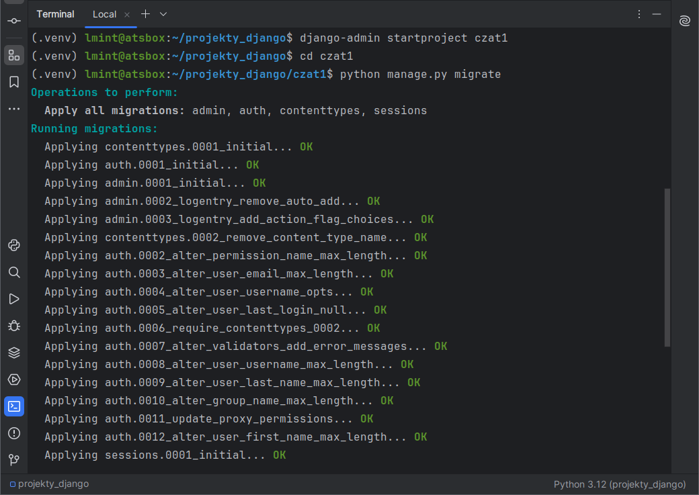

Polecenie ``django-admin.py startproject`` utworzy katalog :file:`czat1` – nazwa tego katalogu może być zmieniana.
Wewnątrz znajdziemy **katalog projektu** o takiej samej nazwie – :file:`czat1` – oraz
skrypt :file:`manage.py`, który służy do zarządzania projektem.

Katalog projektu :file:`projekty_django/czat1/czat1` będzie zawierał widoczne poniżej pliki:

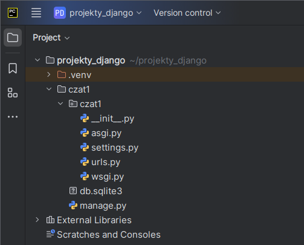

Polecenie ``manage.py migrate`` tworzy domyślną bazę danych SQLite3 zapisaną w pliku :file:`db.sqlite3`.
W bazie tworzone są tabele do przechowywania danych aplikacji domyślnie dostarczanych przez Django, m. in.:

- ``admin`` – obsługa panelu administracyjnego,
- ``auth`` – obsługa autentykacji użytkowników,
- ``messages`` – obsługa komunikatów dla użytkownika.

Serwer deweloperski
--------------------

Serwer, który służy do testowania działania aplikacji, uruchamiamy w katalogu zawierającym skrypt :file:`manage.py`
wydając polecenie w terminalu:

.. code-block:: bash

    (.venv) ~/projekty_django/czat1$ python manage.py runserver

.. note::

    W PyCharmie można również skonfigurować uruchamianie serwera. Rozwijamy listę **Current File** z górnego paska narzędzi
    i wybieramy **Edit Configurations**. Następnie klikamy ikonę **plus**, a następnie **Python**.
    W polu "Name" wpisujemy nazwę, np. *Runserver*. W polu "script" klikamy ikonę katalogu i wskazujemy
    położenie skryptu :file:`manage.py`. Pod spodem jako parametr skryptu wpisujemy *runserver*.
    Jako katalog roboczy wskazujemy katalog :file:`projekty_django/czat1`.

    .. figure:: img/pycharm_07.png

    Od tej pory możemy uruchamiać serwer klikając przycisk **Run** na górnym pasku narzędzi lub skrótu :kbd:`SHIFT+F10`.

Łączymy się z serwerem wpisując w przeglądarce adres: ``127.0.0.1:8000``.

.. tip::

    Jeżeli serwer uruchomiliśmy w terminalu, można również kliknąć adres
    ``http://127.0.0.1:8000`` z wciśniętym klawiszem :kbd:`CTRL`,
    aby otworzyć przeglądarkę.

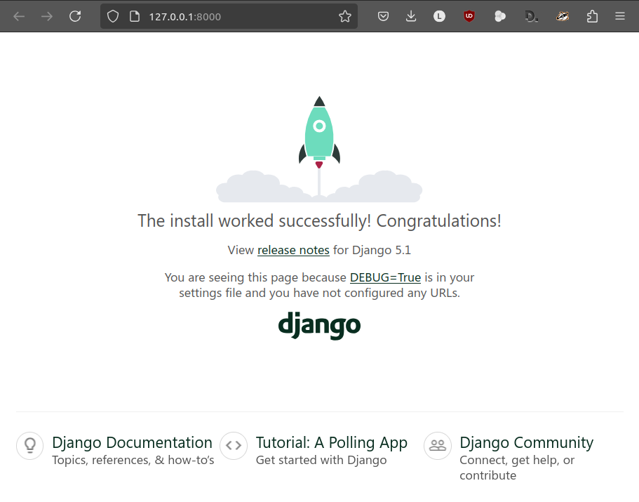

W terminalu możemy obserwować żądania obsługiwane przez serwer.
Serwer zatrzymujemy naciskając w terminalu skrót :kbd:`CTRL+C` lub za pomocą przycisku **Stop** (:kbd:`CTRL+F2`).

.. figure:: img/pycharm_08.png

Aplikacja
---------

W ramach jednego projektu (serwisu internetowego) może działać wiele aplikacji.
Utworzymy teraz aplikację **czat** i zbadamy jej strukturę plików:

.. code-block:: bash

    (.venv) ~/projekty_django/czat1$ python manage.py startapp czat
    (.venv) ~/projekty_django/czat1$ ls -R czat

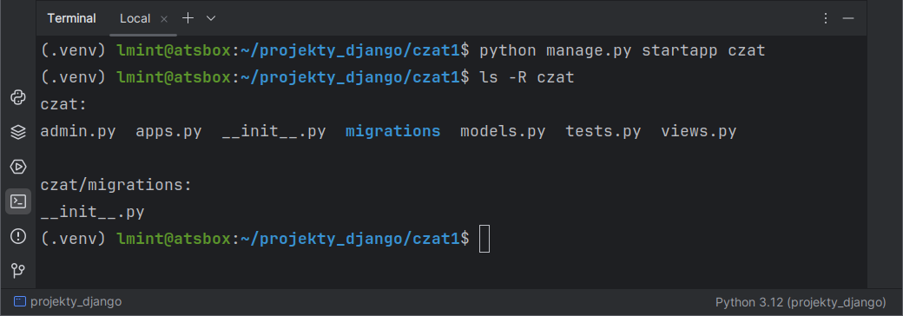

**Katalog aplikacji** :file:`czat1/czat` zawiera:

    - :file:`apps.py` – ustawienia aplikacji;
    - :file:`admin.py` – konfigurację panelu administracyjnego;
    - :file:`models.py` – plik definiujący modele danych przechowywanych w bazie;
    - :file:`views.py` – plik zawierający funkcje lub klasy definiujące tzw. *widoki* (ang. *views*),
      obsługujące żądania klienta przychodzące do serwera.

Ustawienia projektu
-------------------

Ustawienia projektu przechowywane są w pliku :file:`czat1/settings.py`, w którym możemy np.:

- zarejestrować aplikację w projekcie,
- ustawić polską wersję językową,
- zlokalizować datę i czas.

Edytujemy plik :file:`czat1/settings.py` i wprowadzamy:

.. raw:: html

    
Plik <i>settings.py</i>Kod nr 

.. highlight:: python
.. literalinclude:: source/settings.py
    :emphasize-lines: 2, 11, 13

.. note::

    Lista ``INSTALLED_APPS`` zawiera aplikacje zarejestrowane w projekcie, część z nich dostarczana jest przez Django.

Uruchom ponownie serwer deweloperski i sprawdź w przeglądarce, jak wygląda strona powitalna.

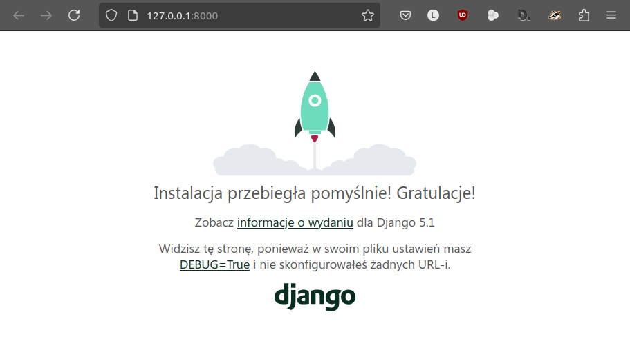

Model danych i migracje
=======================

Budowanie aplikacji w Django nawiązuje do wzorca projektowego :term:`MVC`, czyli
Model-Widok-Kontroler (zob. materiał :ref:`MVC <mvc_wzorzec>`).

Zaczynamy od zdefiniowania **modelu** (zob. :term:`model bazy danych`), czyli klasy, która posłuży do utworzenia tabeli
w bazie danych zawierającej wiadomości. Atrybuty klasy odpowiadają polom tabeli. Instancje (obiekty) tej klasy
reprezentować będą wiadomości utworzone przez użytkowników, czyli rekordy tabeli.
Każda wiadomość będzie zwierała treść, datę dodania oraz identyfikator autora (użytkownika).

.. _model_czat1:

W pliku :file:`czat/models.py` wpisujemy:

.. raw:: html

    
Plik <i>models.py</i>Kod nr 

.. highlight:: python
.. literalinclude:: source/models.py
    :linenos:

Definiując klasę ``Wiadomosc`` podajemy nazwy poszczególnych właściwości (pól)
oraz typy przechowywanych w nich danych.

.. note::

    Typy pól:

        * ``CharField`` – pole znakowe, przechowuje niezbyt długie napisy, np. nazwy;
        * ``DateTimeField`` – pole daty i czasu;
        * ``ForeignKey`` – pole klucza obcego, czyli relacji;
          wymaga nazwy powiązanego modelu jako pierwszego argumentu.

    Właściwości pól:

        * pierwszy argument w definicji pola, np. ``treść wiadomości`` określa przyjazną nazwę używaną np. w formularzach;
        * ``on_delete=models.CASCADE`` – jeżeli klucz obcy, w tym przypadku wskazujący autora, zostanie usunięty, usunięte zostaną również dodane przez niego wiadomości;
        * ``max_length`` – maksymalna długość pola znakowego;
        * ``auto_now_add=True`` – data i czas wstawione zostaną automatycznie.

Podklasa ``Meta`` pozwala określić formy liczby pojedynczej (``verbose_name``) i mnogiej (``verbose_name_plural``)
używane podczas wypisywania obiektów, a także domyślny sposób sortowania wiadomości (``ordering = ['data_pub']``) wg daty dodania.

W metodzie ``__str__()`` decydujemy o tym, co powinno zostać zwrócone, jeżeli będziemy chcieli
wypisać obiekt naszej klasy. W typ przypadku zwracamy treść wiadomości, co będzie przydatne np. w panelu administracyjnym.

Migracje
--------

Operacje wykonywane na bazie danych nazywane są w Django **migracjami**.
Każda :term:`migracja` powiązana jest z aplikacją wchodzącą w skład projektu.
Domyślnie wykonywane są migracje dla aplikacji `admin, auth, contenttypes` oraz `sessions` dostarczanych przez Django.

Po dodaniu lub zmianie modelu należy utworzyć migrację, aby w bazie danych zostały utworzone lub zmodyfikowane tabele,
w których zapisywane są przetwarzane w aplikacji dane. Następnie migrację należy wykonać. W tym celu wydajemy polecenia:

.. raw:: html

    
Terminal nr 

.. code-block:: bash

    (.venv) ~/projekty_django/czat1$ python manage.py makemigrations czat
    (.venv) ~/projekty_django/czat1$ python manage.py migrate

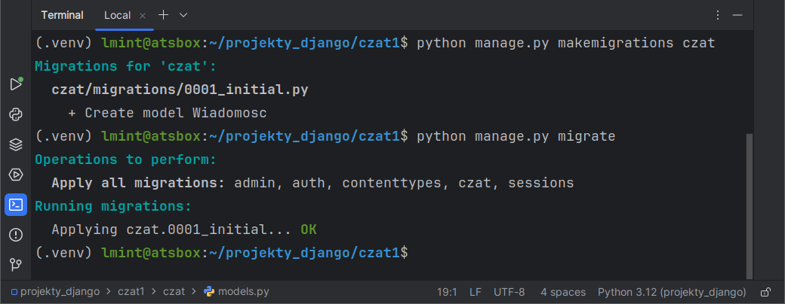

.. note::

    Migracje zapisywane są w podkatalogu :file:`migrations`.

    Domyślnie Django korzysta z bazy SQLite zapisanej w pliku :file:`db.sqlite3`.
    Możemy zobaczyć, co zawiera. W terminalu wydajemy polecenie ``python manage.py dbshell``,
    które otworzy bazę w powłoce ``sqlite3``, o ile będzie zainstalowana w systemie.
    Następnie:

        * ``.tables`` - pokaże listę tabel;
        * ``.schema czat_wiadomosc`` - pokaże instrukcje SQL-a użyte do utworzenia podanej tabeli
        * ``.quit`` - wyjście z interpretera.

    .. figure:: img/sqlite3_tables.png

Panel administracyjny
=====================

Dostarczany przez Django panel administratora pozwala zarządzać użytkownikami
i wprowadzać dane dla zarejestrowanych modeli. W pliku :file:`czat/admin.py` umieszczamy kod:

.. raw:: html

    
Plik <i>admin.py</i>Kod nr 

.. highlight:: python
.. literalinclude:: source/admin.py
    :linenos:

Na początku importujemy zawartość pliku :file:`models.py`, a następnie rejestrujemy w panelu zdefiniowany wcześniej
model: ``admin.site.register(models.Wiadomosc)``.

Ćwiczenia
---------

1) Utwórz **konto administratora**. W terminalu wydaj polecenie:

    .. raw:: html

        
Terminal nr 

    .. code-block:: bash

        (.venv) ~/projekty_django/czat1$ python manage.py createsuperuser

  – na pytanie o nazwę, email i hasło administratora, podajemy: "admin", :kbd:`ENTER`, "zaq1@WSX".

     .. figure:: img/django_superuser.png

2) Uruchom/zrestartuj serwer, w przeglądarce wpisz adres ``127.0.0.1:8000/admin/``
   i zaloguj się na konto administratora.

    .. figure:: img/django_admin_panel.png

3) Dodaj użytkowników "adam" i "ewa" z hasłami "zaq1@WSX".

   Na stronie "Zmień użytkownik", która wyświetli się po kliknięciu przycisku **Zapisz i kontynuuj edycję**,
   zaznacz opcję "W zespole", aby użytkownicy mogli zalogować się do panelu administracyjnego.

    .. figure:: img/django_admin_w_zespole.png

    W sekcji "Uprawnienia użytkownika" zaznacz prawa dodawania (*add*), zmieniania (*change*),
    usuwania (*del*) oraz wyświetlania (*view*) wiadomości (wpisy typu: "Czat | wiadomosc | Can add wiadomosc")
    i przypisz je użytkownikowi naciskając strzałkę w prawo.

    .. figure:: img/django_admin_uprawnienia.png

4) Zaloguj się na utworzone konta. Jako "adam" dodaj dwie przykładowe wiadomości, jako "ewa" – jedną.

    .. figure:: img/django_admin_wiadomosci.png

Strona główna
================

Tworzenie stron dostępnych w serwisie przebiega zazwyczaj według następującego schematu:

1) zdefiniowanie adresu URL, pod którym dostępna będzie strona, i powiązanie go z widokiem,
2) napisanie widoku, tj. funkcji obsługującej adres URL, która obsługuje żądanie i zwraca odpowiedź,
3) dodanie szablonu, w którym umieszczamy dane dostarczane przez widok.

Definicja adresu URL
--------------------

Konfiguracja adresów aplikacji powinna znajdować się w pliku :file:`czat/urls.py`, który trzeba utworzyć.

Tworzymy więc nowy plik :file:`czat/urls.py` i uzupełniamy go kodem:

.. raw:: html

    
Plik <i>urls.py</i>Kod nr 

.. highlight:: python
.. literalinclude:: source/urls_z1.py
    :linenos:

- ``app_name = 'czat'`` – określamy przestrzeń nazw, w której dostępne będą mapowania
  między adresami URL a widokami,
- ``path()`` – funkcja wiąże zdefiniowany adres URL z widokiem,
- ``''`` – pierwszym argumentem funkcji ``path()`` jest ciąg znaków definiujący adres,
  w tym przypadku ciąg pusty ``''`` oznacza domyślny adres aplikacji,
- ``views.index`` – przykładowy widok, czyli nazwa funkcji zdefiniowanej w pliku :file:`czat/views.py`,
- ``name='index'`` – nazwa, która pozwoli na generowanie adresów URL dla linków w kodzie HTML.

Zdefiniowane adresy URL aplikacji musimy włączyć do konfiguracji adresów URL projektu.
W pliku :file:`czat1/urls.py` dopisujemy:

.. raw:: html

    
Plik <i>urls.py</i>Kod nr 

.. highlight:: python
.. literalinclude:: source/urls_p1.py
    :linenos:
    :lineno-start: 16
    :lines: 16-
    :emphasize-lines: 2, 5

- ``include()`` – funkcja pozwala na import (dołączenie) adresów URL podanej aplikacji,
- ``'czat.urls'`` – plik konfiguracyjny adresów URL aplikacji.

Dodanie widoku
--------------

Drugim krokiem podczas dodawania strony jest dodanie widoku (zob. :term:`widok`, :ref:`więcej »»» <mvc_widok>`),
czyli w tym przypadku funkcji ``index()`` w pliku :file:`views.py`:

.. raw:: html

    
Plik <i>views.py</i>Kod nr 

.. highlight:: python
.. literalinclude:: source/views_z1.py
    :linenos:

Każdy widok powinien zwracać do klienta (przeglądarki) obiekt typu ``HttpResponse``.
W najprostszym przypadku może on zawierać tylko tekst, np.: ``return HttpResponse("Witaj w aplikacji Czat!")``.

Ćwiczenie
^^^^^^^^^

Uruchom serwer deweloperski i wejdź na stronę główną, tj. adres URL: ``127.0.0.1:8000/admin/`` –
powinieneś zobaczyć tekst podany jako argument metody ``HttpResponse()``.

Dodanie szablonu
----------------

Typową odpowiedzią na żądanie jest zwrócenie do przeglądarki strony HTML.
Takie zadanie realizujemy za pomocą szablonów, tj. plików HTML, które
umieszczamy w podkatalogu ``templates/nazwa_aplikacji``.

W katalogu aplikacji tworzymy więc katalogi ``templates/czat``, a w nim plik ``index.html``.
Możemy to zrobić za pomocą poleceń wydawanych w terminalu, np.:

.. raw:: html

    
Terminal nr 

.. code-block:: bash

    (.venv) ~/projekty_django/czat1$ mkdir -p czat/templates/czat
    (.venv) ~/projekty_django/czat1$ touch czat/templates/czat/index.html

.. tip::

    Do tworzenie katalogów i pustych plików możemy użyć systemowego menedżera plików lub używanego edytora
    programistycznego.

    Np. w PyCharmie, aby utworzyć wymagane katalogi i pliki klikamy prawym klawiszem katalog aplikacji
    ``czat``, wybieramy **New / File** i wpisujemy ``templates/czat/index.html``.

Do szablonu :file:`templates/czat/index.html` dodajemy kod:

.. raw:: html

    
Plik <i>index.html</i>. Kod nr 

.. highlight:: html
.. literalinclude:: source/index_z2.html
    :linenos:

W pliku :file:`views.py` zmieniamy funkcję ``index()`` tak, aby zwracała utworzony szablon:

.. raw:: html

    
Plik <i>views.py</i>Kod nr 

.. highlight:: python
.. literalinclude:: source/views_z2.py
    :linenos:
    :lineno-start: 4
    :lines: 4-7
    :emphasize-lines: 4

Funkcja ``render()`` jako pierwszy parametr pobiera obiekt typu ``HttpRequest`` zawierający informacje
o żądaniu, jako drugi nazwę szablonu z katalogiem nadrzędnym.

Ćwiczenie
^^^^^^^^^

Uruchom serwer deweloperski i sprawdź w przeglądarce, jak wygląda strona powitalna
– powinna zawierać tekst wpisany w szablonie.

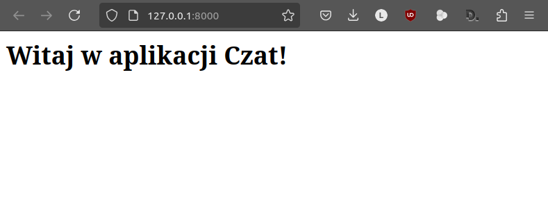

(Wy)logowanie
=============

Chcemy, żeby użytkownicy, którzy nie będą mogli logować się do panelu administracyjnego, również mieli możliwość
dodawania i przeglądania wiadomości. Musimy im więc stworzyć możliwość logowania i wylogowywania się.
Podobnie jak w przypadku strony głównej zaczniemy od zdefiniowania adresów URL, następnie dodamy powiązane z nimi
widoki, a na końcu zmienimy i utworzymy odpowiednie szablony.

Adresy URL
----------

W pliku :file:`czat/urls.py` definiujemy adresy URL:

.. raw:: html

    
Plik <i>urls.py</i>Kod nr 

.. highlight:: python
.. literalinclude:: source/urls.py
    :linenos:
    :lineno-start: 5
    :lines: 5-8
    :emphasize-lines: 3-4

Widoki
------

W pliku :file:`views.py` uzupełniamy importy:

.. raw:: html

    
Plik <i>views.py</i>Kod nr 

.. highlight:: python
.. literalinclude:: source/views.py
    :linenos:
    :lineno-start: 1
    :lines: 1-5

– i dodajemy widoki ``loguj()`` i ``wyloguj()``

.. raw:: html

    
Plik <i>views.py</i>Kod nr 

.. highlight:: python
.. literalinclude:: source/views.py
    :linenos:
    :lineno-start: 13
    :lines: 13-30

**Logowanie** rozpoczyna się od żadania typu :term:`GET` wysłanego na adres ``/loguj``.
Widok ``loguj()`` zwraca wtedy szablon: ``return render(request, 'czat/loguj.html', kontekst)``.
W słowniku ``kontekst`` w kluczu ``form`` przekazujemy do szablonu pusty formularz logowania
– instancję klasy ``AuthenticationForm()``.

Kiedy użytkownik wypełni formularz logowania danymi i kliknie przycisk "Zaloguj", otrzymamy żądanie typu :term:`POST`.
Po wykryciu takiego żądania (``if request.method == 'POST':``) tworzymy instancję
formularza wypełnioną przesłanymi danymi: ``form = AuthenticationForm(request, request.POST)``.
Jeżeli dane są poprawne ``if form.is_valid():``, możemy zalogować użytkownika
za pomocą funkcji ``login(request, form.get_user())``.

Przygotowujemy również informację zwrotną dla użytkownika, wykorzystując system komunikatów:
``messages.success(request, '...')``.
Tak utworzone komunikaty możemy odczytać w każdym szablonie ze zmiennej ``messages``.

Na koniec przekierowujemy użytkownika na stronę główną (``return redirect(reverse('index'))``)
z żądaniem (typu GET) jej wyświetlenia.

**Wylogowanie** polega na użyciu funkcji ``logout(request)`` – wyloguje ona
użytkownika, którego dane zapisane są w przesłanym żądaniu.

.. note::

    Warto zauważyć, że każdy widok otrzymuje jako pierwszy argument obiekt ``request``
    zawierający wszystkie dane przetwarzanego żądania, w tym dane przesłane z formularza
    – ``request.POST``.

Szablony
--------

Tworzymy i uzupełniamy **szablon logowania** :file:`templates/czat/loguj.html` kodem:

.. raw:: html

    
Plik <i>loguj.html</i> Kod nr 

.. highlight:: html
.. literalinclude:: source/loguj_z3.html
    :linenos:

W szablonach wykorzystujemy specjalne **tagi** dwóch rodzajów:

- ```` – pozwalają używać instrukcji sterujących, np. warunkowych lub pętli,
- ``{{ zmienna }}`` – służą stawianiu wartości zmiennych lub wywoływaniu metod obiektów przekazanych do szablonu.

Zastosowanie:

- ```` – instrukcja sprawdza, czy aktualny użytkownik nie jest zalogowany,
- ```` – zabezpieczenie formularza przed atakiem typu csrf,
- ``{{ form.as_p }}`` – wyświetla pola formularza w akapitach,
- ```` – generuje adres URL: w cudzysłowach podajemy przestrzeń nazw naszej aplikacji
  (``app_name``), a później nazwę widoku (``name``) zdefiniowane w pliku :file:`czat/urls.py`,
- ``{{ user.username }}`` – obiekt ``user`` zawiera dane zalogowanego użytkownika, m. in. jego nazwę, którą wyświetlamy.

Uzupełniamy szablon :file:`index.html`. Po znaczniku ``<h1>`` wstawiamy poniższy kod:

.. raw:: html

    
Plik <i>index.html</i> Kod nr 

.. highlight:: html
.. literalinclude:: source/index_z3.html
    :linenos:
    :lineno-start: 7
    :lines: 7-22

- ```` – sprawdzamy, czy mamy jakieś komunikaty zwrotne,
- ```` – w pętli odczytujemy kolejne komunikaty i ...
- ``{{ komunikat|capfirst }}`` – wyświetlamy przy użyciu filtra z dużej litery.

Jeżeli użytkownik został zalogowany, wyświetlamy formularz zawierający tylko przycisk "Wyloguj się".
Po jego kliknięciu zostanie wysłane żądanie typu POST, które zostanie obsłużone przez omawiany
wyżej widok ``wyloguj()``.

Ćwiczenie
^^^^^^^^^

1) Dodaj w panelu administracyjnym użytkownika "ola" z hasłem "zaq1@WSX". Nie zaznaczaj opcji "W zespole".

2) Uruchom serwer deweloperski i zaloguj się pod adresem ``127.0.0.1:8000/loguj`` podając dane utworzonego użytkownika.

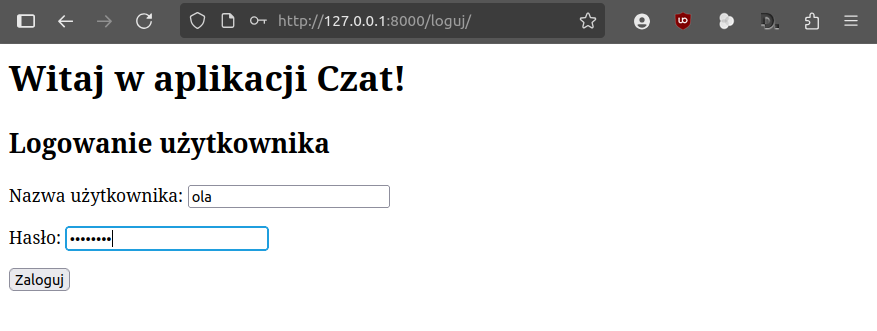

Po zalogowaniu się powinniśmy zobaczyć komunikat potwierdzający oraz przycisk pozwalający na wylogowanie się:

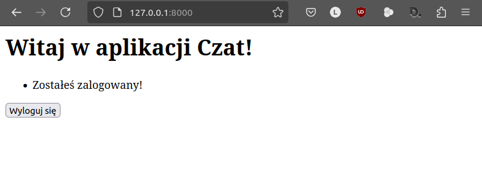

3) Wyloguj się – powinniśmy zobaczyć komunikat o wylogowaniu:

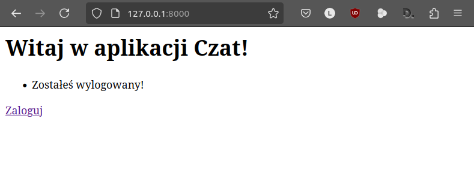

Django ORM
==========

Obsługa żądania typu GET, czyli wyświetlenie wiadomości wymaga odczytu (ang. *Read*) danych z bazy.
W języku SQL używamy do tego klauzuli SELECT. Z kolei żądania typu POST wiążą się z dodawaniem (ang. *Create*),
modyfikacją (ang. *Update*) i usuwaniem (ang. *Delete*) danych w bazie. W języku SQL służą do tego klauzule
INSERT, UPDATE i DELETE.

Django nie wymaga zapytań w języku SQL, chociaż są one obsługiwane. Zamiast tego oferuje niezależny od konkretnej
bazy danych interfejs programistyczny (API) działający jak system :term:`ORM`. Jego podstawowym założeniem jest to,
że każdy model danych odpowiada tablicy w bazie danych, jego instancje (obiekty) reprezentują konkretne rekordy,
a właściwości modelu (obiektu) odpowiadają polom rekordu.

Odczyt danych
-------------

Do odczytu danych (ang. *Read*) używamy managera ``objects``, który zwraca kolekcję obiektów ``QuerySet`` odpowiadającą
klauzuli SQL ``SELECT``. Rekordy w kolekcji można filtrować, co odpowiada klauzulom SQL ``WHERE`` i ``LIMIT``.

Przećwiczmy kilka przykładów. W terminalu w katalogu :file:`projekty_django/czat1` wydajemy polecenie:

.. raw:: html

    
Terminal nr 

.. code-block:: bash

    (.venv) ~/projekty_django/czat1$ python manage.py shell -v 2
    >>> import datetime
    >>> from django.utils import timezone

Uruchomiona zostanie powłoka Pythona w trybie interaktywnym z zaimportowanymi obiektami. Dodatkowo importujemy
moduły potrzebne do operacji na datach i czasie.

Teraz możemy wpisywać po kolei poniższe przykłady kodu:

- ``wiadomosci = Wiadomosc.objects.all()`` – za pomocą metody ``all()`` pobieramy wszystkie obiekty typu ``Wiadomosc``
  z bazy i zapisujemy pod nazwą ``wiadomosci``,
- ``wiadomosci`` – zobaczymy, że ``wiadomosci`` to typ ``QuerySet`` zawierający listę obiektów typu ``Wiadomosc``,
- ``wiadomosci.filter(autor_id=2)`` – metoda ``filter()`` z kolekcji rekordów wyodrębni te,
  których autor ma identyfikator (pole ``id`` obiektu typu ``User``) równy *2*;
- ``wiadomosci.filter(autor__username__exact='adam')`` – z kolekcji rekordów wyodrębniamy te,
  których nazwa autora (właściwość ``username`` obiektu typu ``User``) równa jest 'adam',
- ``wiadomosci.exclude(tekst__contains='Pierwsza')`` – z kolekcji rekordów usunie te,
  które zawierają ciąg znaków *Pierwsza*,
- ``Wiadomosc.objects.filter(data_pub__lte=timezone.now()-datetime.timedelta(days=10))`` –
  zwróci wiadomości opublikowane przed 10 dniami,
- ``w1 = Wiadomosc.objects.get(pk=1)`` – metoda ``get()`` zwraca jeden obiekt, który spełnia podany jako argument warunek,
  w tym przypadku identyfikator obiektu (ang. *pk* to skrót od *primary key* – klucz główny) musi być równy *1*,
- ``w1`` – zobaczymy, że ``w1`` zawiera obiekt typu ``Wiadomosc``.

.. note::

    Metody ``filter(**kwargs)`` i ``get(**kwargs)`` przyjmują argumenty w ogólnej postaci
    **field__lookuptype=value**, gdzie:

    - **field** – to nazwa właściwości modelu odpowiadająca polu rekordu,
    - **__** – podwójne podkreślenie,
    - **lookuptype=value** – rodzaj dopasowania podanej wartości,
      tj. warunek, jaki ma spełniać dana właściwość (pole rekordu).

    Często używane rodzaje dopasowań wartości sprawdzanego pola:

    - ``__exact='ciąg_znaków')`` – musi odpowiadać dokładnie ciągowi znaków,
    - ``__contains='ciąg_znaków'`` – musi zawierać ciąg znaków,
    - ``__in=obiekt_iterowalny`` – zawiera się w obiekcie iterowalnym, tj. tupli, liście, queryset lub ciągu znaków,
    - ``__gt``, ``__gte`` – większe od, większe lub równe,
    - ``__lt``, ``__lte`` – mniejsze od, mniejsze lub równe,

Dodawanie danych
----------------

Dodawanie danych do bazy (ang. *Create*) polega na utworzeniu instancji wybranego modelu z wykorzystaniem
nazwanych argumentów i wywołaniu metody ``save()``, która zapisze go w bazie, czyli wykona operację INSERT SQL.
Poniżej przykład, który wykonujemy w uruchomionej wcześniej powłoce:

- ``user = User.objects.get(username__exact='adam')`` – utworzenie obiektu użytkownika o nazwie 'adam',
- ``Wiadomosc.objects.filter(autor=user)`` – odczyt wiadomości danego użytkownika,
- ``wiadomosc = Wiadomosc(tekst='Trzecia wiadomość Adama', autor=user)`` – utworzenie instancji nowej wiadomości,
- ``wiadomosc.save()`` – zapisanie wiadomości w bazie.

Inną metodą utworzenia i zapisania obiektu w bazie danych jest użycie metody ``create()``, np.:

- ``Wiadomosc.objects.create(tekst='Czwarta wiadomość Adama', autor=user)`` – tworzy i od razu zapisuje nową wiadomość
  w bazie,
- ``Wiadomosc.objects.filter(autor=user)`` – ponowny odczyt wiadomości danego użytkownika, powinniśmy zobaczyć dwie
  nowe wiadomości.

Wiadomości
==========

Chcemy, by zalogowani użytkownicy mogli przeglądać i dodawać wiadomości.

Zaczynamy od zdefiniowania **adresu URL** obsługiwanego przez widok ``wiadomosci()``.
W pliku :file:`czat/urls.py` do słownika ``urlpatterns`` dopisujemy:

.. raw:: html

    
Plik <i>urls.py</i>Kod nr 

.. highlight:: python
.. literalinclude:: source/urls.py
    :linenos:
    :lineno-start: 9
    :lines: 9

Następnie dodajemy **widok** o nazwie ``wiadomosci()``. W pliku :file:`views.py` umieszczamy import i kod funkcji:

.. raw:: html

    
Plik <i>views.py</i>Kod nr 

.. highlight:: python
.. literalinclude:: source/views.py
    :linenos:
    :lineno-start: 6
    :lines: 6

.. raw:: html

    
Plik <i>views.py</i>Kod nr 

.. highlight:: python
.. literalinclude:: source/views.py
    :linenos:
    :lineno-start: 32
    :lines: 32-49

- ``return render(request, 'czat/wiadomosci.html', kontekst)`` – zwracamy szablon,
  do którego przekazujemy słownik ``kontekst`` zawierający wiadomości.

Obsługa żądania typu POST, czyli przetworzenie danych z przesłanego formularza:

- ``tekst = request.POST.get('tekst', '')`` – wiadomość pobieramy ze słownika
  ``request.POST`` za pomocą metody ``get('tekst', '')``, pierwszy argument to
  nazwa pola formularza, drugi argument to wartość domyślna,
  jeśli pole będzie niedostępne.
- ``if not 0 < len(tekst) <= 250:`` – sprawdzenie minimalnej i maksymalnej
  długości wiadomości,
- ``Wiadomosc(tekst=tekst, autor=request.user)`` – utworzenie instancji wiadomości
  za pomocą konstruktora modelu, któremu przekazujemy wartości wymaganych pól,
- ``wiadomosc.save()`` – zapisanie nowej wiadomości w bazie.

W pliku :file:`templates/czat/wiadomosci.html` przygotowujemy **szablon**, który
będzie wyświetlał komunikaty zwrotne, np. błędy, a także formularz dodawania i listę wiadomości:

.. raw:: html

    
Plik <i>wiadomosci.html</i>. Kod nr 

.. highlight:: html
.. literalinclude:: source/wiadomosci_z4.html
    :linenos:

- ``<input type="text" name="tekst" />`` – "ręczne" przygotowanie formularza,
  czyli wstawienie kodu HTML pola do wprowadzania tekstu wiadomości,
- ``{{ wiadomosc.tekst }}`` – wyświetlanie treści wiadomości odczytywanych z listy przekazanej w kontekście.

Ćwiczenie
---------

1) W szablonie strony głównej dodaj link "Dodaj wiadomość", który będzie widoczny dla
   zalogowanych użytkowników.
2) W szablonie wiadomości dodaj link "Strona główna".
3) Zaloguj się jako użytkownik "ola" i dodaj wiadomość [#]_.
   Sprawdź, co się stanie po próbie dodania pustej wiadomości.

.. [#] Jeżeli nie umiesz dodać linku do strony głównej, wpisz adres *127.0.0.1:8000/wiadomosci/*.

Poniższe zrzuty prezentują efekty naszej pracy:

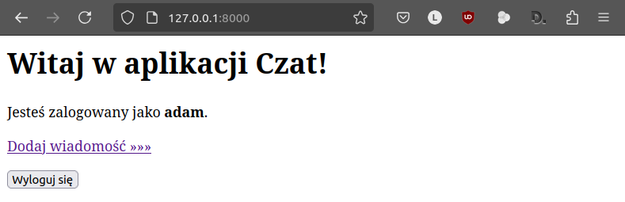

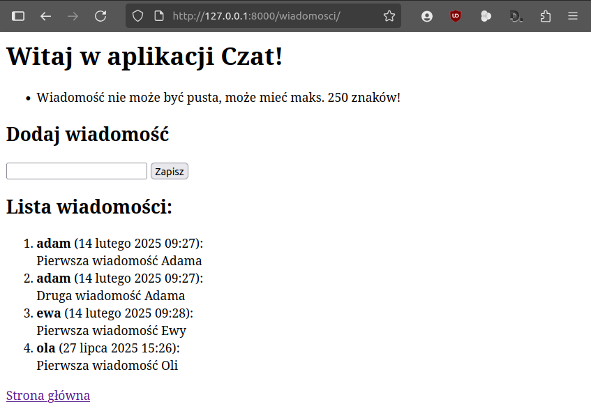

Materiały
=========

1. `O Django <http://pl.wikipedia.org/wiki/Django_(informatyka)>`_
2. `Strona projektu Django <https://www.djangoproject.com/>`_
3. `Co to jest framework? <http://pl.wikipedia.org/wiki/Framework>`_
4. `Protokół HTTP i żądania GET, POST <http://pl.wikipedia.org/wiki/Http>`_
