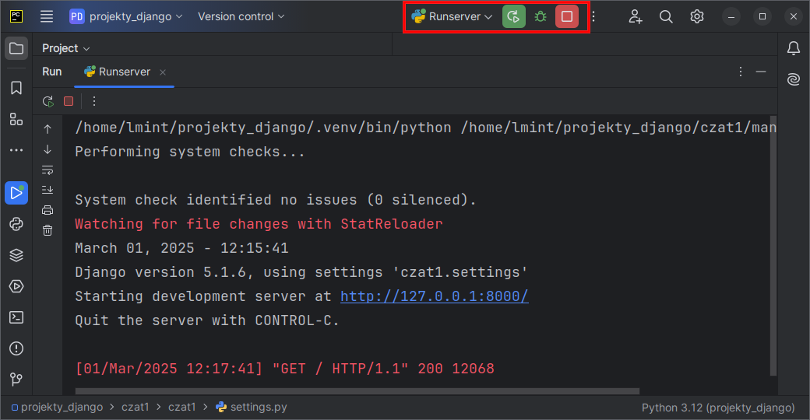
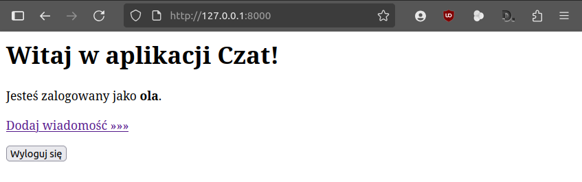

.. _czat-app:

Czat I
######

.. highlight:: python

Zastosowanie frameworka Django do stworzenia aplikacji internetowej
"Czat" – prostego czata, w którym zarejestrowani użytkownicy będą mogli wymieniać się
krótkimi wiadomościami.

.. attention::

    **Wymagane oprogramowanie**:

      * Środowisko wirtualne Pythona v. 3.x
      * Django v. 5.1.x
      * Opcjonalnie: interpreter bazy SQLite3

.. contents::
    :depth: 1
    :local:

.. _czat1-env:

Środowisko pracy
================

Do tworzenia aplikacji z użyciem Django możesz użyć dowolnych narzędzi, np. terminala i ulubionego edytora kodu.
Sugerujemy jednak wykorzystanie środowiska **PyCharm Community**, ponieważ w dużym stopniu ułatwia
pracę nad projektami w języku Python.

Przed rozpoczęciem pracy przygotuj w katalogu :file:`projekty_django`` :ref:`wirtualne środowisko Pythona <venv>`
i w aktywnym środowisku zainstaluj pakiet *Django*:

.. raw:: html

    
Terminal nr 

.. code-block:: bash

    (.venv) ~/projekty_django$ pip install django==5.1.6

.. warning::

    Za każdym razem przed rozpoczęciem pracy nad projektem upewnij się, że środowisko wirtualne zostało aktywowane.

Projekt
===================

Tworzymy nowy projekt Django. W terminalu w katalogu :file:`projekty_django` wydajemy polecenia:

.. raw:: html

    
Terminal nr 

.. code-block:: bash

    (.venv) ~/projekty_django$ django-admin.py startproject czat1
    (.venv) ~/projekty_django$ cd czat1
    (.venv) ~/projekty_django/czat1$ python manage.py migrate

Pierwsze polecenie (``django-admin.py startproject``) utworzy katalog :file:`czat1` z podkatalogiem projektu :file:`czat1`
i skryptem :file:`manage.py`, który służy do zarządzania projektem.

W **katalogu projektu** :file:`projekty_django/czat1/czat1` znajdziemy m. in.:

    - :file:`settings.py` – plik z konfiguracją projektu;
    - :file:`urls.py` – plik z listą obsługiwanych adresów URL.

Polecenie ``manage.py migrate`` tworzy domyślną bazę danych SQLite3 zapisaną w pliku :file:`db.sqlite3`.

Serwer deweloperski
===================

Serwer można uruchomić poleceniem w terminalu:

.. code-block:: bash

    (.venv) ~/projekty_django/czat1$ python manage.py runserver

.. note::

    W PyCharmie można również skonfigurować uruchamianie serwera. Rozwijamy listę **Current File** z górnego paska narzędzi
    i wybieramy **Edit Configurations**. Następnie klikamy ikonę **plus**, a następnie **Python**.
    W polu "Name" wpisujemy nazwę, np. *Runserver*. W polu "script" klikamy ikonę katalogu i wskazujemy
    położenie skryptu :file:`manage.py`. Pod spodem jako parametr skryptu wpisujemy *runserver*.
    Jako katalog roboczy wskazujemy katalog :file:`projekty_django/czat1`.

    .. figure:: img/pycharm_07.png

    Od tej pory możemy uruchamiać serwer klikając przycisk **Run** na górnym pasku narzędzi lub skrótu :kbd:`SHIFT+F10`.

Łączymy się z serwerem wpisując w przeglądarce adres: ``127.0.0.1:8000``.

.. tip::

    Jeżeli serwer uruchomiliśmy w terminalu, można również kliknąć adres
    ``http://127.0.0.1:8000`` z wciśniętym klawiszem :kbd:`CTRL`,
    aby otworzyć przeglądarkę.

W terminalu możemy obserwować żądania obsługiwane przez serwer.
Serwer zatrzymujemy naciskając w terminalu skrót :kbd:`CTRL+C` lub za pomocą przycisku **Stop** (:kbd:`CTRL+F2`).

Aplikacja
=========

W ramach jednego projektu (serwisu internetowego) może działać wiele aplikacji.
Utworzymy teraz aplikację **czat** i zbadamy jej strukturę plików:

.. code-block:: bash

    (.venv) ~/projekty_django/czat1$ python manage.py startapp czat
    (.venv) ~/projekty_django/czat1$ ls -R czat

**Katalog aplikacji** :file:`czat1/czat` zawiera:

    - :file:`apps.py` – ustawienia aplikacji;
    - :file:`admin.py` – konfigurację panelu administracyjnego;
    - :file:`models.py` – plik definiujący modele danych przechowywanych w bazie;
    - :file:`views.py` – plik zawierający funkcje lub klasy definiujące tzw. *widoki* (ang. *views*),
      obsługujące żądania klienta przychodzące do serwera.

Ustawienia projektu
===================

Dostosujemy ustawienia projektu: zarejestrujemy aplikację w projekcie,
ustawimy polską wersję językową oraz zlokalizujemy datę i czas.
Edytujemy plik :file:`czat1/settings.py`:

.. raw:: html

    
Plik <i>settings.py</i>Kod nr 

.. highlight:: python
.. literalinclude:: source/settings.py
    :emphasize-lines: 2, 11, 13

Uruchom ponownie serwer deweloperski i sprawdź w przeglądarce, jak wygląda strona powitalna.

.. figure:: img/django_spolszczone.png

Model danych
============

Budowanie aplikacji w Django nawiązuje do wzorca projektowego :term:`MVC`, czyli
Model-Widok-Kontroler. Więcej informacji na ten temat umieściliśmy w osobnym
materiale :ref:`MVC <mvc_wzorzec>`.

Zaczynamy więc od zdefiniowania modelu (zob. :term:`model`), czyli klasy opisującej tabelę zawierającą
wiadomości. Atrybuty klasy odpowiadają polom tabeli. Instancje tej klasy będą reprezentować wiadomości
utworzone przez użytkowników, czyli rekordy tabeli. Każda wiadomość będzie zwierała treść,
datę dodania oraz identyfikator autora (użytkownika).

W pliku :file:`czat/models.py` wpisujemy:

.. raw:: html

    
Plik <i>models.py</i>Kod nr 

.. highlight:: python
.. literalinclude:: source/models.py
    :linenos:

Opisując klasę ``Wiadomosc`` podajemy nazwy poszczególnych właściwości (pól)
oraz typy przechowywanych w nich danych.

.. note::

    Typy pól:
        * ``CharField`` – pole znakowe, przechowuje niezbyt długie napisy, np. nazwy;
        * ``Date(Time)Field`` – pole daty (i czasu);
        * ``ForeignKey`` – pole klucza obcego, czyli relacji;
          wymaga nazwy powiązanego modelu jako pierwszego argumentu.

    Właściwości pól:

        * pierwszy argument w definicji pola, np. ``treść wiadomości`` określa przyjazną nazwę używaną np. w formularzach;
        * ``on_delete=models.CASCADE`` – jeżeli klucz obcy, w tym przypadku wskazujący autora, zostanie usunięty, usunięte zostaną również dodane przez niego wiadomości;
        * ``max_length`` – maksymalna długość pola znakowego;
        * ``auto_now_add=True`` – data (i czas) wstawione zostaną automatycznie.

Podklasa ``Meta`` pozwala określić formy liczby pojedynczej (``verbose_name``) i mnogiej (``verbose_name_plural``) używane podczas wypisywania obiektów, a także domyślny sposób sortowania wiadomości (``ordering = ['data_pub']``) wg daty dodania.

Zadaniem metody ``__str__()`` jest "autoprezentacja" klasy,
czyli w naszym wypadku wyświetlenie treści wiadomości, np. w panelu administracyjnym.

Migracje
========

Operacje wykonywane na bazie danych nazywane są w Django **migracjami**. Każda :term:`migracja` powiązana jest z aplikacją wchodzącą w skład projektu. Domyślnie wykonywane są migracje dla aplikacji `admin, auth, contenttypes` oraz `sessions` dostarczanych przez Django.

Po dodaniu lub zmianie modelu należy utworzyć migrację, aby w bazie danych zostały utworzone lub zmodyfikowane tabele, w których zapisywane są przetwarzane w aplikacji dane. Następnie migrację należy wykonać:

.. raw:: html

    
Terminal nr 

.. code-block:: bash

    (.venv) ~/projekty_django/czat1$ python manage.py makemigrations czat
    (.venv) ~/projekty_django/czat1$ python manage.py migrate

.. note::

    Migracje zapisywane są w podkatalogu :file:`migrations`.

    Domyślnie Django korzysta z bazy SQLite zapisanej w pliku :file:`db.sqlite3`.
    Możemy zobaczyć, co zawiera. W terminalu wydajemy polecenie ``python manage.py dbshell``,
    które otworzy bazę w powłoce ``sqlite3``, o ile będzie zainstalowana w systemie.
    Następnie:

        * ``.tables`` - pokaże listę tabel;
        * ``.schema czat_wiadomosc`` - pokaże instrukcje SQL-a użyte do utworzenia podanej tabeli
        * ``.quit`` - wyjście z interpretera.

    .. figure:: img/sqlite3_tables.png

Panel administracyjny
=====================

Panel administratora pozwala dodawać użytkowników i wprowadzać dane.
W pliku :file:`czat/admin.py` umieszczamy kod:

.. raw:: html

    
Plik <i>admin.py</i>Kod nr 

.. highlight:: python
.. literalinclude:: source/admin.py
    :linenos:

Na początku importujemy zawartość pliku :file:`models.py`, a następnie rejestrujemy w panelu zdefiniowany wcześniej model ``Wiadomość``:
``admin.site.register(models.Wiadomosc)``.

**Konto administratora** tworzymy wydając w terminalu polecenie:

.. raw:: html

    
Terminal nr 

.. code-block:: bash

    (.venv) ~/projekty_django/czat1$ python manage.py createsuperuser

– na pytanie o nazwę, email i hasło administratora, podajemy: "admin", :kbd:`ENTER`, "zaq1@WSX".

Ćwiczenie
---------

1) Uruchom/zrestartuj serwer, w przeglądarce wpisz adres ``127.0.0.1:8000/admin/``
   i zaloguj się na konto administratora.

    .. figure:: img/django_admin_panel.png

2) Dodaj użytkowników "adam" i "ewa" z hasłami "zaq1@WSX".

   Na stronie "Zmień użytkownik", która wyświetli się po kliknięciu przycisku **Zapisz i kontynuuj edycję**,
   zaznacz opcję "W zespole".

    .. figure:: img/django_admin_w_zespole.png

    W sekcji "Uprawnienia użytkownika" zaznacz prawa dodawania (*add*), zmieniania (*change*),
    usuwania (*del*) oraz wyświetlania (*view*) wiadomości (wpisy typu: "Czat | wiadomosc | Can add wiadomosc")
    i przypisz je użytkownikowi naciskając strzałkę w prawo.

    .. figure:: img/django_admin_uprawnienia.png

3) Z konta "adam" dodaj dwie przykładowe wiadomości, a z konta "ewa" – jedną.

    .. figure:: img/django_admin_wiadomosci.png

Strona główna
================

Definicja adresu URL
--------------------

Pierwszym krokiem jest zdefiniowanie **adresu URL**, pod którym dostępna będzie strona.
Adresy obsługiwane przez naszą aplikację definiujemy w pliku :file:`czat/urls.py`,
który trzeba utworzyć.

Tworzymy więc nowy plik :file:`czat/urls.py` i uzupełniamy go kodem:

.. raw:: html

    
Plik <i>urls.py</i>Kod nr 

.. highlight:: python
.. literalinclude:: source/urls_z1.py
    :linenos:

- ``app_name = 'czat'`` – określamy przestrzeń nazw, w której dostępne będą mapowania
  między adresami url a widokami naszej aplikacji,
- ``path()`` – funkcja, która wiąże zdefiniowany adres URL z widokiem,
- ``''`` – pierwszym argumentem funkcji ``path()`` jest ciąg znaków definiujący adres,
  w tym przypadku ciąg pusty ``''`` oznacza domyślny adres projektu;
- ``views.index`` – przykładowy widok, czyli funkcja zdefiniowana w pliku :file:`czat/views.py`;
- ``name='index'`` – nazwa, która pozwoli na generowanie adresów url dla linków w kodzie HTML.

Konfigurację adresów URL aplikacji musimy jednorazowo włączyć do konfiguracji adresów URL projektu.
W pliku :file:`czat1/urls.py` dopisujemy:

.. raw:: html

    
Plik <i>urls.py</i>Kod nr 

.. highlight:: python
.. literalinclude:: source/urls_p1.py
    :linenos:
    :lineno-start: 16
    :lines: 16-
    :emphasize-lines: 2, 5

- ``include()`` – funkcja pozwala na import (dołączenie) adresów URL podanej aplikacji,
- ``'czat.urls'`` – plik konfiguracyjny adresów URL aplikacji.

Dodanie widoku
--------------

Drugim krokiem podczas dodawania strony jest dodanie widoku (zob. :term:`widok`, :ref:`więcej »»» <mvc_widok>`),
czyli w tym przypadku funkcji ``index()`` w pliku :file:`views.py`:

.. raw:: html

    
Plik <i>views.py</i>Kod nr 

.. highlight:: python
.. literalinclude:: source/views_z1.py
    :linenos:

Każdy widok powinien zwracać do klienta (przeglądarki) obiekt typu ``HttpResponse``. W najprostszym przypadku może on zawierać tylko tekst, np.: ``return HttpResponse("Witaj w aplikacji Czat!")``.

Dodanie szablonu
----------------

Typową odpowiedzią na żądanie jest zwrócenie do przeglądarki strony HTML. Takie zadanie realizujemy za pomocą szablonów.

**Szablony** stron umieszczamy w podkatalogu ``aplikacja/templates/aplikacja``.
Tworzymy więc katalogi ``templates/czat``, a następnie plik ``index.html`` :

.. raw:: html

    
Terminal nr 

.. code-block:: bash

    (.venv) ~/projekty_django/czat1$ mkdir -p czat/templates/czat
    (.venv) ~/projekty_django/czat1$ touch czat/templates/czat/index.html

.. tip::

    W PyCharmie możemy utworzyć wymagane katalogi i plik inaczej: klikamy prawym klawiszem katalog aplikacji
    ``czat``, wybieramy **New / File** i wpisujemy ``templates/czat/index.html``.

Do szablonu :file:`templates/czat/index.html` dodajemy kod:

.. raw:: html

    
Plik <i>index.html</i>. Kod nr 

.. highlight:: html
.. literalinclude:: source/index_z2.html
    :linenos:

W pliku :file:`views.py` zmieniamy funkcję ``index()``:

.. raw:: html

    
Plik <i>views.py</i>Kod nr 

.. highlight:: python
.. literalinclude:: source/views_z2.py
    :linenos:
    :lineno-start: 4
    :lines: 4-
    :emphasize-lines: 7

Funkcja ``render()`` jako pierwszy parametr pobiera obiekt typu ``HttpRequest`` zawierający informacje
o żądaniu, jako drugi nazwę szablonu z katalogiem nadrzędnym.

Uruchom serwer deweloperski i sprawdź w przeglądarce, jak wygląda strona powitalna – powinna zawierać tekst wpisany w szablonie.

(Wy)logowanie
=============

Udostępnimy użytkownikom możliwość logowania i wylogowywania się,
aby mogli dodawać i przeglądać wiadomości. Zaczniemy od zdefiniowania adresów URL obsługujących (wy)logowanie.

W pliku :file:`czat/urls.py` definiujemy adresy URL:

.. raw:: html

    
Plik <i>urls.py</i>Kod nr 

.. highlight:: python
.. literalinclude:: source/urls.py
    :linenos:
    :lineno-start: 5
    :lines: 5-8
    :emphasize-lines: 7-8

W pliku :file:`views.py` uzupełniamy importy:

.. raw:: html

    
Plik <i>views.py</i>Kod nr 

.. highlight:: python
.. literalinclude:: source/views.py
    :linenos:
    :lineno-start: 1
    :lines: 1-5

– i dodajemy widoki ``loguj()`` i ``wyloguj()``

.. raw:: html

    
Plik <i>views.py</i>Kod nr 

.. highlight:: python
.. literalinclude:: source/views.py
    :linenos:
    :lineno-start: 13
    :lines: 13-30

**Logowanie** rozpoczyna się od żadania typu :term:`GET` wysłanego na adres ``/loguj``. Widok ``loguj()`` zwraca wtedy szablon: ``return render(request, 'czat/loguj.html', kontekst)``, do którego w słowniku ``kontekst`` w kluczu ``form`` przekazujemy pusty formularz logowania
utworzony w instrukcji ``AuthenticationForm()``.

Kiedy użytkownik wypełni formularz logowania danymi i kliknie przycisk "Zaloguj", otrzymamy żądanie typu :term:`POST`.
Wykrywamy je w instrukcji ``if request.method == 'POST':``. Następnie tworzymy instancję
formularza wypełnioną przesłanymi danymi: ``form = AuthenticationForm(request, request.POST)``.
Jeżeli dane są poprawne ``if form.is_valid():``, możemy zalogować użytkownika
za pomocą funkcji ``login(request, form.get_user())``.

Tworzymy również informację zwrotną dla użytkownika, wykorzystując system komunikatów: ``messages.success(request, "...")``. Tak utworzone komunikaty możemy odczytać w każdym szablonie ze zmiennej ``messages``.

Po utworzeniu informacji zwrotnej przekierowujemy użytkownika
na stronę główną (``return redirect(reverse('index'))``) z żądaniem jej wyświetlenia (typu GET).

**Wylogowanie** polega na użyciu funkcji ``logout(request)`` – wyloguje ona
użytkownika, którego dane zapisane są w przesłanym żądaniu.

Tworzymy i uzupełniamy **szablon logowania** :file:`templates/czat/loguj.html` kodem:

.. raw:: html

    
Plik <i>loguj.html</i> Kod nr 

.. highlight:: html
.. literalinclude:: source/loguj_z3.html
    :linenos:

W szablonach wykorzystujemy **tagi** dwóch rodzajów:

- ```` – pozwalają używać instrukcji sterujących, np. warunkowych lub pętli,
- ``{{ zmienna }}`` – służą wyświetlaniu wartości zmiennych lub wywoływaniu metod obiektów przekazanych do szablonu.

- ```` – instrukcja sprawdza, czy aktualny użytkownik nie jest zalogowany,
- ```` – zabezpieczenie formularza przed atakiem typu csrf,
- ``{{ form.as_p }}`` – wyświetla pola formularza w akapitach,
- ```` – generuje adres URL: w cudzysłowach podajemy przestrzeń nazw naszej aplikacji (``app_name``), a później nazwę widoku (``name``) zdefiniowane w pliku :file:`czat/urls.py`,
- ``{{ user.username }}`` – obiekt ``user`` zawiera dane zalogowanego użytkownika, m. in. jego nazwę, którą wyświetlamy.

Uzupełniamy szablon :file:`index.html`. Po znaczniku ``<h1>`` wstawiamy poniższy kod:

.. raw:: html

    
Plik <i>index.html</i> Kod nr 

.. highlight:: html
.. literalinclude:: source/index_z3.html
    :linenos:
    :lineno-start: 7
    :lines: 7-22

- ```` – sprawdzamy, czy mamy jakieś komunikaty zwrotne,
- ```` – w pętli odczytujemy kolejne komunikaty i ...
- ``{{ komunikat|capfirst }}`` – wyświetlamy z dużej litery za pomocą filtra.

Jeżeli użytkownik został zalogowany, wyświetlamy przycisk "Wyloguj się" jako jedyny element formularza, który przesyła dane do serwera jako żądania typu POST.

Po uruchomieniu serwera możemy przetestować logowanie pod adresem ``127.0.0.1:8000/loguj``. Poniżej przykład formularza logowania:

Po zalogowaniu się powinniśmy zobaczyć komunikat potwierdzający oraz przycisk pozwalający na wylogowanie się:

Po kliknięciu przycisku "Wyloguj się" powinniśmy zobaczyć komunikat o wylogowaniu:

.. figure:: img/django_wyloguj.png

Dodawanie wiadomości
====================

Chcemy, by zalogowani użytkownicy mogli dodawać wiadomości,
a także przeglądać wiadomości innych.

Zaczynamy od dodania **widoku** o nazwie np. ``wiadomosci()``.
Do pliku :file:`views.py` dodajemy import i kod funkcji:

.. raw:: html

    
Plik <i>views.py</i>Kod nr 

.. highlight:: python
.. literalinclude:: source/views.py
    :linenos:
    :lineno-start: 6
    :lines: 6

.. raw:: html

    
Plik <i>views.py</i>Kod nr 

.. highlight:: python
.. literalinclude:: source/views.py
    :linenos:
    :lineno-start: 32
    :lines: 32-49

Obsługa żądania typu GET, czyli wyświetlenie wiadomości i formularza:

- ``wiadomosci = Wiadomosc.objects.all()`` – pobieramy wszystkie wiadomości z bazy,
  używając wbudowanego w Django systemu ORM.
- ``return render(request, 'czat/wiadomosci.html', kontekst)`` – zwracamy szablon,
  do którego przekazujemy słownik ``kontekst`` zawierający wiadomości.

Obsługa żądania typu POST, czyli przetworzenie danych z przesłanego formularza:

- ``tekst = request.POST.get('tekst', '')`` – wiadomość pobieramy ze słownika
  ``request.POST`` za pomocą metody ``get('tekst', '')``, pierwszy argument to
  nazwa pola formularza, drugi argument to wartość domyślna,
  jeśli pole będzie niedostępne.
- ``if not 0 < len(tekst) <= 250:`` – sprawdzenie minimalnej i maksymalnej
  długości wiadomości,
- ``Wiadomosc(tekst=tekst, autor=request.user)`` – utworzenie instancji wiadomości
  za pomocą konstruktora modelu, któremu przekazujemy wartości wymaganych pól,
- ``wiadomosc.save()`` – zapisanie nowej wiadomości w bazie.

**Szablon** zapisany w pliku :file:`templates/czat/wiadomosci.html`
będzie wyświetlał komunikaty zwrotne, np. błędy, a także formularz dodawania
i listę wiadomości:

.. raw:: html

    
Plik <i>wiadomosci.html</i>. Kod nr 

.. highlight:: html
.. literalinclude:: source/wiadomosci_z4.html
    :linenos:

- ``<input type="text" name="tekst" />`` – "ręczne" przygotowanie formularza,
  czyli wstawienie kodu HTML pola do wprowadzania tekstu wiadomości,
- ``{{ wiadomosc.tekst }}`` – wyświetlenie właściwości obiektu przekazanego
  w kontekście.

**Adres URL**, obsługiwany przez widok ``wiadomosci()``, definiujemy w
pliku :file:`czat/urls.py`, nadając mu nazwę *wiadomosci*:

.. raw:: html

    
Plik <i>urls.py</i>Kod nr 

.. highlight:: python
.. literalinclude:: source/urls.py
    :linenos:
    :lineno-start: 9
    :lines: 9

Ćwiczenie
---------

* W szablonie widoku strony głównej dodaj link "Dodaj wiadomość" dla
  zalogowanych użytkowników.
* W szablonie wiadomości dodaj link "Strona główna".
* Zaloguj się i przetestuj wyświetlanie [#]_ i dodawanie wiadomości pod adresem
  *127.0.0.1:8000/wiadomosci/*. Sprawdź, co się stanie po wysłaniu pustej
  wiadomości.

.. [#] Jeżeli nie dodałeś do tej pory żadnej wiadomości, lista na początku
   będzie pusta.

Poniższe zrzuty prezentują efekty naszej pracy:

Materiały
=========

1. O Django http://pl.wikipedia.org/wiki/Django_(informatyka)
2. Strona projektu Django https://www.djangoproject.com/
3. Co to jest framework? http://pl.wikipedia.org/wiki/Framework
4. Co nieco o HTTP i żądaniach GET i POST http://pl.wikipedia.org/wiki/Http

**Źródła:**

* :download:`czat1.zip <czat1.zip>`
