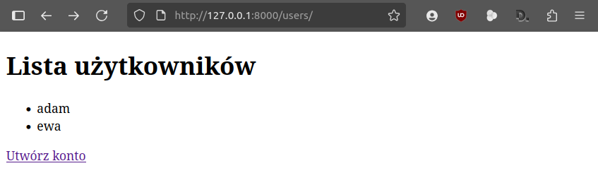
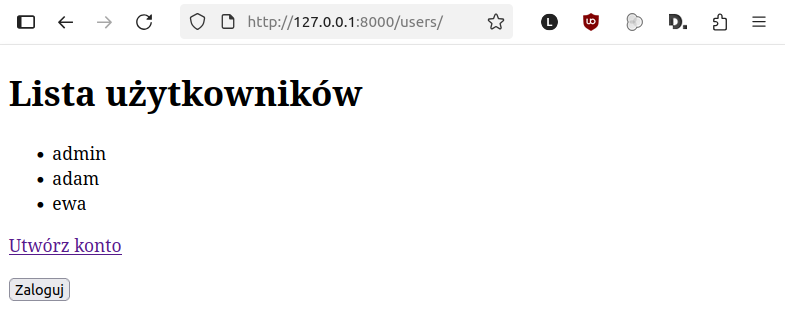
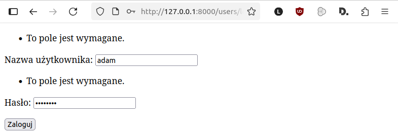
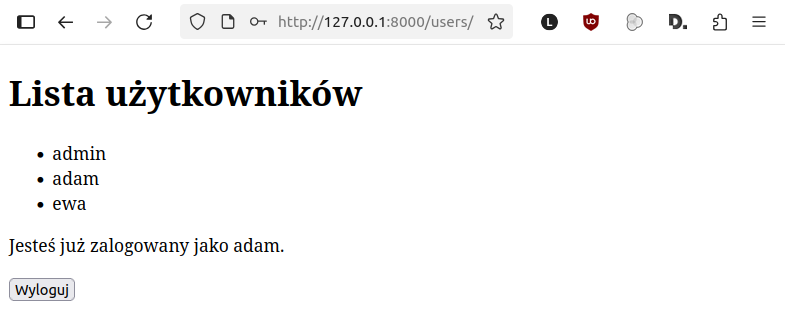
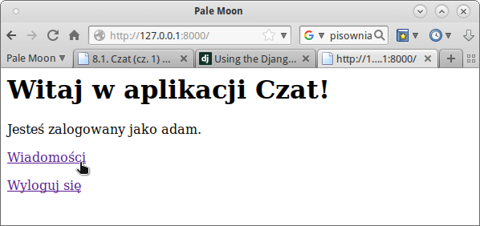
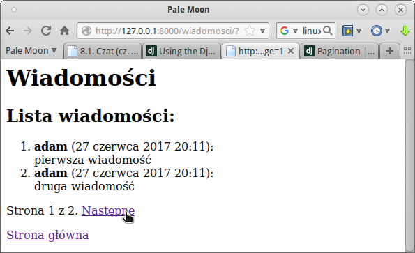
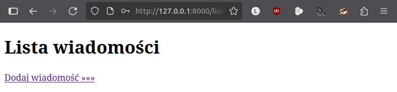
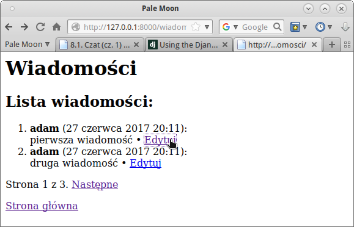
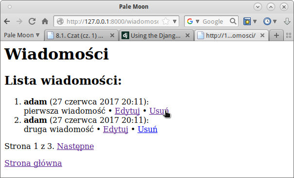
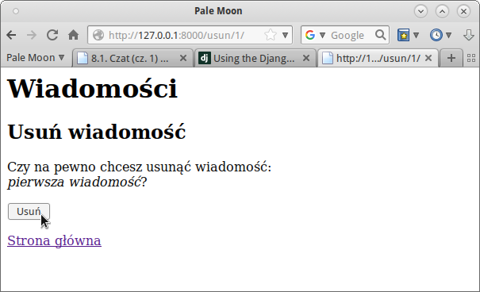

.. _czat2:

Czat (cz. 2)
#########################

Dodawanie, edycja, usuwanie czy przeglądanie danych zgromadzonych w bazie
są typowymi czynnościami w aplikacjach internetowych określanymi angielskim skrótem :term:`CRUD`.
Utworzony w scenariuszu :ref:`Czat (cz. 1) <czat1>` kod ilustruje krok po korku obsługę żądań GET i POST
oraz niektórych operacji CRUD (odczyt i dodawanie danych).

Django zawiera gotowe rozwiązania, które skracają realizację typowych zadań eliminując również potencjalne błędy.
W tym scenariuszu poznasz m. in. widoki wbudowane oparte na klasach służące zarządzaniu użytkownikami oraz
odczytywaniu, dodawaniu, edytowaniu i usuwaniu danych.

.. attention::

    **Wymagane oprogramowanie**:

      * Środowisko wirtualne Pythona v. 3.x
      * Django v. 5.1.x
      * Opcjonalnie: interpreter bazy SQLite3

    **Zalecana wiedza i umiejętności**:

      Zrealizowany scenariusz :ref:`Czat (cz. 1) <czat1>`.

.. contents::
    :depth: 1
    :local:

Środowisko pracy
=================

Do pracy potrzebujemy katalogu z utworzonym środowiskiem wirtualnym Pythona, w którym zainstalowano
pakiet Django. Możemy wykorzystać katalog :file:`projekty_django` ze scenariusza :ref:`Czat (cz. 1) <czat1>`
lub przygotować ten katalog od początku zgodnie z instrukcjami z tego scenariusza (zob. :ref:`Czat (cz. 1) <czat1-env>`

Następnie w katalogu :file:`projekty_django` tworzymy nowy projekt o nazwie **czat2**:

.. raw:: html

    
Terminal nr 

.. code-block:: bash

    (.venv) ~/projekty_django$ django-admin startproject czat2
    (.venv) ~/projekty_django$ cd czat2

Lista użytkowników
==================

Na początku zajmiemy się obsługą użytkowników, która realizowana będzie przez osobną aplikację.

W katalogu :file:`projekty_django/czat2` tworzymy aplikację o nazwie **users**:

.. raw:: html

    
Terminal nr 

.. code-block:: bash

    (.venv) ~/projekty_django/czat2$ python manage.py startapp users

Następnie tworzymy plik :file:`czat2/users/urls.py`, w którym umieszczamy poniższy kod:

.. raw:: html

    
Plik <i>urls.py</i>Kod nr 

.. highlight:: python
.. literalinclude:: source/users_urls_01.py
    :linenos:
    :lineno-start: 1
    :lines: 1-7

W liście ``urlpatterns`` definiujemy powiązanie między domyślnym adresem URL aplikacji i widokiem ``index``.

Dalej w pliku :file:`czat2/users/views.py` umieszczamy kod widoku, czyli funkcję ``index()``:

.. raw:: html

    
Plik <i>views.py</i>Kod nr 

.. highlight:: python
.. literalinclude:: source/users_views.py
    :linenos:
    :lineno-start: 1
    :lines: 1-7

Zadaniem widoku jest pobranie z bazy danych wszystkich użytkowników i przekazanie ich do szablonu.

Kolejnym krokiem jest utworzenie odpowiednich podkatalogów i umieszczenie kodu szablonu
w pliku :file:`czat2/users/templates/users/index.html`:

.. raw:: html

    
Plik <i>index.html</i>Kod nr 

.. highlight:: HTML
.. literalinclude:: source/users_index_01.html
    :linenos:
    :lineno-start: 1

W pierwszym tagu warunkowym ```` sprawdzamy, czy lista ``users`` zawiera jakichś użytkowników.
Jeżeli tak, za pomocą tagu ``for`` wypiszemy ich nazwy, w przeciwnym razie komunikat "Brak użytkowników".

W drugim tagu warunkowym ```` sprawdzamy, czy jakiś użytkownik jest zalogowany.
Jeżeli tak, wypiszemy komunikat "Jesteś już zalogowany jako ...", w przeciwnym razie wypisany zostanie
link do utworzenia konta.

Dodawanie użytkowników
======================

Użytkownicy będą mogli samodzielnie zakładać konta, logować i wylogowywać się.
Inaczej niż w cz. 1 zadania te zrealizujemy za pomocą tzw. widoków wbudowanych opartych na klasach
(ang. `class-based generic views <https://docs.djangoproject.com/en/1.11/topics/class-based-views/>`_).

W pliku :file:`czat2/users/urls.py` importujemy formularz tworzenia użytkownika (``UserCreationForm``)
oraz wbudowany widok przeznaczony do dodawania danych (``CreateView``):

.. raw:: html

    
Plik <i>urls.py</i>Kod nr 

.. highlight:: python
.. literalinclude:: source/users_urls_02.py
    :linenos:
    :lineno-start: 1
    :lines: 1-4
    :emphasize-lines: 3, 4

W tym samym pliku :file:`czat2/users/urls.py` w liście ``urlpatterns`` definiujemy adres URL */rejestruj*,
który obsługiwany będzie przez zaimportowany wyżej widok wywołany jako funkcja.

.. raw:: html

    
Plik <i>urls.py</i>Kod nr 

.. highlight:: python
.. literalinclude:: source/users_urls_02.py
    :linenos:
    :lineno-start: 10
    :lines: 10-14

Widok ``CreateView`` otrzymuje trzy argumenty, które przekazujemy do metody ``as_view()``:

    * ``template_name`` – nazwa pliku szablonu, w którym umieścimy formularz tworzenia użytkownika,
    * ``form_class`` – nazwa klasy definiującej formularz tworzenia użytkownika,
    * ``success_url`` – adres, na który nastąpi przekierowanie w przypadku braku błędów, np. po udanej rejestracji.

Zawartość szablonu umieszczamy w pliku :file:`templates/users/rejestruj.html`:

.. raw:: html

    
Plik <i>rejestruj.html</i>Kod nr 

.. highlight:: HTML
.. literalinclude:: source/rejestruj.html
    :linenos:

Jeżeli zalogowany użytkownik wejdzie na stronę, zobaczy komunikat "Jesteś już zalogowany jako ...", natomiast
użytkownik niezalogowany zobaczy formularz zakładania konta.

Ćwiczenie
---------

1) W ustawieniach projektu *czat2*:

    - zarejestruj aplikację *users*,
    - ustaw polską wersję językową,
    - zlokalizuj datę i czas.

2) W konfiguracji adresów URL projektu powiąż adres URL ``users/`` z adresami URL aplikacji *users*.
3) Uruchom serwer deweloperski i w przeglądarce wejdź na adres *127.0.0.1:8000/users/*.
4) Dodaj użytkowników *adam* i *ewa* z hasłem *zaq1@WSX*.

.. figure:: img/django_rejestracja.png

Wy(logowanie)
=============

Na początku pliku :file:`czat2/users/urls.py` aplikacji dopisujemy wymagany import:

.. raw:: html

    
Plik <i>urls.py</i>Kod nr 

.. highlight:: python
.. literalinclude:: source/users_urls_02.py
    :linenos:
    :lineno-start: 5
    :lines: 5

– a następnie uzupełniamy listę ``urlpatterns``:

.. raw:: html

    
Plik <i>urls.py</i>Kod nr 

.. highlight:: python
.. literalinclude:: source/users_urls_02.py
    :linenos:
    :lineno-start: 15
    :lines: 15-21

Z adresami */loguj* i */wyloguj* wiążemy wbudowane w Django widoki ``LoginView`` i ``LogoutView``
zaimportowane z modułu ``django.contrib.auth.views``. Widoki wywołujemy jako funkcje za pomocą metody ``as_view()``,
która otrzymuje argumenty:

    * ``template_name`` – nazwę pliku szablonu, w którym umieścimy formularz logowania użytkownika,
    * ``next_page`` – nazwa adresu URL, na który przekierowujemy użytkownika po zalogowaniu lub wylogowaniu się.

.. note::

    Adresy, na które zostaje przekierowany użytkownik po zalogowaniu lub wylogowaniu za pomocą widoków wbudowanych,
    mogą być określane również za pomocą stałych ``LOGIN_REDIRECT_URL`` i ``LOGOUT_REDIRECT_URL`` zdefiniowanych w pliku
    ustawień projektu. W naszym przypadku na końcu pliku :file:`czat2/settings.py` moglibyśmy umieścić kod:

.. raw:: html

    
Plik <i>settings.py</i>. Kod nr 

.. code-block:: python

    LOGIN_REDIRECT_URL = '/users/'
    LOGOUT_REDIRECT_URL = '/users/'

Logowanie wymaga szablonu, który tworzymy i zapisujemy w pliku :file:`templates/users/loguj.html`:

.. raw:: html

    
Plik <i>loguj.html</i>Kod nr 

.. highlight:: HTML
.. literalinclude:: source/loguj.html
    :linenos:

Ćwiczenie
---------

1) W pliku :file:`index.html` umieść linki służące do logowania i wylogowania. Użyj metody POST.

2) Zaloguj się jako użytkownik.

3) Wyloguj się.

Początek pracy będzie taki sam jak w przypadku aplikacji "Czat 1". Dla powtórzenia:

1) W katalogu :file:`projekty_django` tworzymy projekt "czat2".
2) W katalogu :file:`projekty_django/czat2` tworzymy aplikację "czat".
3) Zmieniamy ustawienia projektu: rejestrujemy aplikację w projekcie, ustawimy polską wersję językową,
   lokalizujemy datę i czas.
4) Dodajemy model danych, tj. klasę `Wiadomości`.

5) Przygotowujemy migrację dla aplikacji "czat" i wykonujemy migracje.

Przypomnijmy kolejne polecenia wydawane w aktywnym środowisku wirtualnym w katalogu :file:`projekty_django`:

.. code-block:: bash

    (.venv) ~/projekty_django$ django-admin startproject czat2
    (.venv) ~/projekty_django$ cd czat2
    (.venv) ~/projekty_django/czat2$ python manage.py startapp czat
    (.venv) ~/projekty_django/czat2$ python manage.py makemigrations czat
    (.venv) ~/projekty_django/czat2$ python manage.py migrate
    (.venv) ~/projekty_django/czat2$ python manage.py check

Ostatnie wydane polecenie sprawdza poprawność projektu i powinno zwrócić komunikat
*System check identified no issues (0 silenced)*.

.. ::tip

    Jeżeli masz problem z wykonaniem powyższych czynności, zajrzyj do punktów 8.1.1 – 8.1.7 ze scenariusza
    :ref:`Czat (cz. 1) <czat1>`.

Lista wiadomości
================

Chcemy, by zalogowani użytkownicy mogli przeglądać wiadomości wszystkich użytkowników,
zmieniać, usuwać i dodawać własne. Najprostszy sposób to skorzystanie z
widoków wbudowanych.

.. note::

    Django oferuje wbudowane widoki przeznaczone do typowych operacji:

    * DetailView i ListView – (ang. *generic display view*) widoki przeznaczone
      do prezentowania szczegółów i listy danych;
    * FormView, CreateView, UpdateView i DeleteView – (ang. *generic editing views*)
      widoki przeznaczone do wyświetlania formularzy ogólnych, w szczególności
      służących dodawaniu, uaktualnianiu, usuwaniu obiektów (danych).

Do wyświetlania listy wiadomości użyjemy klasy ``ListView``.
Do pliku :file:`urls.py` dopisujemy importy:

.. raw:: html

    
Kod nr 

.. highlight:: python
.. literalinclude:: urls.py
    :linenos:
    :lineno-start: 10
    :lines: 10-12

– i wiążemy adres */wiadomosci* z wywołaniem widoku:

.. raw:: html

    Kod nr 

.. highlight:: python
.. literalinclude:: urls.py
    :linenos:
    :lineno-start: 28
    :lines: 28-33

Zakładamy, że wiadomości mogą oglądać tylko użytkownicy zalogowani. Dlatego
całe wywołanie widoku umieszczamy w funkcji ``login_required()``.

W funkcji ``ListView.as_view()`` podajemy kolejne parametry
modyfikujące działanie widoków:

* ``model`` – podajemy model, którego dane zostaną pobrane z bazy;
* ``context_object_name`` – pozwala zmienić domyślną nazwę (object_list)
  listy obiektów przekazanych do szablonu;
* ``paginate_by``– pozwala określić ilość obiektów wyświetlanych na stronie.

Na końcu pliku :file:`czat2/settings.py` określamy adres logowania,
na który przekierowani zostaną niezalogowani użytkownicy, którzy próbowaliby
zobaczyć listę wiadomości:

.. raw:: html

    Kod nr 

.. code-block:: python

    # czat2/settings.py

    LOGIN_URL = reverse_lazy('czat:loguj')

.. raw:: html

    

Potrzebujemy szablonu, którego Django szuka pod domyślną nazwą
*<nazwa modelu>_list.html*, czyli w naszym przypadku tworzymy plik :file:`czat/wiadomosc_list.html`:

.. raw:: html

    
Plik <i>wiadomosc_list.html</i>Kod nr 

.. highlight:: html
.. literalinclude:: wiadomosc_list_z4.html
    :linenos:

Kolejne wiadomości odczytujemy i wyświetlamy w pętli przy użyciu tagu ````.
Dostęp do właściwości obiektów umożliwia operator kropki, np.: ``{{ wiadomosc.autor.username }}``.

Linki nawigacyjne tworzymy w instrukcji warunkowej ````.
Obiekt ``page_obj`` zawiera następujące właściwości:

* ``has_previous`` – zwraca ``True``, jeżeli jest poprzednia strona;
* ``previous_page_number`` – numer poprzedniej strony;
* ``next_page_number`` – numer następnej strony;
* ``number`` – numer aktualnej strony;
* ``paginator.num_pages`` – ilość wszystkich stron.

Numer strony do wyświetlenia przekazujemy w zmiennej ``page`` adresu URL.

**Ćwiczenie:** Dodaj link do strony wyświetlającej wiadomości na stronie głównej dla zalogowanych użytkowników.

Dodawanie wiadomości
====================

Zadanie to zrealizujemy wykorzystując widok ``CreateView``. Aby ułatwić
dodawanie wiadomości **dostosujemy klasę widoku** tak, aby użytkownik
nie musiał wprowadzać pola autor.

Na początek dopiszemy w pliku :file:`urls.py` skojarzenie adresu URL
*wiadomosc/* z wywołaniem klasy ``CreateView`` jako funkcji:

.. raw:: html

    
Plik <i>urls.py</i> Kod nr 

.. highlight:: python
.. literalinclude:: urls.py
    :linenos:
    :lineno-start: 34
    :lines: 34-37

Dalej kodujemy w pliku :file:`views.py`. Na początku dodajemy importy:

.. raw:: html

    
Plik <i>views.py</i> Kod nr 

.. literalinclude:: views.py
    :linenos:
    :lineno-start: 6
    :lines: 6-9

.. raw:: html

    
Plik <i>views.py</i> Kod nr 

.. literalinclude:: views.py
    :linenos:
    :lineno-start: 19
    :lines: 19-40

Tworzymy klasę opartą na widoku ogólnym (``class DodajWiadomosc(CreateView)``),
określamy jej podstawowe właściwości i nadpisujemy wybrane metody:

* ``fields`` – pozwala wskazać pola, które mają znaleźć się na formularzu;
* ``get_initial()`` – metoda pozwala ustawić domyślne wartości dla wybranych pól.
  Wykorzystujemy ją do zainicjowania pola ``data_pub`` aktualna datą:
  ``initial['data_pub'] = timezone.now()``.
* ``get_context_data()`` – metoda pozwala przekazać do szablonu dodatkowe dane,
  w tym wypadku jest to lista wszystkich wiadomości: ``context['wiadomosci'] = Wiadomosc.objects.all()``.
* ``form_valid()`` – metoda, która sprawdza poprawność przesłanych danych i zapisuje je w bazie:

    - ``wiadomosc = form.save(commit=False)`` – tworzymy obiekt wiadomości, ale go nie zapisujemy;
    - ``wiadomosc.autor = self.request.user`` – uzupełniamy dane autora;
    - ``wiadomosc.save()`` – zapisujemy obiekt;
    - ``messages.success(self.request, "Dodano wiadomość!")`` – przygotowujemy komunikat,
      który wyświetlony zostanie po dodaniu wiadomości.

.. raw:: html

    

Domyślny szablon dodawania danych nazywa się *<nazwa modelu>_form.html*. W nowym pliku
wstawiamy poniższą treść i zapisujemy pod nazwą :file:`templates/czat/wiadomosc_form.html`:

.. raw:: html

    
Plik <i>wiadomosc_form.html</i>Kod nr 

.. highlight:: html
.. literalinclude:: wiadomosc_form_z5.html
    :linenos:

W szablonie :file:`templates/czat/wiadomosc_list.html` wstawimy jeszcze po nagłówku
``<h1>`` kod wyświetlający komunikaty:

.. raw:: html

    
Plik <i>wiadomosc_list.html</i>Kod nr 

.. highlight:: html
.. literalinclude:: wiadomosc_list_z5.html
    :linenos:
    :lineno-start: 6
    :lines: 6-12

.. warning::

    W pliku :file:`czat/models.py` trzeba usunąć parametr ``auto_now_add=True``
    z definicji pola ``data_pub``, aby użytkownik mógł modyfikować datę
    dodania wiadomości w formularzu.

**Ćwiczenie:** Jak zwykle, umieść link do dodawanie wiadomości na stronie głównej.

Edycja wiadomości
=================

Widok pozwalający na edycję wiadomości i jej aktualizację dostępny będzie
pod adresem **/edytuj/id_wiadomości**, gdzie **id_wiadomosci** będzie identyfikatorem
obiektu do zaktualizowania. Zaczniemy od uzupełnienia pliku :file:`urls.py`:

.. raw:: html

    
Plik <i>urls.py</i>Kod nr 

.. highlight:: python
.. literalinclude:: urls.py
    :linenos:
    :lineno-start: 38
    :lines: 38-41

Nowością w powyższym kodzie są wyrażenia regularne definiujące adresy z dodatkowym
parametrem, np. ``r'^edytuj/(?P<pk>\d+)/'``. Część ``/(?P<pk>\d+)`` oznacza,
że oczekujemy 1 lub więcej cyfr (``\d+``), które zostaną zapisane w zmiennej o nazwie
``pk`` (``?P<pk>``) – nazwa jest tu skrótem od ang. wyrażenia *primary key*,
co znaczy "klucz główny". Zmienna ta zawierać będzie identyfikator wiadomości
i dostępna będzie w klasie widoku, który obsłuży edycję wiadomości.

Na początku pliku :file:`views.py` importujemy więc potrzebny widok:

.. raw:: html

    
Plik <i>views.py</i>Kod nr 

.. highlight:: python
.. literalinclude:: views.py
    :linenos:
    :lineno-start: 10
    :lines: 10

Dalej tworzymy klasę ``EdytujWiadomosc``, która dziedziczy, czyli dostosowuje wbudowany
widok ``UpdateView``:

.. raw:: html

    
Plik <i>views.py</i>Kod nr 

.. highlight:: python
.. literalinclude:: views.py
    :linenos:
    :lineno-start: 43
    :lines: 43-59

Najważniejsza jest tu metoda ``get_object()``, która pobiera i zwraca wskazaną przez
identyfikator w zmiennej *pk* wiadomość: ``wiadomosc = Wiadomosc.objects.get(id=self.kwargs['pk'])``.
Omawianą już metodę ``get_context_data()`` wykorzystujemy, aby przekazać
do szablonu listę wiadomości, ale tylko zalogowanego użytkownika
(``context['wiadomosci'] = Wiadomosc.objects.filter(autor=self.request.user)``).

Właściwości ``model``, ``context_object_name``, ``template_name`` i ``success_url``
wyjaśniliśmy wcześniej. Jak widać, do edycji wiadomości można wykorzystać ten sam szablon,
którego użyliśmy podczas dodawania.

Formularz jednak dostosujemy. Wykorzystamy właściwość ``form_class``,
której przypisujemy utworzoną w nowym pliku :file:`forms.py` klasę zmieniającą
domyślne ustawienia:

.. raw:: html

    
Plik <i>forms.py</i>Kod nr 

.. highlight:: python
.. literalinclude:: forms_z6.py
    :linenos:

Klasa ``EdytujWiadomoscForm`` oparta jest na wbudowanej klasie ``ModelForm``.
Właściwości formularza określamy w podklasie ``Meta``:

* ``model`` – oznacza to samo co w widokach, czyli model, dla którego tworzony jest formularz;
* ``fields`` – to samo co w widokach, lista pól do wyświetlenia;
* ``exclude`` – opcjonalnie lista pól do pominięcia;
* ``widgets`` – słownik, którego klucze oznaczają pola danych, a ich wartości
  odpowiadające im w formularzach HTML typy pól i ich właściwości, np. rozmiar.

Żeby przetestować aktualizowanie wiadomości, w szablonie :file:`wiadomosc_list.html`
trzeba wygenerować linki *Edytuj* dla wiadomości utworzonych przez zalogowanego użytkownika.
Wstaw w odpowiednie miejsce szablonu, tzn po tagu wyświetlającym tekst wiadomości
(``{{ wiadomosc.tekst }}``) poniższy kod:

.. raw:: html

    
Plik wiadomosc_lista.html</i> Kod nr 

.. highlight:: html
.. literalinclude:: wiadomosc_list_z6.html
    :linenos:
    :lineno-start: 20
    :lines: 20-22

**Ćwiczenie:** Ten sam link "Edytuj" umieść również w szablonie dodawania.

Usuwanie wiadomości
===================

**Usuwanie danych** realizujemy za pomocą widoku ``DeleteView``, który importujemy
na początku pliku :file:`urls.py`:

.. raw:: html

    
Plik <i>urls.py</i>Kod nr 

.. highlight:: python
.. literalinclude:: urls.py
    :linenos:
    :lineno-start: 13
    :lines: 13

Podobnie, jak w przypadku edycji, usuwanie powiążemy z adresem URL zawierającym
identyfikator wiadomości */usun/id_wiadomości*. W pliku :file:`urls.py` dopisujemy:

.. raw:: html

    
Plik <i>urls.py</i>Kod nr 

.. highlight:: python
.. literalinclude:: urls.py
    :linenos:
    :lineno-start: 42
    :lines: 42-48

Warto zwrócić uwagę, że podobnie jak w przypadku listy wiadomości, o ile wystarcza nam
domyślna funkcjonalność widoku wbudowanego, nie musimy niczego implementować w pliku :file:`views.py`.

Domyślny szablon dla tego widoku przyjmuje nazwę *<nazwa-modelu>_confirm_delete.html*,
dlatego uprościliśmy jego nazwę we właściwości ``template_name``. Tworzymy więc plik
:file:`wiadomosc_usun.html`:

.. raw:: html

    
Plik <i>wiadomosc_usun.html</i>Kod nr 

.. highlight:: html
.. literalinclude:: wiadomosc_usun_z7.html
    :linenos:

Tag ``{{ object }}`` zostanie zastąpiony treścią wiadomości zwróconą przez funkcję
"autoprezentacji" ``__str__()`` modelu.

**Ćwiczenie:** Wstaw link "Usuń" (``&bull; <a href="">Usuń</a>``) za linkiem "Edytuj" w szablonach wyświetlających listę wiadomości.

Materiały
=========

1. O Django http://pl.wikipedia.org/wiki/Django_(informatyka)
2. Strona projektu Django https://www.djangoproject.com/
3. Co to jest framework? http://pl.wikipedia.org/wiki/Framework
4. Co nieco o HTTP i żądaniach GET i POST http://pl.wikipedia.org/wiki/Http

**Źródła:**

* :download:`czat2.zip <czat2.zip>`
