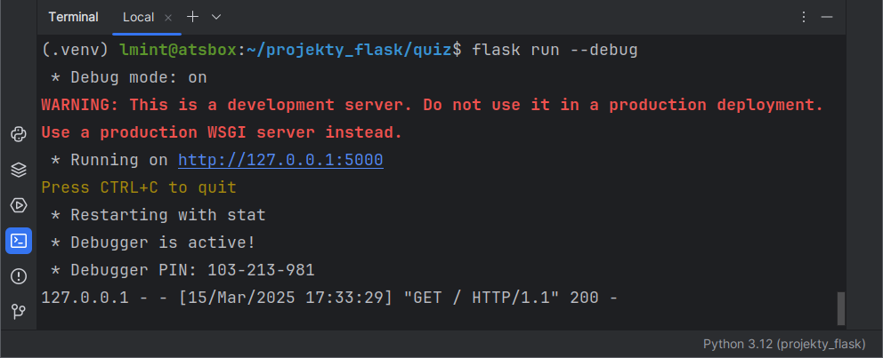

.. _quiz-app:

Quiz
#####

Realizacja aplikacji internetowej Quiz w oparciu o :term:`framework` Flask 3.1.x
Na stronie wyświetlamy pytania, użytkownik zaznacza poprawne odpowiedzi,
przesyła je na serwer i otrzymuje informację o wynikach.

.. contents::
    :depth: 1
    :local:

Środowisko pracy
================

Do tworzenia aplikacji z użyciem Django możesz użyć dowolnych narzędzi, np. terminala i ulubionego edytora kodu.
Sugerujemy jednak wykorzystanie środowiska **PyCharm Community**, ponieważ w dużym stopniu ułatwia
pracę nad projektami w języku Python.

Przed rozpoczęciem pracy przygotuj w katalogu :file:`projekty_flask`` :ref:`wirtualne środowisko Pythona <venv>`
i w aktywnym środowisku zainstaluj pakiet *Flask*.

Projekt i aplikacja
===================

W katalogu :file:`projekty_flask`` tworzymy nowy katalog aplikacji o nazwie :file:`quiz`:

.. raw:: html

    
Terminal nr 

.. highlight:: bash
.. code-block:: bash

    (.venv) ~/projekty_flask$ mkdir quiz
    (.venv) ~/projekty_flask$ cd quiz

Utworzymy szkielet aplikacji Flask, co pozwoli na uruchomienie testowego serwera www.
W katalogu aplikacji :file:`quiz` tworzymy pliku o nazwie :file:`app.py` i umieszczamy w nim poniższy kod.

.. raw:: html

    
Kod nr 

.. highlight:: python
.. literalinclude:: source/app1.py
    :linenos:

Serwer uruchamiamy jednym z poleceń w terminalu w katalogu projektu:
``flask run --debug`` lub ``python3 app.py``:

.. raw:: html

    
Terminal nr 

.. code-block:: bash

    (.venv) ~/projekty_flask/quiz$ flask run --debug

Domyślnie serwer uruchamia się pod adresem *http://127.0.0.1:5000*.
Po otwarciu przeglądarki i wpisaniu tego adresu (można też kliknąć adres
z wciśniętym klawiszem :kbd:`CTLR`) zobaczymy napis "Cześć, tu Python i Flask!"
zwrócony przez aplikację.

.. tip::

    Działanie serwera zatrzymujemy w terminalu skrótem :kbd:`CTRL+C`.

Strona główna
=============

Nasza aplikacja zwraca użytkownikowi stronę główną za pomocą widoku (zob. :term:`widok`)
``index()``. Jest to funkcja Pythona powiązana z określonym w dekoratorze
(zob. :term:`dekorator`) ``route()`` adresem ``/`` oznaczającym domyślny zasób serwera.

Widoki obsługują podstawowe żądania protokołu :term:`HTTP`, czyli: :term:`GET`
– wysyłane przez przeglądarkę, kiedy użytkownik chce zobaczyć stronę,
i :term:`POST` – kiedy użytkownik przesyła dane na serwer za pomocą formularza.

W odpowiedzi aplikacja może odsyłać różne dane, np. tekst, ale najczęściej będzie to
strona :term:`HTML` zawierająca dane pobrane z bazy, np. wyniki quizu. Flask ułatwia
tworzenie takich stron za pomocą szablonów. Będziemy je zapisywać w katalogu
:file:`templates`, który utworzymy w katalogu projektu:

.. raw:: html

    
Terminal nr 

.. code-block:: bash

    (.venv) ~/projekty_flask/quiz$ mkdir templates

Następnie w nowym pliku :file:`templates/index.html` umieszczamy kod:

.. raw:: html

    
Plik <i>index.html</i>. Kod nr 

.. highlight:: html
.. literalinclude:: source/index.html
    :linenos:

Na koniec modyfikujemy funkcję ``index()`` w pliku :file:`app.py`:

.. raw:: html

    
Kod nr 

.. highlight:: python
.. literalinclude:: source/app2.py
    :linenos:
    :emphasize-lines: 2, 9

Do renderowania szablonu (zob: :term:`renderowanie szablonu`) używamy
funkcji ``render_template('index.html')``, która jako argument przyjmuje
nazwę pliku szablonu. Pod adresem *http://127.0.0.1:5000* strony głównej,
zobaczymy dokument HTML:

Pytania i odpowiedzi
====================

Dane aplikacji, a więc pytania i odpowiedzi, umieścimy w liście
``DANE`` w postaci słowników zawierających: treść pytania,
listę możliwych odpowiedzi oraz poprawną odpowiedź.

Modyfikujemy plik :file:`app.py`. Nowy kod wstawiamy po instrukcji
``app = Flask(__name__)``:

.. raw:: html

    
Kod nr 

.. highlight:: python
.. literalinclude:: source/app3.py
    :linenos:
    :emphasize-lines: 6-28

W konfiguracji aplikacji przechowywanej w słowniku ``config`` dodajemy sekretny klucz,
wykorzystywany do obsługi sesji (zob :term:`sesja`).

Następnie definiujemy najprostsze źródło danych dla naszej aplikacji. Jest to lista ``dane``
zawierająca trzy słowniki z pytaniami i odpowiedziami.

Dalej definiujemy nowy adres URL ``/pytania``, który będzie obsługiwany przez
funkcję ``pytania()``. W funkcji zwracamy szablon ``pytania.html``, do którego przekazujemy
dane w zmiennej ``pytania``.

W katalogu :file:`templates` tworzymy nowy plik :file:`pytania.html`, do którego wstawiamy
poniższy kod:

.. raw:: html

    
Plik <i>pytania.html</i>. Kod nr 

.. highlight:: html
.. literalinclude:: source/pytania.html
    :linenos:

Tworzymy formularz za pomocą znacznika HTML ``<form>``. W atrybucie ``action`` generujemy
przy użyciu funkcji ``url_for('pytania')`` adres URL obsługiwany przez widok podany jako argument.

W formularzu wypisujemy pytania i odpowiedzi przy użyciu specjalnych tagów dostępnych w szablonach:

* ```` – tak wstawiamy instrukcje sterujące ``for``, ``set``;
* ``{{ zmienna }}`` – tak wstawiamy wartości danych przekazanych do szablonu.

Z przekazanej do szablonu zmiennej ``pytania`` odczytujemy w pętli
```` kolejne słowniki. Dalej w znacznikach akapitu ``
``
wyświetlamy treść pytania ``{{ p.pytanie }}``, a w kolejnej pętli
```` odpowiedzi jako grupy opcji typu radio ``<input type="radio">``.

Każda grupa odpowiedzi nazywana jest dla odróżnienia numerem pytania liczonym od 0.
Odpowiednią zmienną ustawiamy w instrukcji ````,
a używamy w postaci ``name="{{ pnr }}"``. Dzięki temu przyporządkujemy
przesłane odpowiedzi do kolejnych pytań podczas ich sprawdzania.

Na końcu w znaczniku ``<a>`` generujemy adres strony głównej za pomocą wspomnianej
funkcji ``url_for('index')``, której argumentem jest nazwa widoku,
czyli funkcji obsługującej adres domyślny.

Po uruchomieniu serwera i wpisaniu w przeglądarce adresu ``http://127.0.0.1:5000/pytania``
powinniśmy zobaczyć:

Oceniamy odpowiedzi
===================

Mechanizm sprawdzana liczby poprawnych odpowiedzi umieścimy w widoku ``pytania()``.
Na początku pliku :file:`app.py` dodajemy potrzebne importy:

.. raw:: html

    
Kod nr 

.. highlight:: python
.. literalinclude:: source/app4.py
    :linenos:
    :lineno-start: 3
    :lines: 3

– i uzupełniamy kod funkcji ``pytania()``:

.. raw:: html

    
Kod nr 

.. highlight:: python
.. literalinclude:: source/app4.py
    :linenos:
    :lineno-start: 27
    :lines: 27-39

* ``methods=['GET', 'POST']`` – dodajemy typy żądań, które chcemy obsługiwać,
  tj. :term:`GET` (wysłanie żądanej strony), jak i :term:`POST`
  (przesłanie danych z formularza, tj. odpowiedzi, i odesłanie wyników);
* ``request`` – obiekt zawierający informacje związane z żądaniem, m. in. typ żądania
  i ewentualne dane z formularza,
* ``if request.method == 'POST':`` – instrukcja warunkowa, która wykrywa
  żądania POST i wykonuje blok kodu zliczający poprawne odpowiedzi;
* ``odpowiedzi = request.form`` – przesyłane dane z formularza zapisujemy w zmiennej ``odpowiedzi``;
* ``for pnr, odp in odpowiedzi.items()`` – w pętli odczytujemy
  kolejne pary danych, czyli numer pytania i udzieloną odpowiedź;
* ``if odp == dane[int(pnr)]['odpok']:`` – sprawdzamy, czy nadesłana odpowiedź
  jest zgodna z poprawną, którą odczytujemy z listy pytań.

Zwróćmy uwagę, że wartości zmiennej ``pnr``, czyli numery pytań liczone od zera,
ustaliliśmy wcześniej w szablonie.

Jeżeli nadesłana odpowiedź jest poprawna, doliczamy punkt (``punkty += 1``).

Informacje o wyniku przekazujemy użytkownikowi za pomocą funkcji ``flash()``.
W szablonie wyświetlamy je w pętli ````.

Ćwiczenie
----------

1. Wstaw w szablonie strony głównej link do strony wyświetlającej pytania.

   .. figure:: img/flask_strona_03.png

2. Uruchom serwer, wejdź na stronę główną, a następnie na stronę z pytaniami.

   .. figure:: img/flask_pytania_01.png

3. Zaznacz odpowiedzi i prześlij dane na serwer.

   .. figure:: img/flask_pytania_02.png

Materiały
=========

* Szybki start z Flask https://flask.palletsprojects.com/en/stable/quickstart/
