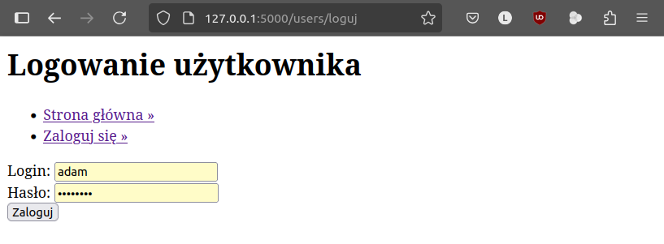
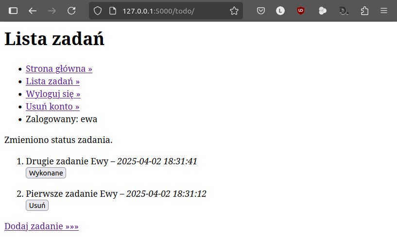
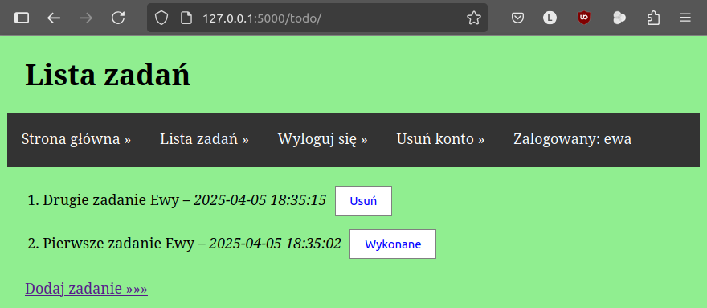

.. _todo-app:

ToDo
#####

.. highlight:: python

Aplikacja internetowa **ToDo** w oparciu o :term:`framework` Realizacja aplikacji internetowej Quiz w oparciu
o :term:`framework` `Flask <https://flask.palletsprojects.com/en/stable/>`_ 3.1.x
i bazę danych `SQLite <http://pl.wikipedia.org/wiki/SQLite>`_.
Aplikacja umożliwi dodawanie przez zalogowanego użytkownika zadań z określoną datą,
ich przeglądanie i oznaczanie jako wykonane.

Zalecamy zapoznanie się z materiałami zawartymi w scenariuszach:

* :ref:`Podstawy Pythona <podstawy-python>`,
* :ref:`Bazy danych w Pythonie <bazy-python>`,
* :ref:`Quiz <quiz-app>`.

.. contents::
    :depth: 1
    :local:

Do pracy potrzebne nam będzie wirtualne środowisko Pythona z zainstalowanym pakietem Flask.
Początek pracy jest taki sam, jak w przypadku aplikacji :ref:`Quiz <quiz-app>`, tzn.:

1. przygotowujemy wirtualne środowisko Pythona w katalogu :file:`projekty_flask`, chyba że
   zrobiliśmy to wcześniej podczas realizacji aplikacji Quiz;
2. w katalogu :file:`projekty_flask` tworzymy **katalog aplikacji**: :file:`todo`;
3. wykonujemy 2. i 3. punkt scenariusza Quiz, tj.: "Projekt i aplikacja" oraz "Strona główna".

W pliku :file:`app.py` zmieniamy w konfiguracji aplikacji nazwę serwisu
zapisaną w kluczu ``SITE_NAME`` na "Projekty Flask".

Model danych i baza
===================

Jako źródło danych aplikacji wykorzystamy tym razem bazę SQLite3 obsługiwaną za pomocą
modułu Pythona `sqlite3 <https://docs.python.org/3/library/sqlite3.html>`_.

**Model danych**, tj. w tym przypadku schemat bazy danych, zdefiniujemy w pliku :file:`modele.sql`,
który tworzymy w katalogu aplikacji i wypełniamy kodem `SQL <https://pl.wikipedia.org/wiki/SQL>`_:

.. raw:: html

    
Plik <i>modele.sql</i> Kod nr 

.. highlight:: sql
.. literalinclude:: source/modele.sql
    :linenos:

Wykonanie klauzul SQL spowoduje utworzenie dwóch tabel i wypełnienie ich przykładowymi danymi.
Tabele:

- ``user`` – zawierać będzie identyfikator, nazwę i hasło użytkownika,
- ``zadanie`` – zawierać będzie identyfikator zadania, identyfikator użytkownika, treść zadania,
  oznaczenie wykonania oraz datę dodania.

Funkcje potrzebne do obsługi bazy danych umieścimy w nowym pliku :file:`db.py`, który zapisujemy
w katalogu aplikacji.

.. raw:: html

    
plik <i>db.py</i> Kod nr 

.. highlight:: sql
.. literalinclude:: source/db.py
    :linenos:

.. note::

    Podczas działania aplikacji mamy dostęp do tzw. kontekstu, który zawiera
    ustawienia zapisane w słowniku ``config`` oraz dane w obiektach ``current_app`` i ``g``.

Zadaniem funkcji ``get_db()`` będzie połączenie z bazą danych i zapisanie obiektu
``db`` reprezentującego bazę w kontekście aplikacji:

* ``if 'db' not in g:`` – sprawdzamy, czy w obiekcie ``g`` nie ma
  obiektu ``db``;
* dalsza część kodu tworzy połączenie wywołując metodę ``sqlite3.connect()``
  i zapisuje je w kontekście aplikacji.

Funkcja ``close_db()`` odpowiadać będzie za zamknięcie połączenia. Będzie ona wywoływana
po obsłużeniu każdego żądania dzięki kolejnej funkcji ``init_app()``, która
rejestruje funkcję ``close_db()`` w kontekście aplikacji: ``app.teardown_appcontext(close_db)``.

Funkcja ``query_db()`` ułatwi wykonywanie zapytań SQL odczytujących dane z bazy.
Pierwszy wymagany argument to zapytanie ``SELECT``, drugi opcjonalny to lista wartości
wstawianych do klauzuli ``WHERE``. Domyślnie funkcja zwracała będzie wszystkie
pobrane rekordy dzięki metodzie ``fetchall()``. Jeżeli jednak w wywołaniu podamy trzeci argument
w postaci ``one=True``, zwrócony zostanie tylko pierwszy pobrany rekord.

Funkcja ``init_db()`` posłuży do utworzenia pliku bazy danych, a następnie tabel
do przechowywania danych.

Pozostaje nam uzupełnienie kodu w pliku :file:`app.py`:

.. raw:: html

    
Plik <i>app.py</i> Kod nr 

.. highlight:: python
.. literalinclude:: source/app1.py
    :linenos:
    :lineno-start: 1
    :emphasize-lines: 1-3, 11, 14, 25-26

Przede wszystkim uzupełniamy importy. Następnie w słowniku konfiguracji dodajemy
klucz ``DATABASE`` wskazujący na plik bazy danych :file:`db.sqlite`.

Następnie umieszczamy wywołanie funkcji ``init_app(app)``, dzięki czemu jeżeli
na dysku nie będzie pliku bazy danych, zostanie on utworzony, a wraz z nim
tabele zdefiniowane w pliku :file:`todo.sql`.

Po uruchomieniu serwera deweloperskiego i otwarciu adresu ``http://127.0.0.1:5000``
powinniśmy zobaczyć stronę:

.. figure:: img/todo_01.png

– a w katalogu aplikacji powinien zostać utworzony plik bazy danych :file:`db.sqlite`.

.. hint::

    Bazę danych można też utworzyć ręcznie za pomocą wiersza poleceń bazy Sqlite3.
    W terminalu w katalogu aplikacji możemy użyć następujących poleceń:

    .. raw:: html

        
Terminal nr 

    .. code-block:: bash

        ~/projekty_flask/todo$ sqlite3 db.sqlite < modele.sql
        ~/projekty_flask/todo$ sqlite3 db.sqlite
        sqlite> select * from zadanie;
        sqlite> .quit

    Pierwsze polecenie tworzy bazę danych w pliku :file:`db.sqlite`.
    Drugie otwiera ją w interpreterze. Trzecie to zapytanie SQL, które pobiera
    wszystkie dane z tabeli *zadanie*. Interpreter zamykamy poleceniem ``.quit``.

    .. figure:: img/sqlite3_cmd.png

Użytkownicy
===========

.. note::

    Jedna aplikacja Flask może składać się z wielu modułów odpowiedzialnych np. za
    autoryzację użytkowników, system komentarzy, quiz czy listę zadań.
    Obsługę tych składników warto rozdzielić na osobne moduły, nazywane we Flasku
    ``blueprint``, co ułatwi konstruowanie i rozszerzanie aplikacji.

Zadania do wykonania powiązane będą z użytkownikami, dlatego na początku
zajmiemy się blueprintem, który pozwoli na logowanie, rejestrację i usuwanie użytkownika.

W katalogu aplikacji tworzymy plik :file:`users.py` i dodajemy do niego poniższy kod:

.. raw:: html

    
Plik <i>users.py</i> Kod nr 

.. highlight:: python
.. literalinclude:: source/users.py
    :linenos:
    :lines: 1-8

Blueprint jest instancją klasy (obiektem typu) ``Blueprint``. Do konstruktora przekazujemy:

- ``users`` – nazwę blueprinta,
- ``__name__`` – nazwa pliku, w którym blueprint jest definiowany,
- ``template_folder`` – podkatalog katalogu aplikacji, w którym należy szukać szablonów,
- ``url_prefix`` – część adresu URL, który blueprint będzie obsługiwał, w tym przypadku będzie to adres
  ``http://nazwa_serwera/users/``.

(Wy)Logowanie
-------------

W utworzonym blueprincie zdefiniujemy widok ``loguj()`` powiązany z adresem URL ``http://nazwa_serwera/users/loguj``,
który obsłuży żądania ``GET`` i ``POST``:

.. raw:: html

    
Plik <i>users.py</i> Kod nr 

.. highlight:: python
.. literalinclude:: source/users.py
    :linenos:
    :lineno-start: 10
    :lines: 10-31

Jeżeli serwer otrzyma żądanie typu ``GET`` oraz w przypadku błędów logowania,
funkcja zwróci szablon ``users/loguj.html``. Natomiast kiedy serwer otrzyma dane z formularza,
wykonamy następujące operacje:

* ``request.form[]`` – odczytanie loginu i hasłu z przesłanego formularza;
* ``query_db('SELECT...', lista)`` – wykonanie zapytania SQL pobierającego dane użytkownika
  o podanym loginie, znak zapytania zostanie zastąpiony wartością z listy;
* przygotowanie informacji o błędzie w zmiennej ``error``, jeżeli w bazie nie ma użytkownika o podanym
  loginie (``user is None``) lub jeżeli podano błędne hasło (``not check_password_hash(user['haslo'], haslo)``);
* ``session['user_id'] = user['id']`` – zapisanie identyfikatora użytkownika w sesji (zob. :term:`sesja`),
  jeżeli dane logowania są poprawne;
* ``redirect(url_for('index'))`` przekierowanie zalogowanego użytkownika na stronę główną;
* ``flash()`` – zapisanie komunikatów dla użytkownika, które będzie można później odczytać w szablonie.

Po poprawnym zalogowaniu identyfikator użytkownika będzie dostępny w sesji podczas przetwarzania
kolejnych żądań. Będzie on odczytywany przez funkcję ``load_user()``, którą umieszczamy w blueprincie:

.. raw:: html

    
Plik <i>users.py</i> Kod nr 

.. highlight:: python
.. literalinclude:: source/users.py
    :linenos:
    :lineno-start: 33
    :lines: 33-39

Funkcja wykonywana będzie przed każdym żądaniem, ponieważ poprzedzamy ją dekoratorem ``@bp.before_app_request``.
Zadaniem funkcji będzie pobranie danych zalogowanego użytkownika z bazy i zapisanie ich w kontekście ``g.user``.

Adres ``http://nazwa_serwera/users/wyloguj`` będzie obsługiwany przez widok ``wyloguj()``:

.. raw:: html

    
Plik <i>users.py</i> Kod nr 

.. highlight:: python
.. literalinclude:: source/users.py
    :linenos:
    :lineno-start: 41
    :lines: 41-45

Wylogowanie polega na usunięciu danych użytkownika z sesji, po czym nastąpi przekierowanie na stronę główną.

Na koniec dodamy jeszcze jedną funkcję ``login_required()``, której użyjemy do zabezpieczenia dostępu niektórych widoków:

.. raw:: html

    
Plik <i>users.py</i> Kod nr 

.. highlight:: python
.. literalinclude:: source/users.py
    :linenos:
    :lineno-start: 47
    :lines: 47-53

Dodana funkcja to :term:`dekorator`, który jeżeli użytkownik nie będzie zalogowany,
przekieruje go na stronę logowania, w przeciwnym razie zwróci żądany widok.

Rejestracja blueprinta
----------------------

Użycie blueprinta wymaga zarejestrowania go w aplikacji.

Na początku pliku :file:`app.py` importujemy moduł ``users``, następnie poniżej komentarza
dodajemy kod:

.. raw:: html

    
Plik <i>app.py</i> Kod nr 

.. highlight:: python
.. code-block:: python

    import users
    
    ...

    # rejestracja blueprintów
    app.register_blueprint(users.bp)

Szablony
=========

W rozbudowanych aplikacjach zawierających wiele blueprintów i widoków zwracających
szablony, część kodu HTML powtarza się na każdej stronie, co zapewnia spójność wyglądu.
Tę wspólną część, aby jej nie powielać, umieścimy w **szablonie bazowym**.
Użyjemy dotychczasowego pliku :file:`templates/index.html`, w którym
umieszczamy poniższy kod:

.. raw:: html

    
Plik <i>index.html</i> Kod nr 

.. highlight:: html
.. literalinclude:: source/index1.html
    :linenos:

W szablonach wykorzystujemy specjalne **tagi** dwóch rodzajów:

- ```` – pozwalają używać instrukcji sterujących, np. warunkowych lub pętli, oraz definiować bloki,
  które będą uzupełniane przez szablony dziedziczące,
- ``{{ zmienna }}`` – służą wyświetlaniu wartości zmiennych lub wywoływaniu metod obiektów przekazanych do szablonu.

Zastosowanie tagów w szablonach:

- ``{{ config.SITE_NAME }}`` – wstawienie nazwy serwisu zdefiniowanego w słowniku ustawień aplikacji ``config``;
- `` `` – zdefiniowanie bloku o podanej nazwie, którego zawartość może zostać nadpisana
  w szablonach dziedziczących;
- `` ...  ... `` – jeżeli użytkownik jest zalogowany, wstawiamy odnośnik "Wyloguj się"
  oraz informację, kto jest zalogowany, w przeciwnym razie wstawiamy odnośnik "Zaloguj się";
- ``{{ url_for('index') }}`` – funkcja ``url_for()`` zwraca adres URL powiązany z podanym jako argument widokiem,
  poprzedzonym ewentualna nazwą blueprintu, w którym został zdefiniowany, np. ``{{ url_for('users.loguj') }}``;
- `` `` – odczytanie komunikatów dla użytkownika
  utworzonych w widokach, jeżeli zostały utworzone (````), odczytujemy je w pętli
  (````) i wstawiamy do szablonu w osobnych akapitach
  ``
 {{ komunikat }} 
``.

Szablony blueprintów mogą być zapisywane w osobnych podkatalogach. W katalogu
:file:`projekty_flask/todo/templates` tworzymy podkatalog o takiej samej nazwie
jak nasz blueprint, tj. :file:`users`, a w nim plik :file:`user_loguj.html`.
W utworzonym szablonie umieszczamy kod:

.. raw:: html

    
Plik <i>user_loguj.html</i> Kod nr 

.. highlight:: html
.. literalinclude:: source/user_loguj.html
    :linenos:

Tag ```` wskazuje szablon bazowy, z którego dziedziczymy kod.
W tagach `` `` wstawiamy kod charakterystyczny dla bieżącego szablonu.
W tym przypadku tworzymy formularz HTML pozwalający na wpisanie loginu i hasła i przesłanie
tych danych na adres zdefiniowany w atrybucie ``action`` obsługiwany przez widok ``loguj()``
z blueprinta ``users``.

Po uruchomieniu serwera deweloperskiego i wejściu na adres ``http://127.0.0.1:5000/users/loguj``
powinniśmy zobaczyć stronę logowania:

Ćwiczenie
----------

Spróbuj zalogować się na konto użytkownika utworzonego podczas dodawania do bazy przykładowych
danych. W formularzu podaj login ``adam`` i hasło ``zaq1@WSX``. Po zalogowaniu
powinieneś zobaczyć stronę główną z odpowiednim komunikatem:

.. figure:: img/todo_adam.png

Po wylogowaniu podobnie:

Dodawanie i usuwanie kont
=========================

W blueprincie :file:`users.py` umieścimy jeszcze dwa widoki, które umożliwią zarejestrowanie się
użytkownika oraz usuwanie konta:

.. highlight:: python
.. literalinclude:: source/users.py
    :linenos:
    :lineno-start: 55
    :lines: 55-

Po wysłaniu żądania ``GET`` na adres ``http://nazwa_serwera/users/dodaj`` widok ``dodaj()``
zwróci szablon :file:`user_dodaj.html` zawierający formularz. Po wypełnieniu i wysłaniu formularza,
czyli w przypadku żądania typu ``POST`` odczytujemy login oraz hasło i próbujemy dodać
do bazy nowego użytkownika wykonując klauzulę SQL ``INSERT INTO user ...``.
Warto zwrócić uwagę, że hasło jest szyfrowane za pomocą funkcji skrótu ``generate_password_hash()``.

Jeżeli podany login istnieje w bazie, zwrócony zostanie wyjątek ``db.IntegrityError``,
tj. błąd integralności, wtedy przygotowujemy komunikat dla użytkownika i ponownie zawracamy
szablon z formularzem. Pod udanym dodaniu konta użytkownik zostanie przekierowany na stronę główną
z komunikatem potwierdzającym dodanie konta.

Zalogowany użytkownik będzie mógł usunąć konto po wejściu na stronę o adresie
``http://nazwa_serwera/users/usun``. Widok ``usun()`` obsługujący ten adres zabezpieczamy dodanym
wcześniej dekoratorem ``login_required``. Jeżeli użytkownik potwierdzi chęć usunięcia konta
oraz wszystkich jego zadań przesyłając formularz z szablonu ``user_usun.html``,
wykonamy klauzulę SQL ``DELETE FROM users ...``, która usunie jego konto z bazy oraz kaskadowo
wszystkie powiązane zadania. Na koniec przekierujemy użytkownika na stronę główną.

Pozostaje dodanie szablonów zwracanych przez omówione widoki. W katalogu
:file:`projekty_flask/todo/templates/users`:

- dodajemy plik :file:`user_dodaj.html`:

    .. raw:: html

        
Plik <i>user_dodaj.html</i> Kod nr 

    .. highlight:: html
    .. literalinclude:: source/user_dodaj.html
        :linenos:

– oraz plik :file:`user_usun.html`:

    .. highlight:: html
    .. literalinclude:: source/user_usun.html
        :linenos:

Ćwiczenie
------------

1. Dodaj do szablonu bazowego we właściwych sekcjach odnośniki pozwalające na dodawanie
   i usuwanie konta przez użytkownika.
2. Dodaj koto użytkownika ``ewa``, a następnie je usuń.

.. figure:: img/todo_ewa.png

Lista zadań
=============

Obsługę zadań umieścimy w osobnym blueprincie. W katalogu aplikacji :file:`projekty_flask/todo`
tworzymy plik :file:`todo.py` i wypełniamy kodem:

.. raw:: html

    
Plik <i>todo.py</i> Kod nr 

.. highlight:: python
.. literalinclude:: source/todo.py
    :linenos:
    :lines: 1-14

Widok ``index()`` wywoływany będzie po wejściu na adres ``http://nazwa_serwera/todo``.
Jego zadaniem jest pobranie z bazy wszystkich zadań zalogowanego użytkownika i przekazanie ich do szablonu
w zmiennej ``zadania``.

Szablon tworzymy w pliku :file:`projekty_flask/todo/templates/todo/index.html`:

.. raw:: html

    
Plik <i>todo/index.html</i> Kod nr 

.. highlight:: html
.. literalinclude:: source/todo_index1.html
    :linenos:

W pętli ```` odczytujemy zadania z listy przekazanej
do szablonu, wypisujemy treść zadania i datę dodania.

Ćwiczenie
---------

1. W pliku :file:`app.py` zaimportuj moduł ``todo`` i zarejestruj blueprint ``todo.bp`` w aplikacji.
2. Dodaj do szablonu bazowego odnośnik do listy zadań.
3. Zaloguj się podając login ``adam`` i hasło ``zaq1@WSX``.
4. Wejdź na stronę z listą zadań.

Dodawanie zadań
===============

W pliku :file:`todo.py` dopisujemy widoki:

.. raw:: html

    
Plik <i>todo.py</i> Kod nr 

.. highlight:: python
.. literalinclude:: source/todo.py
    :linenos:
    :lineno-start: 16
    :lines: 16-44

Widok ``dodaj()`` w odpowiedzi na żądanie typu ``GET`` zwróci szablon :file:`zadanie_dodaj.html`,
który będzie zawierał formularz pozwalający na wpisanie treści zadania.

Po przesłaniu formularza na serwer odczytamy treść zadania i sprawdzimy,
czy zawiera jakieś znaki. Jeżeli tak, wykonamy zapytanie SQL ``INSERT INTO ...``,
które do tabeli ``zadanie`` doda nowy rekord zawierający identyfikator użytkownika,
treść zadania oraz wartość ``0`` oznaczającą, że zadanie nie jest wykonane.

Warto zwrócić uwagę, że nie podajemy daty publikacji, ponieważ zostanie ona utworzona
automatycznie przez bazę danych dzięki zdefiniowaniu wartości domyślnej
pola ``data_pub`` w modelu danych: ``DEFAULT CURRENT_TIMESTAMP``.

Widok ``zrobione()`` obsługiwał będzie tylko żądania typu ``POST``. Po otrzymaniu
identyfikatora zadania przesłanego z formularza wykonamy zapytanie SQL ``UPDATE``,
które oznaczy zadanie wskazane w klauzuli ``WHERE`` jako zrobione: ``SET zrobione=1``.

W szablonie :file:`projekty_flask/todo/templates/todo/zadanie_dodaj.html` umieszczamy kod
HTML formularza pozwalającego dodać zadanie:

.. raw:: html

    
Plik <i>zadanie_dodaj.html</i>. Kod nr 

.. highlight:: html
.. literalinclude:: source/zadanie_dodaj.html
    :linenos:

Szablon :file:`projekty_flask/todo/templates/todo/index.html` uzupełniamy, tzn.
kod w pętli ```` zmieniamy na:

.. raw:: html

    
Plik <i>todo/index.html</i>. Kod nr 

.. highlight:: html
.. literalinclude:: source/todo_index.html
    :linenos:
    :lines: 7-22

- ```` – jeżeli zadanie nie jest wykonane, dodajemy
  formularz zmiany statusu zadania zawierający ukryte pole z identyfikatorem zadania.
  Jeżeli użytkownik kliknie przycisk ``Zrobione``, do serwera zostanie wysłane
  żądanie ``POST`` z identyfikatorem zadania, które zostanie obsłużone przez widok
  ``zrobione()``.

Ćwiczenie
----------

1. Do szablonu wyświetlającego listę zadań dodaj na końcu odnośnik umożliwiający
   dodawanie zadań.
2. Dodaj konto dla użytkownika o loginie ``ewa`` i zaloguj się na nie.
3. Dodaj dwa zadania i oznacz jedno z nich jako wykonane.

Style CSS
=========

O wyglądzie aplikacji decydują arkusze stylów CSS. Tego typu zasoby, podobnie jak np. obrazy,
nie zmieniają się zbyt często, dlatego umieszczamy je w specjalnym podkatalogu :file:`static`
w folderze aplikacji.

Tworzymy więc podkatalog :file:`projekty_flask/todo/static`, a w nim plik :file:`style.css`.
W pliku umieszczamy przykładowe definicje:

.. raw:: html

    
Plik <i>style.css</i> Kod nr 

.. highlight:: css
.. literalinclude:: source/style.css
    :linenos:

Arkusz CSS dołączamy do szablonu bazowego :file:`projekty_flask/todo/templates/index.html` w sekcji ``head``:

.. raw:: html

    
Plik <i>index.html</i>. Kod nr 

.. highlight:: html
.. literalinclude:: source/index.html
    :linenos:
    :lines: 1-6
    :emphasize-lines: 5

Ćwiczenie
----------

Uruchom aplikację lub odśwież stroną z listą zadań zalogowanego użytkownika po dołączeniu stylów CSS.

Zadania dodatkowe
=================

Dodaj możliwość usuwania zadań, czyli:

- w szablonie listy zadań dodaj formularz podobny do formularza oznaczania zadań
  jako wykonane, z którego identyfikator zadania wysyłany jest do widoku ``usun``,
- w blueprincie :file:`todo.py` dodaj wymagający zalogowania się widok ``usun()``
  obsługujący adres URL ``/usun``, który przy użyciu klauzuli SQL ``DELETE FROM``
  usuwa z bazy zadanie o odczytanym z formularza identyfikatorze należące
  do zalogowanego użytkownika,
- usuń pierwsze zadanie użytkownika ``ewa``.

Materiały
=========

* `SQLite <https://www.sqlite.org/>`_
* `Using SQLite 3 with Flask <https://flask.palletsprojects.com/en/stable/patterns/sqlite3/>`_

.. admonition:: Pojęcia

    :term:`framework`, :term:`HTTP`, :term:`GET`, :term:`POST`, :term:`sesja`,
    :term:`dekorator`, :term:`widok`, :term:`szablon`, :term:`renderowanie szablonu`
