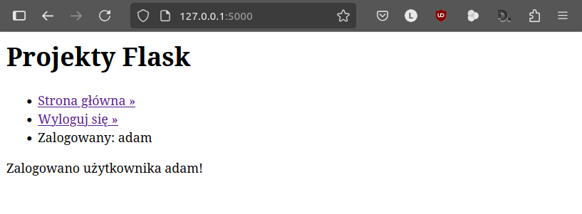
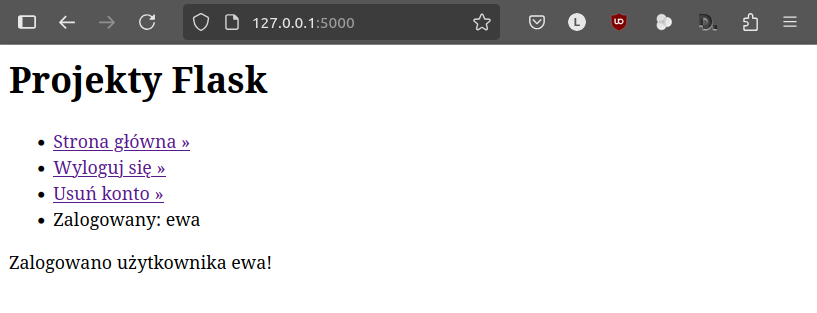

.. _todo-app:

ToDo
#####

.. highlight:: python

Aplikacja internetowa ToDo w oparciu o :term:`framework` Flask 3.1.x.
Aplikacja umożliwi dodawanie przez zalogowanego użytkownika zadań z określoną datą,
ich przeglądanie i oznaczanie jako wykonane.
Dane użytkowników i zadania zapisywane będą w bazie danych `SQLite <http://pl.wikipedia.org/wiki/SQLite>`_.

.. contents::
    :depth: 1
    :local:

Do pracy potrzebne nam będzie wirtualne środowisko Pythona z zainstalowanym pakietem Flask.
Początek pracy jest taki sam, jak w przypadku aplikacji :ref:`Quiz <quiz-app>`, tzn.:

1. przygotowujemy wirtualne środowisko Pythona w katalogu :file:`projekty_flask`, chyba że
   zrobiliśmy to wcześniej podczas realizacji aplikacji Quiz;
2. w katalogu :file:`projekty_flask` tworzymy **katalog aplikacji**: :file:`todo`;
3. wykonujemy 2. i 3. punkt scenariusza Quiz, tj.: "Projekt i aplikacja" oraz "Strona główna".

W pliku :file:`app.py` zmieniamy w konfiguracji aplikacji nazwę serwisu
zapisaną w kluczu ``SITE_NAME`` na "Projekty Flask".

Model danych i baza
===================

Jako źródło danych aplikacji wykorzystamy tym razem bazę SQLite3 obsługiwaną za pomocą
modułu Pythona `sqlite3 <https://docs.python.org/3/library/sqlite3.html>`_.

**Model danych**, tj. w tym przypadku schemat bazy danych, zdefiniujemy w pliku :file:``,
który tworzymy w katalogu aplikacji i wypełniamy kodem `SQL <https://pl.wikipedia.org/wiki/SQL>`_:

.. raw:: html

    
plik <i>schema.pl</i> Kod nr 

.. highlight:: sql
.. literalinclude:: source/
    :linenos:

Wykonanie klauzul SQL spowoduje utworzenie dwóch tabel:

- ``user`` – zawierać będzie identyfikator, nazwę i hasło użytkownika,
- ``zadanie`` – zawierać będzie identyfikator zadania, identyfikator użytkownika, treść zadania,
  oznaczenie wykonania oraz datę dodania.

Tabele zostaną również wypełnione przykładowymi danymi.

Funkcje potrzebne do obsługi bazy danych umieścimy w nowym pliku :file:`db.py`, który zapisujemy
w katalogu aplikacji.

.. raw:: html

    
plik <i>schema.pl</i> Kod nr 

.. highlight:: sql
.. literalinclude:: source/db.py
    :linenos:

.. note::

    Podczas działania aplikacji Flask mamy dostęp do tzw. kontekstu aplikacji,
    który tworzą ustawienia zapisane w słowniku ``config`` oraz dane w obiektach
    ``current_app`` i ``g``.

Zadaniem funkcji ``get_db()`` będzie połączenie z bazą danych i zapisanie obiektu
``db`` reprezentującego bazę w kontekście aplikacji:

* ``if 'db' not in g:`` – sprawdzamy, czy w obiekcie ``g`` nie ma
  obiektu ``db``;
* dalsza część kodu tworzy połączenie wywołując metodę ``sqlite3.connect()``
  i zapisuje je w kontekście aplikacji.

Funkcja ``close_db()`` odpowiadać będzie za zamknięcie połączenia. Będzie ona wywoływana
po obsłużeniu każdego żądania dzięki kolejnej funkcji ``init_app()``, która
rejestruje funkcję ``close_db()`` w kontekście aplikacji: ``app.teardown_appcontext(close_db)``.

Funkcja ``init_db()`` posłuży do utworzenia pliku bazy danych, a następnie tabel
do przechowywania danych.

Pozostaje nam uzupełnienie kodu w pliku :file:`app.py`:

.. raw:: html

    
Plik <i>todo.py</i> Kod nr 

.. highlight:: python
.. literalinclude:: source/app1.py
    :linenos:
    :lineno-start: 1
    :emphasize-lines: 1-3, 11, 14, 25-26

Przede wszystkim uzupełniamy importy. Następnie w słowniku konfiguracji dodajemy
klucz ``DATABASE`` wskazujący na plik bazy danych :file:`db.sqlite`.

Następnie umieszczamy wywołanie funkcji ``init_app(app)``, dzięki czemu jeżeli
na dysku nie będzie pliku bazy danych, zostanie on utworzony, a wraz z nim
tabele zdefiniowane w pliku :file:`todo.sql`.

Po uruchomieniu serwera deweloperskiego i otwarciu adresu ``http://127.0.0.1:5000``
powinniśmy zobaczyć stronę:

– a w katalogu aplikacji powinien zostać utworzony plik bazy danych :file:`db.sqlite`.

.. hint::

    Bazę danych można też utworzyć ręcznie za pomocą wiersza poleceń bazy Sqlite3.
    W terminalu w katalogu aplikacji możemy użyć następujących poleceń:

    .. raw:: html

        
Terminal nr 

    .. code-block:: bash

        ~/projekty_flask/todo$ sqlite3 db.sqlite < schema.sql
        ~/projekty_flask/todo$ sqlite3 db.sqlite
        sqlite> select * from zadania;
        sqlite> .quit

    Pierwsze polecenie tworzy bazę danych w pliku :file:`db.sqlite`.
    Drugie otwiera ją w interpreterze. Trzecie to zapytanie SQL, które pobiera
    wszystkie dane z tabeli *zadania*. Interpreter zamykamy poleceniem ``.quit``.

    .. figure:: img/sqlite3_cmd.png

Użytkownicy
===========

.. note::

    Jedna aplikacja Flask może składać się z wielu modułów odpowiedzialnych np. za
    autoryzację użytkowników, system komentarzy, quiz czy listę zadań.
    Obsługę tych składników warto rozdzielić na osobne moduły, nazywane we Flasku
    <foreign lang='en'>blueprint</foreign>, co ułatwi konstruowanie i rozszerzanie aplikacji.

W naszej aplikacji zadania do wykonania powiązane będą z użytkownikami, dlatego na początku
zajmiemy się blueprintem, który pozwoli na logowanie, rejestrację i usuwanie użytkownika.
W katalogu aplikacji tworzymy plik :file:`users.py` i dodajemy do niego poniższy kod:

.. raw:: html

    
Plik <i>users.py</i> Kod nr 

.. highlight:: python
.. literalinclude:: source/users.py
    :linenos:
    :lines: 1-56

Blueprint jest instancją klasy (obiektem typu) ``Blueprint``. Do konstruktora przekazujemy:

- ``users`` – nazwę blueprinta,
- ``__name__`` – nazwa pliku, w którym blueprint jest definiowany,
- ``template_folder`` – podkatalog katalogu aplikacji, w którym należy szukać szablonów,
- ``url_prefix`` – część adresu URL, który blueprint będzie obsługiwał, w tym przypadku będzie to adres
  ``http://nazwa_serwera/users/``.

(Wy)Logowanie
-------------

W utworzonym blueprincie za pomocą dekoratora (``@bp.route()``) definiujemy widok, czyli
funkcję ``loguj()`` powiązaną z adresem URL ``http://nazwa_serwera/users/loguj``, która obsługuje
żądania ``GET`` i ``POST`` (``methods=['GET', 'POST']``).

.. note::

    Żądania typu ``GET`` występują zazwyczaj wtedy, kiedy chcemy pobrać jakieś dane z serwera,
    np. stronę. Ewentualne dane przekazywane do serwera (np. parametry wyszukiwania)
    widoczne są w adresie URL, np.:

    ``www.google.com/search?client=firefox-b-lm&channel=entpr&q=żądania+GET+i+POST``

    Żądanie typu ``POST`` służą natomiast do przesyłania na serwer danych niewidocznych w adresie URL,
    które mają zazwyczaj zmieniać stan aplikacji, np. dodać lub zalogować użytkownika.
    Do przesyłania danych metodą ``POST`` służą formularze.

Jeżeli serwer otrzyma żądanie typu ``GET`` oraz w przypadku błędów logowania,
funkcja zwróci szablon ``users/loguj.html``. Natomiast w przypadku żądania typu POST, funkcja:

* odczyta login i hasło z przesłanego formularza dostępnego w słowniku ``request.form``;
* utworzy obiekt bazy danych: ``db = get_db()``;
* wykona podane zapytanie SQL: ``db.execute('SELECT...')``,
  czyli pobranie danych użytkownika o podanym loginie;
* jako wynik zapytania zwrócony zostanie jeden rekord: ``fetchone()``;
* jeżeli w bazie nie będzie użytkownika o podanym loginie (``user is None``)
  lub jeżeli podane hasło będzie błędne (``not check_password_hash(user['haslo'], haslo)``),
  funkcja przygotuje odpowiedni komunikat błędu w zmiennej ``error``;
* jeżeli podany login i hasło będą poprawne, identyfikator użytkownika zostanie zapisany
  w sesji [zob. :term:`sesja`], a zalogowany użytkownik zostanie przekierowany na stronę
  główną ``redirect(url_for('index'))``;
* w przypadku poprawnego logowania, jak i błędów funkcja ``flash()`` przygotuje komunikaty
  dla użytkownika, które będzie można później odczytać w szablonie.

Po poprawnym zalogowaniu identyfikator użytkownika będzie dostępny w sesji podczas przetwarzania
kolejnych żądań. Za pomocą instrukcji ``@bp.before_app_request`` rejestrujemy funkcję ``load_user()``,
która wykonywana będzie przed każdym żądaniem. Jeżeli w sesji zapisany został identyfikator
użytkownika, funkcja odczyta jego dane z bazy i zapisze w ``g.user``.

Adres ``http://nazwa_serwera/users/wyloguj`` będzie obsługiwał widok ``wyloguj()``. Jego zadaniem
jest usunięcie danych użytkownika z sesji, co oznacza wylogowanie, oraz przekierowanie użytkownika
na stronę główną.

Funkcja ``login_required()`` to :term:`dekorator`, którego użyjemy do zabezpieczenia dostępu niektórych widoków.
Jeżeli użytkownik nie będzie zalogowany, dekorator przekieruje go na stronę logowania,
w przeciwnym razie zwróci żądany widok.

Rejestracja blueprinta
----------------------

Użycie blueprinta wymaga zarejestrowania go w aplikacji. W pliku :file:`app.py` dodajemy więc
kod:

.. raw:: html

    
Plik <i>app.py</i> Kod nr 

.. highlight:: python
.. code-block:: python

    # rejestracja blueprintów
    app.register_blueprint(users.bp)

Szablony
=========

W rozbudowanych aplikacjach zawierających wiele blueprintów i widoków zwracających
szablony, część kodu HTML powtarza się na każdej stronie, aby zachować spójność wyglądu.
Tę wspólną część, aby jej nie powielać, umieścimy w **szablonie bazowym**.
Użyjemy dotychczasowego pliku :fle:`templates/index.html`, w którym
umieszczamy poniższy kod:

.. raw:: html

    
Plik <i>index.html</i> Kod nr 

.. highlight:: html
.. literalinclude:: source/index1.html
    :linenos:

W szablonach wykorzystujemy specjalne **tagi** dwóch rodzajów:

- ```` – pozwalają używać instrukcji sterujących, np. warunkowych lub pętli, oraz definiować bloki,
  które będą uzupełniane przez szablony dziedziczące,
- ``{{ zmienna }}`` – służą wyświetlaniu wartości zmiennych lub wywoływaniu metod obiektów przekazanych do szablonu.

Zastosowanie:

- ``{{ config.SITE_NAME }}`` – wstawienie nazwy serwisu zdefiniowanego w słowniku ustawień aplikacji ``config``;
- `` `` – zdefiniowanie bloku o nazwie ``h1``, którego zawartość może zostać nadpisana
  w szablonach dziedziczących;
- `` `` – odczytanie komunikatów dla użytkownika
  utworzonych w widokach, jeżeli zostały utworzone (````), odczytujemy je w pętli
  (````) i wstawiamy do szablonu w osobnych akapitach
  ``
 {{ komunikat }} 
``;
- ``{{ url_for('index') }}`` – funkcja ``url_for()`` zwraca adres URL powiązany z podanym jako argument widokiem,
  poprzedzonym ewentualna nazwą blueprintu, w którym został zdefiniowany, np. ``{{ url_for('users.loguj') }}``.

Szablony blueprintów mogą być zapisywane w osobnych podkatalogach. W katalogu
:file:`projekty_flask/todo/templates` tworzymy podkatalog o takiej samej nazwie
jak nasz blueprint, tj. :file:`users`, a w nim plik (szablon) :file:`user_loguj.html`.
W utworzonym szablonie umieszczamy kod:

.. raw:: html

    
Plik <i>user_loguj.html</i> Kod nr 

.. highlight:: html
.. literalinclude:: source/user_loguj.html
    :linenos:

Tag ```` wskazuje szablon bazowy, z którego dziedziczymy kod.
W tagach `` `` wstawiamy kod charakterystyczny dla bieżącego szablonu.
W tym przypadku tworzymy formularz HTML pozwalający na wpisanie loginu i hasła i przesłanie
tych danych na adres zdefiniowany w atrybucie ``action`` obsługiwany przez widok ``loguj()``
z blueprinta ``users``.

Po uruchomieniu serwera deweloperskiego i wejściu na adres ``http://127.0.0.1:5000/users/loguj``
powinniśmy zobaczyć stronę logowania:

.. figure:: img/todo_loguj.png

Ćwiczenie
----------

Spróbuj zalogować się na konto użytkownika utworzonego podczas dodawania do bazy przykładowych
danych. W formularzu podaj login ``adam`` i hasło ``zaq1@WSX``. Po zalogowaniu
powinieneś zobaczyć stronę główną z odpowiednim komunikatem:

Po wylogowaniu podobnie:

.. figure:: img/todo_wyloguj.png

Dodawanie i usuwanie kont
=========================

W blueprincie :file:`users.py` umieścimy jeszcze dwa widoki, które umożliwią zarejestrowanie się
użytkownika oraz usuwanie konta:

.. highlight:: python
.. literalinclude:: source/users.py
    :linenos:
    :lines: 58-

Po wysłaniu żądania ``GET`` na adres ``http://nazwa_serwera/users/dodaj`` widok ``dodaj()``
zwróci szablon :file:`user_dodaj.html` zawierający formularz. Po wypełnieniu i wysłaniu formularza,
czyli w przypadku żądania typu ``POST`` odczytujemy login oraz hasło i próbujemy dodać
do bazy nowego użytkownika wykonując klauzulę SQL ``INSERT INTO user ...``.
Warto zwrócić uwagę, że hasło jest szyfrowane za pomocą funkcji skrótu ``generate_password_hash()``.

Jeżeli podany login istnieje w bazie, zwrócony zostanie wyjątek, tj. błąd integralności, wtedy
przygotowujemy komunikat dla użytkownika i ponownie zawracamy szablon z formularzem.
W przeciwnym razie użytkownik zostanie przekierowany na stronę główną z komunikatem potwierdzającym
dodanie konta.

Zalogowany użytkownik będzie mógł usunąć konto po wejściu na stronę o adresie
``http://nazwa_serwera/users/usun``. Widok ``usun()`` obsługujący ten adres zabezpieczamy dodanym
wcześniej dekoratorem ``login_required``. Jeżeli użytkownik potwierdzi chęć usunięcia konta
oraz wszystkich jego zadań przesyłając formularz zwrócony w szablonie ``user_usun.html``,
wykonamy klauzulę SQL ``DELETE FROM users ...``, która usunie jego konto z bazy oraz kaskadowo
wszystkie powiązane zadania. Na koniec przekierujemy użytkownika na stronę główną.

Pozostaje dodanie szablonów zwracanych przez omówione widoki. W katalogu
:file:`projekty_flask/todo/templates/users`:

- dodajemy plik :file:`user_dodaj.html`:

    .. raw:: html

        
Plik <i>user_dodaj.html</i> Kod nr 

    .. highlight:: html
    .. literalinclude:: source/user_dodaj.html
        :linenos:

– oraz plik :file:`user_usun.html`:

    .. highlight:: html
    .. literalinclude:: source/user_usun.html
        :linenos:

Ćwiczenie
------------

1. Dodaj do szablonu bazowego we właściwych sekcjach odnośniki pozwalające na dodawanie
   i usuwanie konta przez użytkownika.
2. Dodaj koto użytkownika, a następnie je usuń.

.. figure:: img/todo_dodaj.png

.. figure:: img/todo_usun.png

Lista zadań
=============

Obsługę zadań umieścimy w osobnym blueprincie. W katalogu aplikacji :file:`projekty_flask/todo`
tworzymy plik :file:`todo.py` i wypełniamy kodem:

.. raw:: html

    
Plik <i>todo.py</i> Kod nr 

.. highlight:: python
.. literalinclude:: source/todo1.py
    :linenos:

Widok ``index()`` wywoływany będzie po wejściu na adres ``http://nazwa_serwera/todo``.
Jego zadaniem jest pobranie z bazy wszystkich zadań zalogowanego użytkownika i przekazanie ich do szablonu
w zmiennej ``zadania``.

Szablon tworzymy w pliku :file:`projekty_flask/todo/templates/todo/index.html`:

.. raw:: html

    
Plik <i>todo/index.html</i>. Kod nr 

.. highlight:: html
.. literalinclude:: source/todo_index.html
    :linenos:

W pętli ```` odczytujemy zadania z listy przekazanej
do szablonu, wypisujemy treść zadania i datę dodania.

Ćwiczenie
---------

1. Dodaj do szablonu bazowego odnośnik do listy zadań.
2. Zaloguj się podając login ``adam`` i hasło ``zaq1@WSX``.
3. Wejdź na stronę z listą zadań.

.. figure:: img/todo_zadania.png

Dodawanie zadań
===============

Dodawanie zadań wymaga przesłania danych z formularza na serwer – są to
żądania typu :term:`POST`, które modyfikują dane aplikacji.

Na początku pliku :file:`todo.py` trzeba, jak zwykle, zaimportować wymagane funkcje:

.. raw:: html

    
Kod nr 

.. highlight:: python
.. literalinclude:: todo_z4.py
    :linenos:
    :lineno-start: 8
    :lines: 8-9

Następnie rozbudujemy widok listy zadań:

.. raw:: html

    
Kod nr 

.. highlight:: python
.. literalinclude:: todo_z4.py
    :linenos:
    :lineno-start: 43
    :lines: 43-63
    :emphasize-lines: 1, 3-16, 21

* ``methods=['GET', 'POST']`` – w liście wymieniamy typy obsługiwanych żądań;
* ``request.form['zadanie']`` – dane przesyłane w żądaniach POST odczytujemy ze
  słownika ``form``;
* ``db.execute(...)`` – wykonujemy zapytanie, które dodaje nowe zadanie,
  w miejsce symboli zastępczych ``(?, ?, ?, ?)`` wstawione zostaną dane
  z listy podanej jako drugi parametr;
* ``flash()`` – funkcja pozwala przygotować komunikaty dla użytkownika,
  które można będzie wstawić w szablonie;
* ``redirect(url_for('zadanie'))`` – przekierowanie użytkownika na adres związany
  z podanym widokiem – żądanie typu GET.

Warto zauważyć, że do szablonu przekazujemy dodatkową zmienną ``error``.

W szablonie :file:`zadania_lista.html` po znaczniku ``<h1>`` umieszczamy kod:

.. raw:: html

    
Plik <i>zadania_lista.html</i>. Kod nr 

.. highlight:: html
.. literalinclude:: templates/zadania_lista_z4.html
    :linenos:
    :lineno-start: 10
    :lines: 10-25

* ```` – sprawdzamy, czy zmienna ``error`` cokolwiek zawiera;
* ```` – pętla odczytująca komunikaty;

.. figure:: img/todo_04_dodawanie.png

Style CSS
=========

O wyglądzie aplikacji decydują arkusze stylów CSS. Umieszczamy je w podkatalogu ``static``
folderu aplikacji. Tworzymy więc plik :file:`~/todo/static/style.css`
z przykładowymi definicjami:

.. raw:: html

    
Plik <i>style.css</i>. Kod nr 

.. highlight:: css
.. literalinclude:: static/style.css
    :linenos:

Arkusz CSS dołączamy do pliku :file:`zadania_lista.html` w sekcji ``head``:

.. raw:: html

    
Plik <i>zadania_lista.html</i>. Kod nr 

.. highlight:: html
.. literalinclude:: templates/zadania_lista_z5.html
    :linenos:
    :lineno-start: 3
    :lines: 3-8
    :emphasize-lines: 4-5

**Ćwiczenie**

Dołącz arkusz stylów CSS również do szablonu :file:`index.html`. Odśwież aplikację w przeglądarce.

.. figure:: img/todo_05_css.png

Zadania wykonane
================

Do każdego zadania dodamy formularz, którego wysłanie będzie oznaczało,
że wykonaliśmy dane zadanie, czyli zmienimy atrybut ``zrobione`` wpisu
z *0* (niewykonane) na *1* (wykonane). Odpowiednie żądanie typu POST
obsłuży nowy widok w pliku :file:`todo.py`, który wstawiamy
przed kodem uruchamiającym aplikację (``if __name__ == '__main__':``):

.. raw:: html

    
Plik <i>todo.py</i> Kod nr 

.. highlight:: python
.. literalinclude:: todo_z6.py
    :linenos:
    :lineno-start: 65
    :lines: 65-73

* ``zadanie_id = request.form['id']`` – odczytujemy przesłany identyfikator zadania;
* ``db.execute('UPDATE zadania SET zrobione=1 WHERE id=?', [zadanie_id])`` – wykonujemy
  zapytanie aktualizujące staus zadania.

W szablonie :file:`zadania_lista.html` modyfikujemy fragment wyświetlający
listę zadań i dodajemy formularz:

.. raw:: html

    
Plik <i>zadania_lista.html</i>. Kod nr 

.. highlight:: html
.. literalinclude:: templates/zadania_lista_z6.html
    :linenos:
    :lineno-start: 29
    :lines: 29-50

Możemy dodawać zadania oraz zmieniać ich status.

.. figure:: img/todo_06_zrobione.png

Zadania dodatkowe
=================

* Dodaj możliwość usuwania zadań.
* Dodaj mechanizm logowania użytkownika tak, aby użytkownik mógł dodawać i edytować tylko swoją listę zadań.

Materiały
=========

**Źródła:**

* :download:`todo.zip <todo.zip>`
